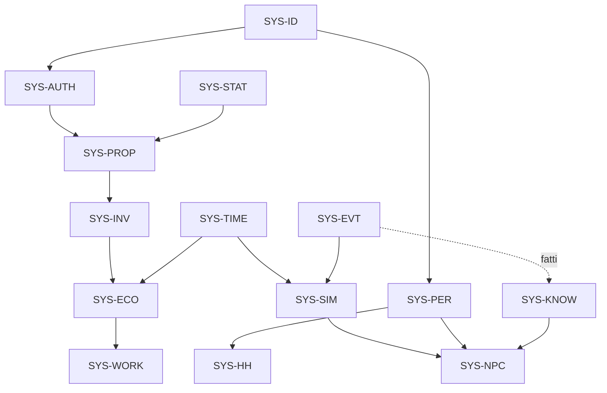

# Matrice delle dipendenze tra sistemi

## Scopo

Governare le dipendenze tra sistemi, dichiarandone direzione, contratto, criticità, temporalità, comportamento degradato e impatto delle modifiche.

## Descrizione

La matrice è una vista del [catalogo canonico](system-catalog.md), non un sostituto delle specifiche. Una dipendenza `hard` impedisce il flusso se indisponibile; una dipendenza `soft` ammette fallback. I dati attraversano i confini solo con query, comandi o eventi registrati.

## Ambito

Sistemi fondazionali P0/P1 e dipendenze determinanti per Pompei. I sistemi P2–P4 saranno aggiunti quando promossi almeno a S2.

## Regole

- Nessun ciclo sincrono tra autorità di dominio.
- SYS-TIME ordina il tempo ma non possiede le scadenze di dominio.
- SYS-EVT trasporta fatti ma non modifica stato di dominio.
- SYS-AUTH orchestra transazioni senza appropriarsi dei dati partecipanti.
- UI e contenuti non mutano direttamente dati autorevoli.
- Ogni edge `hard` richiede test contrattuale e comportamento di errore.

## Matrice dettagliata

| Consumer | Provider | Contratto | Tipo | Modalità | Criticità | Se indisponibile | Documenti da rivalidare |
|---|---|---|---|---|---:|---|---|
| SYS-SIM | SYS-TIME | EVT avanzamento/intervallo | evento | async ordinato | P0 hard | pausa sicura | tempo, simulazione, save |
| SYS-SIM | SYS-EVT | publish/dispatch | servizio | async | P0 hard | accoda entro budget, poi pausa | eventi, errori, performance |
| tutti | SYS-ID | allocazione/risoluzione ID | CMD/QRY | sync | P0 hard | rifiuto mutazione | data model, save |
| SYS-NPC | SYS-SIM | quota e livello L0–L4 | QRY/EVT | mista | P0 hard | degrada livello | AI, routine, performance |
| SYS-NPC | SYS-PER | stato persona | QRY | sync cached | P0 hard | mantiene ultimo snapshot valido | persona, AI |
| SYS-NPC | SYS-KNOW | fatti conosciuti | QRY | sync cached | P1 hard | nessuna informazione nuova | AI, dialoghi, crimine |
| SYS-HH | SYS-PER | nascita/morte | EVT | async | P0 hard | quarantena successione | famiglia, proprietà, save |
| SYS-HH | SYS-STAT | capacità giuridica | QRY | sync | P0 hard | blocca atto | famiglia, diritto |
| SYS-PROP | SYS-STAT | capacità/titolo | QRY | sync | P0 hard | blocca trasferimento | proprietà, diritto |
| SYS-PROP | SYS-AUTH | commit transazionale | CMD | sync logico | P0 hard | rollback | proprietà, inventario, economia |
| SYS-INV | SYS-PROP | titolarità/custodia | QRY/EVT | mista | P0 hard | conserva custodia, segnala conflitto | inventario, proprietà |
| SYS-ECO | SYS-INV | lotti e quantità | CMD/QRY | sync logico | P0 hard | transazione rifiutata | economia, commercio |
| SYS-ECO | SYS-PROP | diritto di disposizione | QRY | sync | P0 hard | transazione rifiutata | economia, diritto |
| SYS-ECO | SYS-TIME | finestre e stagioni | EVT/QRY | async | P1 hard | ultimo periodo valido | prezzi, agricoltura |
| SYS-WORK | SYS-TIME | calendario attività | EVT/QRY | mista | P1 hard | attività sospesa | professioni, routine |
| SYS-WORK | SYS-INV | input/output fisici | CMD | transazionale | P1 hard | nessuna produzione parziale | produzione, crafting |
| SYS-INT | SYS-AUTH | permessi e commit | CMD | sync | P0 hard | feedback di rifiuto | interazione, UX |
| SYS-REP | SYS-KNOW | osservazioni attribuibili | EVT/QRY | async | P1 hard | nessun aggiornamento | reputazione, AI |
| SYS-CRIME | SYS-KNOW | testimonianze | EVT/QRY | async | P1 hard | caso resta privo di prova | crimine, processi |
| SYS-CRIME | SYS-STAT | competenza e status | QRY | sync | P1 hard | sospende atto | diritto, pene |
| SYS-COMBAT | SYS-PER | corpo/salute | CMD/QRY | transazionale | P1 hard | scontro sospeso/annullato | combattimento, salute |
| SYS-COMBAT | SYS-CRIME | contesto di liceità | QRY/EVT | mista | P1 soft | registra fatto da valutare | crimine, reputazione |
| SYS-RELIG | SYS-TIME | calendario rituale | EVT/QRY | async | P1 hard | rinvia trigger | religione, eventi |
| SYS-POL | SYS-STAT | eleggibilità/autorità | QRY | sync | P1 hard | blocca nomina | politica, diritto |
| SYS-WAR | SYS-POL | mandato | EVT/QRY | async | P2 hard | nessuna campagna nuova | guerra, politica |
| SYS-WAR | SYS-ECO | logistica/risorse | CMD/QRY | mista | P2 hard | degrada o arresta operazione | guerra, economia |
| SYS-CONT | SYS-KNOW | lead, fonti e fatti creduti | QRY/EVT | async | P0 hard | informazione non mostrata | missioni, diario |
| SYS-CONT | SYS-DYN | trasformazione e scadenze | EVT | async | P1 hard | situazione degradata/archiviata | missioni, eventi |
| SYS-NARR | SYS-EVT | fatti e causalità | EVT/QRY | async | P0 hard | thread non creato | narrazione, recap |
| SYS-UI | SYS-KNOW | viste epistemiche | QRY/EVT | async | P0 hard | mostra sconosciuto | UI, conoscenza |
| SYS-AUDIO | SYS-WORLD | sorgenti, ambienti e occlusione | QRY/EVT | mista | P1 hard | fallback soundscape | audio, mondo |
| SYS-UI | sistemi dominio | viste conoscibili | QRY/EVT | async | P1 soft | stato precedente + indicatore | UI, accessibilità |
| SYS-DBG | tutti | metriche/errori | EVT | async | P1 soft | buffer limitato | logging, test |

## Grafo delle fondazioni

## Gestione delle modifiche

Una modifica a payload, ownership, ordine, consistenza o semantica di errore richiede aggiornamento del provider, di tutti i consumer elencati, dei test contrattuali, della [matrice dati](../10-technical/data/data-ownership-matrix.md), dei [contratti evento](../10-technical/architecture/event-contracts.md) e della [readiness](../11-production/roadmap-backlog/implementation-readiness-matrix.md).

## Strategie di test

- test automatici per edge hard e fallback soft;
- rilevamento di cicli sincroni e accessi dati non autorizzati;
- contract test per versione;
- fault injection del provider;
- soak test delle catene ad alto fan-out.

## Criteri di accettazione

- Ogni sistema P0/P1 ha provider, consumer e contratti coerenti.
- Nessun ciclo sincrono attraversa più autorità.
- Ogni edge hard ha errore e recovery documentati.
- Ogni modifica identifica i documenti da rivalidare.

## Definition of Done

La matrice è allineata al catalogo, approvata dai responsabili dei sistemi, verificata dal controllo dei link e usata come input obbligatorio per la Definition of Ready.

## Dipendenze

- [Catalogo dei sistemi](system-catalog.md)
- [Standard di specifica](system-specification-standard.md)
- [Architettura della simulazione](../04-simulation/simulation-architecture.md)

## Collegamenti agli altri documenti

- [Mappa documentale](documentation-map.md)
- [Matrice di tracciabilità](traceability-matrix.md)
- [Registro rischi](../11-production/risk-register.md)
- [Modello dati](../10-technical/data-model.md)

## Decisioni ancora aperte

- Quantificare timeout e budget per le dipendenze sincrone dopo la scelta delle piattaforme.
- Definire il confine transazionale massimo della vertical slice.

## TODO

- Estendere la matrice ai sistemi P2–P4 quando raggiungono S2.
- Integrare un validator automatico di cicli, ownership e versioni.
