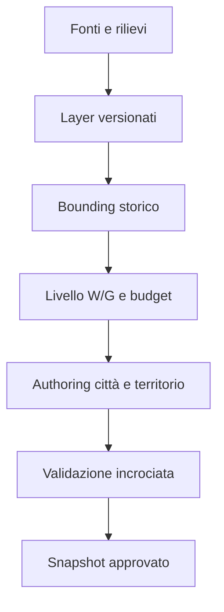

# Framework geografico e regionale

## Scopo

Definire coordinate, scale, confini, reti e provenienza geografica per tutte le regioni e gli insediamenti.

## Descrizione

La geografia separa terreno fisico, confini amministrativi, territori civici, bacini economici e aree culturali. Questi layer possono sovrapporsi e cambiare nel tempo.

## Ambito

Dal mondo imperiale aggregato allo spazio interno 1:1; comprende paleoambiente, idrologia, suolo, coste, strade e precisione.

## Layer canonici

| Layer | Unità | Versionamento | Consumer |
|---|---|---|---|
| coordinate/quote | punto, linea, poligono | datum e fonte | world/art/navigation |
| terreno/geologia | cella/bacino | fase storica | agricoltura, estrazione, rischio |
| idrologia/costa | rete/bacino | stagione e paleo-data | acqua, porto, salute |
| amministrazione | provincia/civitas/territorio | intervallo storico | diritto, tasse, politica |
| insediamento | impronta/gerarchia | snapshot | NPC, economia, contenuti |
| trasporto | edge/nodo | modalità/stagione | logistica, informazione |
| uso del suolo | parcella/cella | stagione/proprietà | produzione, proprietà |
| evidenza | feature → fonte/classe | review | audit storico |

## Scale

| Scala | Rappresentazione | Precisione |
|---|---|---|
| G0 imperiale | grafo di regioni e rotte | aggregata, tempi/rischi |
| G1 regionale | terreno, città, fiumi, strade | corridoi e bacini |
| G2 territorio civico | parcelle/siti principali | fonti permettendo |
| G3 insediamento | rete urbana e lotti | 1:1 nelle zone prodotte |
| G4 edificio | ambienti e accessi | rilievo/ricostruzione |
| G5 punto funzionale | porta, fontana, workstation | interazione precisa |

## Confini e incertezza

Ogni geometria ha `precision_class`: Surveyed, Reconstructed, Approximate, Design. Un confine amministrativo non diventa muro; un'area culturale non diventa giurisdizione. La costa moderna non sostituisce la paleo-costa.

## Contratto di regione

Identità e periodo; geometria; autorità; città e gerarchia; popolazione aggregata; ambiente; prodotti e consumi; culti e lingue; infrastrutture; rotte; rischi; eventi; fonti; regole locali che specializzano sistemi comuni.

## Flusso

## Dipendenze

- [Framework insediamenti](../settlements/settlement-framework.md)
- [Idrologia](hydrology.md)
- [Regioni](regions.md)
- [Cronologia](../../02-historical-foundation/chronology/official-timeline.md)

## Collegamenti agli altri documenti

- [Scale mappa](map-scales.md)
- [Terreno](terrain-and-biomes.md)
- [Rete Pompei](../../07-pompeii-demo/design/regional-connections.md)
- [Modello mondo](../world-model.md)

## Criteri di completamento

Layer e snapshot coerenti; precisione esplicita; nessuna costa o confine moderno retrodatato; edge con tempi e capacità; review geoarcheologica.

## Rischi di produzione

Mappe di fasi diverse sovrapposte, falsa precisione GIS, confusione tra regione amministrativa e culturale, costo eccessivo del territorio 1:1.

## Decisioni ancora aperte

- Datum, pipeline GIS e granularità G0–G5.
- Paleo-costa e idrologia della demo.

## TODO

- Creare schema metadata e atlante Pompei.
- Validare una seconda regione con geografia molto diversa.
