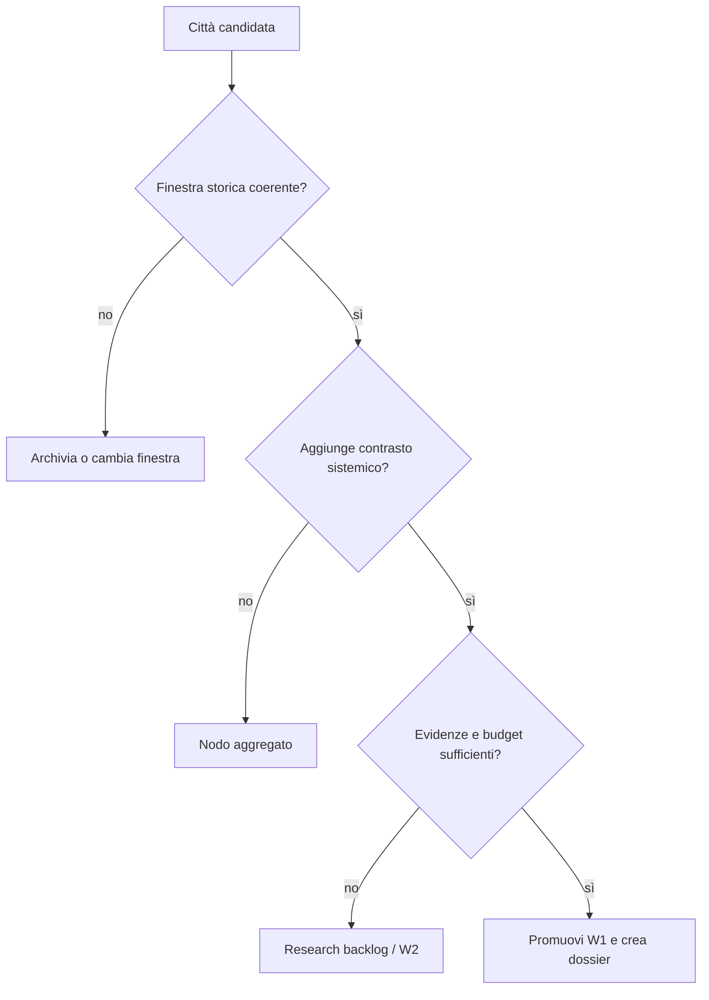

# Matrice riutilizzabile per città e insediamenti

## Scopo

Fornire la checklist comparabile con cui progettare circa 30–40 città senza trasformarle in copie di Pompei.

## Descrizione

Ogni riga diventa una sezione del dossier locale. I valori devono indicare classe A–E, fonte, owner e stato; campi non applicabili richiedono motivazione.

## Ambito

Città W0–W2; per W3–W5 si applica il sottoinsieme definito nel framework.

## Matrice di dossier

| ID | Area | Domande obbligatorie | Output | Consumer |
|---|---|---|---|---|
| CTY-01 | periodo | quale data/fase e quali cesure? | snapshot e timeline | tutti |
| CTY-02 | estensione | totale, giocabile, visibile, aggregata? | poligoni e metriche | world/performance |
| CTY-03 | scala | geometrica, temporale, demografica? | policy di scala | UX/simulazione |
| CTY-04 | quartieri | confini attestati o analitici? | zone con criteri | NPC/contenuti |
| CTY-05 | strade | gerarchia, fondo, pendenza, capacità, manutenzione? | grafo viario | movimento/logistica |
| CTY-06 | porte/mura | fasi, accessi, controllo, orari? | nodi e capacità | crimine/difesa |
| CTY-07 | edifici pubblici | funzioni, autorità, accesso, orari? | catalogo | politica/quest |
| CTY-08 | abitazioni | tipologie, occupancy, uso misto? | archetipi situati | household/NPC |
| CTY-09 | botteghe/mercati | attività, scorte, proprietà, clienti? | rete economica | economia |
| CTY-10 | religione | luoghi, culti, officianti, calendario? | rete rituale | religione/eventi |
| CTY-11 | terme/spettacoli | capacità, accesso, programma, costi? | venue | folla/audio |
| CTY-12 | infrastrutture | acqua, drenaggio, rifiuti, fuoco, manutenzione? | reti e failure | salute/eventi |
| CTY-13 | necropoli | localizzazione, fasi, gruppi, accesso? | fascia funeraria | religione/memoria |
| CTY-14 | territorio | suolo, colture, ville, aziende, estrazione? | hinterland | economia |
| CTY-15 | connessioni | porto, fiume, strade, distanze, stagioni? | grafo regionale | commercio/guerra |
| CTY-16 | popolazione | residenti/presenti, status, mobilità, confidenza? | scenari | NPC/performance |
| CTY-17 | élite/autorità | famiglie, magistrati, patroni, giurisdizioni? | grafo potere | politica/diritto |
| CTY-18 | economia | vantaggi, import/export, prezzi, rischio? | bilancio locale | economia |
| CTY-19 | culti/comunità | appartenenze e luoghi? | matrice sociale | religione |
| CTY-20 | criminalità | opportunità, controllo, denuncia, reti? | threat model diegetico | crimine |
| CTY-21 | attività | ritmi per luogo/status/stagione? | heatmap temporale | AI/audio |
| CTY-22 | eventi | ricorrenti, eccezionali, trasformativi? | catalogo/event graph | eventi |
| CTY-23 | Impero | quali dipendenze e ritardi? | edge interregionale | world sim |
| CTY-24 | gameplay | visitabile, utilizzabile, chiuso, simulato? | access tier | demo/UX |
| CTY-25 | validazione | fonti, controversie, licenze, test? | readiness | governance |

## Portfolio 30–40 città

Ogni candidata riceve punteggi 0–3 per rilevanza storica nella finestra, contrasto culturale, valore sistemico, qualità delle fonti, costo ambientale, riuso controllato, connessione alle reti e rischio di stereotipo. Il punteggio non decide da solo: crea shortlist W1/W2 e rende visibili i costi.

| Campo portfolio | Valore |
|---|---|
| City ID / nome | identificatore stabile; esonimi/endonimi |
| periodo e provincia | finestra specifica, non “Roma antica” |
| archetipo funzionale | capitale, porto, colonia, frontiera, santuario, produzione… |
| livello release | W1/W2/nodo aggregato |
| differenziatori | massimo tre, storicamente sostenuti |
| sistemi provati | economia, politica, guerra, religione, navigazione… |
| fonti | archeologia/corpora/studi e lacune |
| dipendenze | città/rotte/risorse collegate |
| costo | ambiente, NPC, lingua, sistemi, ricerca |
| rischio | uniformazione, sensitività, scarsità dati |
| gate | evidenza e feature richieste |

## Diagramma decisionale

## Dipendenze

- [Framework insediamenti](settlement-framework.md)
- [Framework storico](../../02-historical-foundation/historical-framework.md)

## Collegamenti agli altri documenti

- [Matrice imperiale](imperial-city-matrix.md)
- [Template fonte](../../appendices/templates/historical-source-template.md)
- [Pompei](../../07-pompeii-demo/pompeii-vertical-slice.md)

## Criteri di completamento

Tutti i CTY-01–25 hanno valore o motivazione N/A; classe/fonti e consumer sono collegati; livello W e budget sono approvati.

## Rischi di produzione

Checklist compilata senza ricerca, falsa comparabilità tra epoche, selezione guidata solo da fama e duplicazione di feature.

## Decisioni ancora aperte

- Città candidate e finestra cronologica dell'espansione.
- Peso dei criteri portfolio.

## TODO

- Creare shortlist 30–40 solo dopo approvazione della finestra imperiale.
- Eseguire un test con porto, frontiera e capitale.
