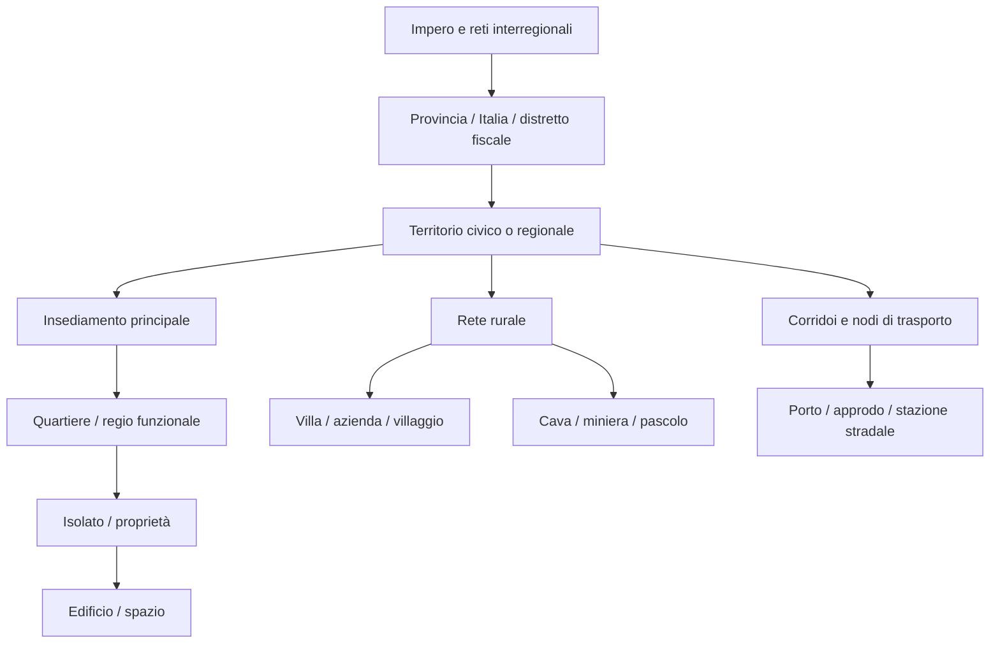
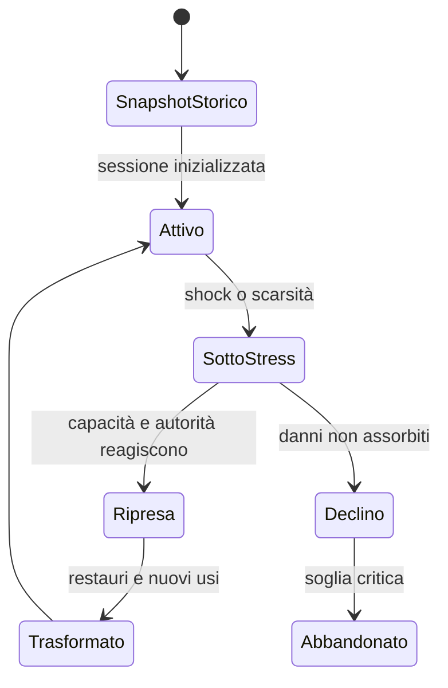

# Framework generale di regioni e insediamenti

**ID:** WRL-SET-001

**Stato:** Review

**Owner:** World Design / Historical Direction

## Scopo

Definire un modello riutilizzabile per regioni, città, villaggi, campi, ville, aziende agricole, cave, miniere, porti, accampamenti e stazioni stradali.

## Descrizione

Ogni luogo è un nodo storico, fisico e sistemico con confini, popolazione, capacità, autorità, flussi e memoria. Il framework evita di copiare Pompei come modello universale e permette di simulare 30–40 città con fedeltà diversa ma contratti comuni.

## Ambito

Authoring, simulazione, contenuti e validazione degli spazi. Sono esclusi rendering, streaming e implementazione UE5, descritti soltanto come requisiti futuri.

## Gerarchia canonica

Le *regiones* archeologiche di Pompei sono una griglia moderna di catalogazione e non vanno automaticamente trattate come quartieri sociali antichi.

## Scheda minima di ogni nodo

| Gruppo | Campi obbligatori |
|---|---|
| identità | ID stabile, nomi antichi/moderni, tipo, periodo, area, classe A–E |
| geometria | coordinate, superficie, scala, quota, confini fisici/amministrativi, precisione |
| accesso | porte, strade, sentieri, fiumi, porti, diritti, tempi e capacità |
| tessuto | quartieri, lotti, edifici, spazi aperti, mura, necropoli, infrastrutture |
| popolazione | residenti, presenti temporanei, livelli L0–L4, status e household |
| istituzioni | autorità, giurisdizioni, collegia, culti, patroni e famiglie influenti |
| economia | produzioni, consumi, scorte, mercati, lavoro, importazioni ed esportazioni |
| ambiente | clima, acqua, suolo, colture, rischi, rifiuti, malattie e animali |
| tempo | fase storica, routine, stagioni, calendario, trasformazioni ed eventi |
| gameplay | affordance, accessibilità, contenuti, limiti, fallback e metriche |
| fonti | primaria, archeologica, moderna, controversie, licenze e reviewer |

## Strati di una regione

| Strato | Possiede | Esempio di output |
|---|---|---|
| fisico | terreno, idrologia, edifici, capacità | percorribilità, danno, produzione |
| amministrativo | confini, status, autorità | tassazione, accesso, procedura |
| demografico | household, coorti, mobilità | domanda, lavoro, successione |
| economico | attività, mercati, rotte | prezzi, scorte, fallimenti |
| sociale | patronato, reputazione, gruppi | opportunità, protezione, conflitto |
| religioso | luoghi, calendari, pratiche | ritmi, spesa, legittimità |
| informativo | messaggeri, voci, iscrizioni | conoscenza locale, ritardi |
| storico | fasi, danni, restauri, divergenze | snapshot e trasformazioni |

## Modello della città

Una città deve documentare:

1. periodo e snapshot edilizio;
2. estensione totale, giocabile e simulata;
3. scala geometrica, temporale e demografica;
4. quartieri analitici e criteri, senza inventare confini sociali;
5. strade, porte, mura e gerarchia dei percorsi;
6. edifici pubblici, abitazioni, botteghe, mercati, templi, terme e spettacoli;
7. acqua, drenaggio, rifiuti, illuminazione e manutenzione;
8. necropoli e spazi periurbani;
9. campagna, aziende, cave, miniere, porto, fiume e strade esterne;
10. popolazione presente e residente, status, famiglie, autorità e culti;
11. economia, criminalità, routine ed eventi;
12. relazioni regionali e imperiali con tempo, costo, capacità e rischio.

## Stati e trasformazioni

Ogni trasformazione modifica capacità e uso, non “skin” soltanto. Un incendio chiude locali, sposta persone, crea domanda di materiali e lascia memoria.

## Livelli di dettaglio degli insediamenti

| Livello | Tipi | Geometria | Popolazione | Economia/eventi | Requisito minimo |
|---:|---|---|---|---|---|
| W0 | capitale/città protagonista | zone 1:1 selettive, rete completa | individui + coorti | filiere e istituzioni complete | dossier multidisciplinare S4 |
| W1 | città principale | hub 1:1 + quartieri aggregati | cast persistente + coorti | mercati e politica regionali | matrice completa, 3 loop |
| W2 | città secondaria | centro e accessi | cast ridotto + coorti | specializzazioni e shock | 1 loop completo + connessioni |
| W3 | villaggio/accampamento/porto | nucleo funzionale | household/unità chiave | 1–2 funzioni dominanti | capacità, autorità, rischio |
| W4 | villa/fattoria/cava/miniera/stazione | sito o nodo | operatori aggregati | input/output/capacità | scheda produttiva/logistica |
| W5 | area rurale/transito | celle e corridoi | densità/coorti | raccolti, rischio, movimento | suolo, percorso, stagione |

Il livello non indica importanza storica: indica costo e risoluzione nella release corrente.

## Regole per tipo di sito

| Tipo | Obblighi specifici |
|---|---|
| capitale | corte/senato o autorità equivalenti, approvvigionamento, quartieri multipli, rete interregionale |
| città principale | istituzioni civiche, mercato regionale, culti e infrastrutture stratificate |
| città secondaria | rapporto col territorio, élite locali, specializzazione e dipendenze |
| villaggio | household, terra, acqua, luogo di culto/scambio, autorità esterna |
| accampamento | unità, pianta/fase, disciplina, scorte, difesa, rapporto coi civili |
| villa | parte residenziale/produttiva, proprietà, lavoro, stagionalità, accesso |
| azienda agricola | colture, suolo, acqua, lavoro, attrezzi, stoccaggio, resa e rischio |
| cava/miniera | materiale, giacimento, estrazione, manodopera, sicurezza, trasporto, scarti |
| porto | bacino/approdo, fondali, magazzini, dogane/autorità, stagionalità e hinterland |
| stazione stradale | strada, distanza, cambio/riposo, acqua, sicurezza e servizi |
| area rurale | uso del suolo, proprietà, insediamento disperso, sentieri, visibilità e pericoli |

## Flusso di authoring

Ricerca → bounding storico → modello di rete → budget W0–W5 → blocco funzionale → popolazione/economia → contenuti → validazione storica → simulazione longitudinale → promozione.

## Dipendenze

- [Framework geografico](../geography/geographic-framework.md)
- [Modello del mondo](../world-model.md)
- [Simulazione](../../04-simulation/simulation-architecture.md)
- [Standard storico](../../02-historical-foundation/historical-framework.md)

## Collegamenti agli altri documenti

- [Template città](city-template.md)
- [Matrice città imperiali](imperial-city-matrix.md)
- [Strutture](../structures/README.md)
- [Siti rurali](../rural-sites/README.md)

## Rischi di produzione

| Rischio | Segnale | Mitigazione |
|---|---|---|
| scala prima della densità | molte città senza loop | gate W0 Pompei prima di W1 |
| falsa uniformità imperiale | template riempiti con stessi valori | moduli regionali/cronologici e review |
| precisione geometrica senza gameplay | costo ambientale inutilizzato | ogni zona deve sostenere capacità e loop |
| dati archeologici incompatibili | mappe di fasi diverse | snapshot e provenance per layer |
| esplosione di NPC | individui senza funzione | livelli demografici e budget |

## Criteri di completamento

- Scheda minima completa e fonti A–E.
- Confini giocabili/simulati e scala espliciti.
- Almeno un ciclo economico-sociale end-to-end.
- Dipendenze esterne con tempi e capacità.
- Eventi, trasformazioni e fallback testabili.
- Rischi, controversie e licenze registrati.

## Decisioni ancora aperte

- Elenco e ordine delle 30–40 città oltre Pompei.
- Budget quantitativi W0–W5 e piattaforme.
- Modello geografico globale della prima release completa.

## TODO

- Assegnare owner di regione.
- Applicare il framework a Pompei e a una città provinciale contrastante come test.
