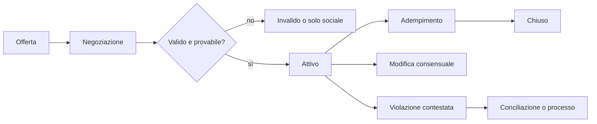

# Contratti e obbligazioni economiche

## Scopo

Specificare accordi verificabili che coordinano lavoro, locazione, vendita, trasporto, società, credito e fornitura.

## Descrizione

Un contratto è un impegno tra soggetti con capacità, oggetto lecito, condizioni, prove e rimedi contestuali. Il sistema distingue accordo sociale, obbligazione economica ed eseguibilità giuridica.

## Ambito

Offerta, negoziazione, conclusione, adempimento, modifica, cessione, controversia e chiusura. Non pretende di ridurre il diritto romano a un contratto moderno universale.

## Modello e regole

| Dato | Funzione |
|---|---|
| Parti e ruoli | debitore, creditore, garanti, intermediari |
| Capacità/status | determina atti consentiti e rappresentanza |
| Oggetto | bene, servizio, uso, denaro o risultato |
| Prestazioni | quantità, qualità, luogo, tempo e responsabilità |
| Condizioni | sospensive, risolutive, tolleranze e forza maggiore |
| Prova | documento, sigillo, testimoni, registrazione, possesso |
| Rimedio/foro | negoziazione, restituzione, penale, arbitrato o processo |

Invarianti: consenso informato per quanto compatibile con status e contesto; nessun trasferimento prima della condizione prevista; una modifica conserva lo storico; un contratto non crea beni; l'autorità del rappresentante è verificata.

## Stati e flusso

## Input, output ed eventi

Input: identità, status, diritti, inventari, capacità, reputazione, condizioni di mercato e autorità. Output: obbligazioni, riserve di beni/fondi, trasferimenti, ricevute, reputazione e casi. Produce `ContractProposed`, `ContractActivated`, `PerformanceDue`, `ContractFulfilled`, `ContractDisputed`; ascolta morte, emancipazione, confisca, perdita del carico, evento di forza maggiore e decisione giudiziaria.

## Errori, casi limite e persistenza

Oggetto inesistente, doppia vendita, rappresentante privo di mandato, parte morta, scadenza durante time-skip, misura ambigua e clausole incompatibili sospendono l'esecuzione e generano verifica. Si persistono versioni, firme/prove, prestazioni, riserve, pagamenti e contenzioso. Le operazioni di trasferimento sono atomiche e idempotenti.

## Dipendenze

- [Modello economico](economic-model.md)
- [Proprietà](property.md)
- [Credito e debiti](credit-and-debt.md)
- [Diritto](../politics-law/law-framework.md)

## Collegamenti agli altri documenti

- [Lavoro](labor.md)
- [Trasporto](transport.md)
- [Commercio](trade.md)
- [Questioni aperte](../../00-governance/open-questions.md)

## Strategie di test e criteri di completamento

Testare capacità, adempimento parziale, doppia esecuzione, modifica, morte, controversia, aggregazione e reload. Completato quando ogni trasferimento contrattuale è spiegabile, conservativo, revocabile solo tramite evento autorizzato e collegato alle prove.

## Decisioni ancora aperte

- Tassonomia storica minima dei contratti nella vertical slice.
- Forma di presentazione al giocatore senza linguaggio giuridico moderno.

## TODO

- Creare esempi attestati per locazione, trasporto, lavoro e vendita.
- Mappare i rimedi per status nella data di Pompei.
