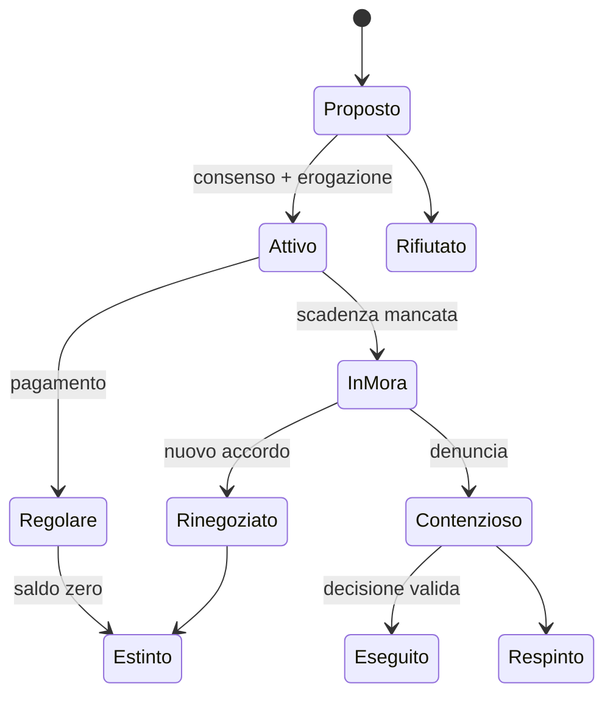

# Credito, debito e insolvenza

## Scopo

Definire obbligazioni monetarie persistenti senza trasformare il credito in denaro gratuito o in una spirale punitiva inevitabile.

## Descrizione

Il credito collega fabbisogno, fiducia, garanzie, reputazione e potere sociale. Ogni debito ha parti, capitale, causa, calendario, interesse o corrispettivo, prove, garanzie e rimedi; nessuna somma nasce dalla sola registrazione contabile.

## Ambito

Prestiti, anticipi, acquisti differiti, interessi, garanzie personali o reali, cessione, rimborso, mora, rinegoziazione e insolvenza. La validità giuridica dipende da epoca, status e foro: i valori storici restano configurabili e classificati nel dossier delle fonti.

## Visione e requisiti

- Il creditore deve possedere o raccogliere il capitale erogato.
- Capitale residuo, pagamenti e interessi sono tracciati separatamente.
- L'interesse è concordato per periodo; niente capitalizzazione implicita.
- Fiducia, patronato, parentela, collegium, garanzia e rischio influenzano accesso e condizioni.
- L'insolvenza apre conseguenze negoziali, patrimoniali, reputazionali e giudiziarie; non trasferisce automaticamente persone o beni.
- Un prestito aggregato conserva saldi, scadenze, parti e garanzie quando torna in simulazione dettagliata.

## Dati posseduti

| Entità | Campi minimi |
|---|---|
| `CreditAgreement` | ID, creditore, debitore, causa, capitale iniziale/residuo, valuta di conto, tasso, periodo, scadenze, foro, prove, stato |
| `Security` | tipo, garante o diritto vincolato, priorità, valore stimato, validità |
| `PaymentRecord` | data, importo, quota capitale, quota interesse, mezzo, testimoni/ricevuta |
| `DefaultCase` | mora, notifiche, tentativi, rimedio, esito, autorità |

## Stati e transizioni

## Flussi principali e alternativi

1. Richiesta: il debitore dichiara scopo e condizioni.
2. Valutazione: liquidità, rischio, reputazione e garanzie.
3. Accordo: consenso, prove e calendario.
4. Erogazione atomica: diminuisce la disponibilità del creditore e aumenta quella del debitore.
5. Servizio: pagamenti registrati, scadenze aggiornate.
6. Chiusura o mora.

Alternative: anticipo su consegna, credito del fornitore, garanzia del patrono, prestito collettivo, rinegoziazione, remissione, cessione documentata. Frode, coercizione e incapacità giuridica inviano il caso a diritto e criminalità.

## Bilanciamento, errori e casi limite

- Limiti di esposizione per soggetto e impresa; rischio crescente, non divieto arbitrario.
- Fallimento non equivale a game over: perdita di beni, lavoro vincolato da accordi leciti, reputazione, protezione o processo sono esiti distinti.
- Morte: credito e debito entrano nell'asse ereditario solo secondo regole valide.
- Creditore privo di liquidità, pagamenti duplicati, date saltate, garante morto e garanzia già alienata bloccano l'operazione e aprono revisione.
- Simulazioni di stress verificano usura sistemica, indebitamento infinito e prestiti circolari.

## Prestazioni e persistenza

Accordi del giocatore, scaduti o contestati restano individuali. Portafogli remoti regolari possono essere aggiornati per lotto temporale; maturazione e pagamenti devono essere deterministici e idempotenti. Si persistono contratto, saldi, calendario, prove, garanzie e controversie.

## Dipendenze

- [Contratti](contracts.md)
- [Moneta](currency.md)
- [Proprietà](property.md)
- [Diritto](../politics-law/law-framework.md)
- [Relazioni](../npc-population-ai/relationships.md)

## Collegamenti agli altri documenti

- [Modello economico](economic-model.md)
- [Prezzi](prices.md)
- [Eredità](../family-social/inheritance.md)
- [Matrice delle dipendenze](../../00-governance/system-dependency-matrix.md)

## Strategie di test e criteri di completamento

- Conservazione monetaria su erogazione/rimborso; arrotondamenti riproducibili.
- Test di mora, rinegoziazione, successione, garanzia concorrente, aggregazione e save/load.
- Completato quando ogni debito ha provenienza, prove, transizioni valide e conseguenze verificabili senza duplicazioni.

## Decisioni ancora aperte

- Convenzione temporale e arrotondamento degli interessi della demo.
- Rimedi disponibili per status e foro nella data canonica di Pompei.

## TODO

- Collegare valori attestati al dossier economico storico.
- Definire scenari di credito per cittadino, liberto e schiavo.
