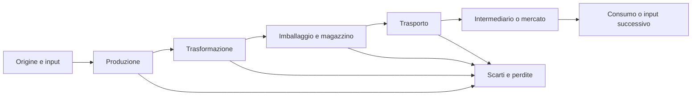

# Filiere economiche canoniche

## Scopo

Definire origine, trasformazione, logistica, consumo e rischi delle filiere necessarie alla simulazione, con dettaglio scalabile e senza valori pseudo-storici non verificati.

## Descrizione

Una filiera è un grafo di ricette, capacità, lavoro, lotti, rotte, mercati e consumatori. Ogni passaggio conserva quantità secondo rese configurate, registra perdite e genera costi. Prezzi e tempi sono classi relative finché il dossier storico locale non assegna valori attestati.

## Ambito

Ventuno filiere minime: alimenti, tessili, materiali, manifatture, lusso, medicina e trasferimenti coercitivi di persone schiavizzate. Il documento descrive il modello condiviso e i dossier di design; agricoltura, artigianato e logistica mantengono le regole specialistiche.

## Template dati comune

| Campo | Contenuto obbligatorio |
|---|---|
| Origine | area, produttore, stagionalità e attendibilità storica |
| Produzione/trasformazione | input, output, resa, scarti, capacità, ricetta |
| Strumenti/lavoratori | attrezzature, competenze, status e condizioni |
| Tempi | classe breve/media/lunga, calendario e colli di bottiglia |
| Trasporto/magazzino | mezzo, rotta, volume, custodia, condizioni |
| Intermediari/mercati/clienti | attori e nodi di scambio |
| Sprechi/deterioramento | perdita normale, qualità, scadenza o rottura |
| Rischi/eventi | meteo, incendio, guerra, epidemia, frode, politica |
| Prezzo | fascia relativa, componenti di costo, fonte futura |

## Flusso canonico

## Filiere alimentari

| Filiera | Origine e produzione | Trasformazione, strumenti, lavoratori e tempi | Trasporto, magazzini e intermediari | Mercati/clienti, deterioramento e prezzo | Rischi ed eventi |
|---|---|---|---|---|---|
| Grano | fondi locali e importazioni regionali; semina, cura, mietitura | aratro/attrezzi, squadre rurali di status diversi; ciclo stagionale lungo; trebbiatura e vagliatura | sacchi o contenitori, carri/navi; granai; proprietari, affittuari, mercanti | panifici, famiglie, autorità; umidità, infestanti e calo peso; fascia base ma volatile | siccità, pioggia, requisizioni, guerra, blocco rotta, incendio |
| Pane | farina da grano, acqua, lievito/impasto | molitura, impasto e forno; mugnai, fornai, addetti; ciclo breve ripetuto | distribuzione urbana breve; deposito secco di grano/farina, pane giornaliero | consumo domestico, taverne e distribuzioni; rapido raffermamento; prezzo da farina, combustibile e lavoro | carenza grano, guasto mola, incendio forno, controllo pubblico, folla |
| Vino | vigneti locali/regionali, vendemmia | pigiatura, fermentazione, affinamento e miscelazione; torchi, dolia/anfore; stagionale + maturazione | anfore, carri/navi, cantine; produttori, negotiatores, osti | famiglie, cauponae, élite, rituali; ossidazione/perdite; fasce da comune a prestigio | vendemmia scarsa, contaminazione, rottura, pirateria, moda |
| Olio | oliveti, raccolta stagionale | frangitura e pressatura; mole, presse, manodopera; ciclo medio | anfore, magazzini freschi; proprietari, frantoi, mercanti | cucina, luce, cura, terme e rituali; irrancidimento/perdite; fascia media variabile per qualità | raccolto, incendio, rottura, domanda religiosa/termale, rotta interrotta |
| Carne | allevamenti, caccia limitata, macellazione autorizzata/localizzata | allevamento lungo; macellazione e porzionatura breve; allevatori, macellai, addetti | animali vivi o tagli su tratte brevi; recinti e banchi | famiglie abbienti, taverne, sacrifici; deperimento molto rapido salvo trattamento; fascia medio-alta | malattia animale, caldo, festa/sacrificio, divieto o ispezione |
| Pesce | pesca costiera/fluviale e allevamento dove attestato | cattura, selezione, salagione/essiccazione; barche, reti, vasche; breve e stagionale | fresco su tratte brevi, conservato su lunghe; ceste/anfore | mercati, case, taverne, trasformatori; fresco altamente deperibile; prezzo da specie/distanza | mare, cattiva pesca, caldo, contaminazione, porto chiuso |
| Garum | pesce e parti, sale, impianti costieri | fermentazione e filtraggio; vasche, anfore, addetti specializzati; ciclo lungo | anfore sigillate, nave/carro, magazzino | cucine, taverne, élite; perdite da contenitore/qualità; più fasce | sale scarso, contaminazione, odori/conflitti urbani, naufragio, reputazione produttore |

## Filiere tessili e animali

| Filiera | Origine e produzione | Trasformazione, strumenti, lavoratori e tempi | Trasporto, magazzini e intermediari | Mercati/clienti, deterioramento e prezzo | Rischi ed eventi |
|---|---|---|---|---|---|
| Lana | greggi e tosatura stagionale | lavaggio, cardatura, filatura; fusi/telai a valle; pastori e lavoratori domestici/artigiani | balle asciutte; fattorie, fullonicae/botteghe, mercanti | tessitori, famiglie, esercito; tarme/umidità; fascia per finezza e pulizia | epidemia animale, clima, furto, domanda militare |
| Tessuti | lana, lino e altri input attestati per luogo/epoca | filatura, tessitura, follatura, tintura e finitura; telai, vasche; tempi medi/lunghi | rotoli/balle, botteghe e magazzini asciutti; produttori/mercanti | abbigliamento, casa, esercito, élite; macchie, tarme, scolorimento; fascia ampia | coloranti scarsi, acqua, incendio, moda, commessa pubblica |
| Cuoio | pelli da macellazione/allevamento | scuoiatura, concia, taglio e cucitura; coltelli, vasche; conciatori e artigiani; medio | pelli protette dall'umidità; concerie, calzolai, sellai | calzature, finimenti, equipaggiamento; muffa/secchezza; prezzo da qualità e taglia | bestiame scarso, contaminazione acqua, incendio, domanda militare |

## Materiali e manifatture

| Filiera | Origine e produzione | Trasformazione, strumenti, lavoratori e tempi | Trasporto, magazzini e intermediari | Mercati/clienti, deterioramento e prezzo | Rischi ed eventi |
|---|---|---|---|---|---|
| Legname | boschi e fondi gestiti; taglio selettivo | abbattimento, stagionatura, segagione; asce/seghe; boscaioli e carpentieri; medio/lungo | carri, fiumi, mare; piazzali asciutti; grossisti | edilizia, cantieri, mobili, combustibile; marcescenza/incendio; costo dominato da massa/distanza | incendio, pioggia, esaurimento locale, guerra, domanda navale/edile |
| Ceramica | argilla, acqua, combustibile | estrazione, depurazione, foggiatura, essiccazione, cottura; ruota/forno; vasai; medio | impilaggio fragile, officine e depositi; distributori | casa, trasporto, edilizia; rottura; fascia bassa/alta per forma e decorazione | forno fallito, combustibile, argilla, incendio, picco domanda anfore |
| Vetro | materie prime e rottame secondo provenienza attestata | fusione o lavorazione di semilavorati, soffiatura/stampo; fornaci; specialisti; medio | casse/protezioni, botteghe; importatori di materia/semilavorato | contenitori, finestre e lusso; rottura ma riciclabile; fascia medio-alta | combustibile, rotta, rottura, incendio, competenza rara |
| Metalli | miniere e riciclo; minerale/lingotti importati | estrazione, arricchimento, fusione e raffinazione; forni, mantici; minatori/fonditori; lungo | lingotti pesanti via nave/carro; depositi sicuri; appaltatori/mercanti | fabbri, zecche/autorità, edilizia, esercito; corrosione/furto; alto costo energetico/logistico | crollo miniera, guerra, confisca, combustibile, rotta, domanda statale |
| Pietra | cave locali/regionali | estrazione, squadratura, finitura; cunei, leve, scalpelli; cavatori/lapicidi; lungo | carri/slitte/navi, piazzali; imprenditori di cantiere | edilizia e infrastrutture; rottura/scarti; costo dominato da trasporto e lavoro | crollo, incidente, strada impraticabile, commessa pubblica |
| Marmo | cave regionali specializzate e recupero | blocchi, taglio, scultura/lucidatura; specialisti; molto lungo | navi e trasporto pesante; depositi di progetto; grandi intermediari | élite, templi, edifici pubblici; rottura/errore irreversibile; lusso | naufragio, politica, commessa imperiale, cava/rotta, moda |
| Armi | metalli, legno, cuoio e componenti | forgiatura, trattamento, assemblaggio, affilatura, prova; fabbri specializzati; medio | casse/depositi controllati; officine, fornitori militari, mercato lecito/illecito | esercito, guardie, privati secondo regole; usura/corrosione; medio-alto | guerra, requisizione, licenze, furto, metallo scarso, controllo autorità |
| Utensili | metallo, legno, pietra e cuoio | forgia, fusione, carpenteria, assemblaggio/riparazione; artigiani; breve/medio | botteghe e mercati locali; riparatori e venditori | agricoltori, artigiani, edilizia, famiglie; usura/rottura; fascia per materiale/qualità | picco agricolo/edile, metallo scarso, incendio bottega, innovazione locale |

## Lusso e salute

| Filiera | Origine e produzione | Trasformazione, strumenti, lavoratori e tempi | Trasporto, magazzini e intermediari | Mercati/clienti, deterioramento e prezzo | Rischi ed eventi |
|---|---|---|---|---|---|
| Profumi | oli, resine, fiori, spezie locali/importate | macerazione, miscelazione, filtraggio; recipienti e bilance; profumieri; medio | piccoli contenitori protetti; mercanti specializzati | élite, cura, rituali e funerali; volatilità/contaminazione; lusso | ingrediente raro, adulterazione, moda, festa, rotta lunga |
| Medicinali | erbe, minerali, prodotti animali dove attestati | raccolta, essiccazione, macinazione, miscela; mortai/bilance; raccoglitori e praticanti; breve/medio | contenitori etichettati e asciutti; speziali/praticanti/mercati | malati, famiglie, strutture e veterinaria; perdita potenza/contaminazione; molto variabile | epidemia, raccolto, frode, diagnosi errata, ingrediente raro |

## Persone schiavizzate e trasferimenti coercitivi

| Campo | Specifica di design |
|---|---|
| Origine | nascita in schiavitù, guerra, vendita o altri percorsi soltanto se validi per data/luogo; provenienza e storia individuale persistono |
| “Produzione/trasformazione” | non applicabile: nessun NPC viene fabbricato, trasformato in merce o consumato; competenze, salute e relazioni evolvono come per ogni persona |
| Strumenti/lavoratori/tempi | intermediari, proprietari e autorità agiscono nel sistema coercitivo; pratiche e durata richiedono fonti e conseguenze |
| Trasporto/magazzino | movimento forzato è un evento su NPC con salute, paura, fuga, custodia e testimonianze; mai stock anonimo vicino al giocatore |
| Intermediari/mercati/clienti | ogni trasferimento registra parti, autorità, prezzo/obbligazione, prove e nuova relazione giuridica; il compratore non acquisisce “inventario” |
| Spreco/deterioramento | categorie non applicabili alle persone; malattia, trauma, morte e separazione familiare sono danni umani persistenti |
| Prezzo | se simulato, è attributo storico dell'atto coercitivo, non valore intrinseco della persona; influenzato dal contesto e soggetto ad audit |
| Rischi/eventi | violenza, abuso, fuga, resistenza, manomissione, separazione, denuncia, guerra e mutamento di status; trattazione non celebrativa |

## Livelli di simulazione e aggregazione

- E0: lotti, qualità, proprietari, lavoratori e passaggi visibili.
- E1: impresa/edificio conserva capacità, scorte, ordini e forza lavoro.
- E2: mercato cittadino compensa flussi aggregati mantenendo attori rilevanti.
- E3: città non caricata aggiorna saldi per intervalli e genera eccezioni.
- E4: regione/rotta usa capacità, costo, rischio e disponibilità.
- E5: Impero genera condizioni esterne e corridoi, non singole transazioni.

Le persone, i contratti, i diritti unici, i lotti del giocatore e le controversie non sono mai cancellati dall'aggregazione. Un raccolto personale modifica l'impresa e il mercato locale in proporzione alla sua quota verificata, non l'indice imperiale.

## Bilanciamento e casi limite

Rese, tempi e fasce di prezzo devono essere data-driven e localizzati. Colli di bottiglia devono offrire alternative (sostituzione, importazione, riparazione, credito) senza garantire successo. Zero offerta, domanda negativa, cicli di ricetta, scorte duplicate, qualità fuori intervallo, rotta senza capacità e produttore morto bloccano o degradano esplicitamente il flusso.

## Dipendenze

- [Produzione](production.md)
- [Agricoltura](agriculture.md)
- [Artigianato](craftsmanship.md)
- [Trasporto](transport.md)
- [Magazzini](warehousing.md)
- [Prezzi](prices.md)

## Collegamenti agli altri documenti

- [Modello economico](economic-model.md)
- [Professioni](../professions-education/professions.md)
- [Salute](../health-medicine/health-system.md)
- [Schiavitù](../family-social/slavery.md)
- [Pompei economica](../../07-pompeii-demo/demo-economy.md)

## Strategie di test, prestazioni e persistenza

- Test di conservazione per ogni ricetta, perdita, trasporto e vendita.
- Test di shock, sostituzione, percorso interrotto, aggregazione/disaggregazione e save/load.
- Profilare numero di lotti, ordini e nodi; aggiornare E2–E5 a intervalli con budget e risultati deterministici.
- Persistono lotti rilevanti, saldi di mercato, capacità, ordini, rotte, shock e provenienza.

## Criteri di completamento

Ogni filiera possiede tutti i campi del template, almeno un percorso completo Pompei-origine-consumo, rese conservative, eventi, proprietari dei dati, copertura storica e test E0–E5.

## Decisioni ancora aperte

- Filiere P0 effettivamente attive nella demo oltre grano-pane, vino, olio, ceramica e tessili.
- Valori storici di rese, tempi, capacità e fasce di prezzo per la data canonica.

## TODO

- Allegare dossier di fonti per ciascuna filiera P0.
- Creare grafi di ricetta e nodi logistici specifici di Pompei.
