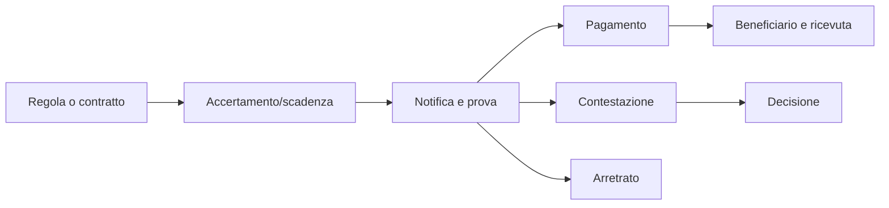

# Tasse, tributi, canoni e affitti

## Scopo

Definire obbligazioni periodiche o transazionali verso autorità e proprietari con base, competenza, prova e destinazione esplicite.

## Descrizione

Imposte, dazi, canoni e affitti non sono “money sink” indistinti. Ogni prelievo ha soggetto competente, contribuente, base, periodo, esenzione, riscossione, ricorso e beneficiario; ogni affitto nasce da diritto d'uso e contratto.

## Ambito

Fiscalità locale/imperiale pertinente alla data, dazi e tariffe, canoni, affitti di abitazioni/terre/botteghe, arretrati, esenzioni, riscossione, corruzione e controversie. Forme non attestate restano E/D.

## Modello e flussi

`ObligationRule` definisce autorità, area, periodo, base e validità; `Assessment` calcola il dovuto con prove; `Liability` registra debitore, saldo e scadenza; `Collection` trasferisce valore al beneficiario. Affitto: titolo del locatore → contratto d'uso → canone/deposito → manutenzione → rinnovo/restituzione/lite.

## Regole, eventi e casi limite

Nessuna autorità tassa fuori giurisdizione; nessun proprietario concede uso incompatibile con titolo/vincolo. Produce `AssessmentIssued`, `RentDue`, `Paid`, `ArrearsOpened`, `LeaseEnded`; ascolta vendita, morte, distruzione, status, esenzione e decisione. Doppio accertamento, immobile distrutto, cambio proprietario, assenza del contribuente e pagamento in natura richiedono riconciliazione.

## Bilanciamento, prestazioni e persistenza

Gli importi derivano da basi storiche/configurabili, non scalano occultamente col livello del player. Pressione e servizi/uscite dell'autorità sono misurati separatamente. Obbligazioni remote sono aggiornate per periodo; player, immobili P0, arretrati e controversie restano individuali. Persistono regola/versione, valutazione, prove, saldi, pagamenti e ricorsi.

## Dipendenze

- [Proprietà](property.md)
- [Contratti](contracts.md)
- [Credito](credit-and-debt.md)
- [Amministrazione](../politics-law/administration.md)

## Collegamenti agli altri documenti

- [Finanza pubblica](../politics-law/public-finance.md)
- [Corruzione](../politics-law/corruption.md)
- [Bilanciamento](economic-balancing.md)

## Test e criteri di completamento

Testare giurisdizione, esenzione, pagamento, arretrato, alienazione, distruzione, ricorso, aggregazione e save/load. Completato quando ogni prelievo P0 ha fonte storica, autorità, beneficiario e conseguenza verificabili.

## Decisioni ancora aperte

- Prelievi e forme locative pertinenti alla Pompei canonica.
- Responsabilità di manutenzione e rimedi per status.

## TODO

- Costruire matrice autorità-base-periodo-fonte.
- Collegare immobili P0 e scenari di morosità.
