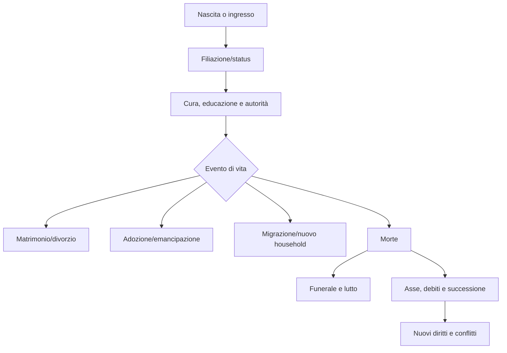

# Famiglia, household e successione

## Scopo

Definire parentela biologica, giuridica, affettiva e convivenza come strutture persistenti ma non coincidenti.

## Descrizione

La famiglia è una rete di filiazione, matrimonio, adozione, autorità, cura, obblighi, beni e memoria. L'household è l'unità concreta di coabitazione e risorse; una persona può appartenere a reti familiari e domestiche differenti.

## Ambito

Nascita, filiazione, patria potestas quando applicabile, tutela, matrimonio, divorzio, adozione, emancipazione, figli, household, morte, funerale ed eredità. Regole differenziate per status, sesso, età, periodo e giurisdizione.

## Modello dati

`KinshipLink` registra tipo, origine, validità e prove; `HouseholdMembership` residenza, ruolo, dipendenza e quote; `AuthorityRelation` ambito e limiti; `MarriageUnion`, `AdoptionAct`, `EmancipationAct`, `Estate` e `SuccessionCase` mantengono lifecycle separati.

## Regole

- Parentela, affetto, coabitazione, autorità e proprietà non sono sinonimi.
- La patria potestas è una relazione giuridica contestuale, non controllo mentale né permesso universale di violenza.
- Matrimonio richiede capacità/consenso secondo profilo storico; dote, beni e alleanze restano entità distinte.
- Divorzio scioglie un'unione ma apre residenza, beni, figli, reputazione e alleanze; non cancella la storia.
- Adozione modifica filiazione giuridica tramite atto valido; non riscrive memoria o legami affettivi.
- Morte congela il patrimonio, paga obblighi validi, applica testamento/successione e trasferisce titoli una sola volta.

## Ciclo e flussi

## Interazioni ed eventi

Produce `KinshipEstablished`, `MarriageChanged`, `AuthorityChanged`, `HouseholdSplit`, `EstateOpened`, `InheritanceSettled`; ascolta nascita, status, proprietà, debito, malattia, morte, processo e migrazione. Conseguenze economiche, reputazionali, politiche, religiose e narrative persistono.

## Casi limite e accuratezza

Paternità contestata, adozione concorrente, coniuge assente, divorzio durante debito, erede morto, testamenti incompatibili, minore e household estinto aprono casi espliciti. Ogni forma familiare e capacità è datata/localizzata A–E; evitare il modello nucleare moderno come default.

## Prestazioni e persistenza

Legami significativi restano individuali a ogni livello; coorti possono aggregare soltanto distribuzioni. Save/load conserva genealogia, household, autorità, unioni, atti, patrimonio e casi successori.

## Dipendenze

- [Household](household.md)
- [Matrimonio](marriage.md)
- [Adozione ed emancipazione](adoption-emancipation.md)
- [Eredità](inheritance.md)
- [Status](social-status.md)

## Collegamenti agli altri documenti

- [Proprietà](../economy-production/property.md)
- [Debiti](../economy-production/credit-and-debt.md)
- [Religione domestica](../religion-calendar/domestic-religion.md)
- [Politica](../politics-law/political-system.md)

## Test e Definition of Done

Testare l'intero ciclo, grafi senza paradossi, matrimonio/divorzio, adozione, emancipazione, morte, debiti, successione, aggregazione e continuazione con erede. S4 dopo matrice storica P0 e scenari per i tre status demo.

## Decisioni ancora aperte

- Regole P0 di matrimonio, dote, tutela e successione.
- Condizioni per continuare come figlio, adottato o altro erede.

## TODO

- Allineare sottodocumenti specialistici al modello.
- Collegare famiglie/household della demo agli edifici P0.
