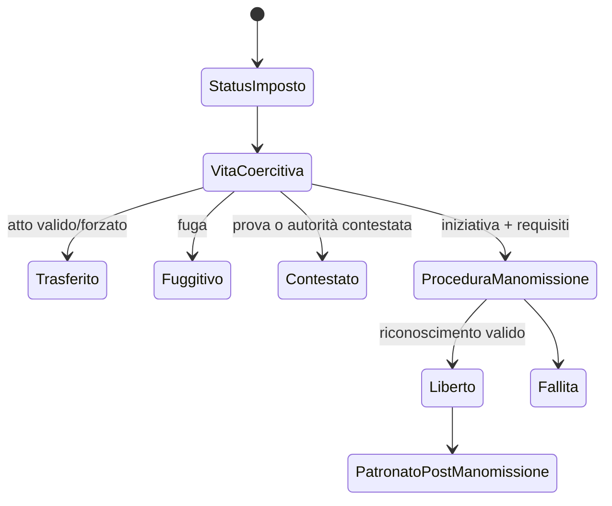

# Schiavitù, coercizione e manomissione

## Scopo

Rappresentare la schiavitù romana come istituzione violenta, giuridica, economica e sociale, senza romanticizzazione, spettacolarizzazione o riduzione decorativa.

## Descrizione

La persona schiavizzata è sempre un NPC persistente. Il sistema registra la pretesa giuridica esercitata su di lei, custodia, lavoro imposto, violenza, reti, famiglia, resistenza, fuga e possibilità non garantita di manomissione. Non esistono “unità schiavo” anonime né stack inventariali.

## Ambito

Origini e trasferimenti storicamente validi, vita domestica/rurale/artigianale, coercizione, sanzioni, peculio solo quando applicabile, relazioni, fuga, vendita, separazione familiare, manomissione e condizione dei liberti. Differenze regionali/temporali obbligatorie.

## Invarianti etici e sistemici

- Identità, memoria, salute, parentela e conoscenze non appartengono al proprietario.
- Un trasferimento modifica una relazione giuridica coercitiva, non crea o consuma una persona.
- Violenza e abuso producono danni, testimoni, paura, reputazione e conseguenze; mai buff produttivi gratuiti.
- Agency significa scelte situate sotto costrizione, non libertà fittizia.
- Manomissione è una procedura con motivazioni, autorità, condizioni e conseguenze; non una ricompensa morale automatica.
- Nessun percorso tratta l'acquisto di persone come collezionismo o power fantasy.

## Dati

| Gruppo | Dati |
|---|---|
| Persona | biografia, origine, competenze, salute, paure, desideri, legami, memoria |
| Status | base dichiarata, titolare della pretesa, autorità, prove, area/periodo, contestazioni |
| Coercizione | ordini, sorveglianza, restrizioni, violenze, minacce, possibilità di rifiuto/fuga |
| Economia | lavoro, condizioni, eventuali risorse gestite, debiti/obblighi altrui; mai valore intrinseco |
| Manomissione | iniziatore, forma, requisiti, testimoni, costi, validità e patronato successivo |

## Conseguenze

- **Sociali:** stigma, isolamento o reti, dipendenza, conflitti household, solidarietà, separazione.
- **Economiche:** lavoro coercitivo, concentrazione di potere, sostituzione/concorrenza, costi di controllo, perdita di capacità per danno o fuga.
- **Giuridiche:** capacità limitate, rappresentanza, testimonianza/protezione contestuali, punizioni e vulnerabilità differenziate.
- **Narrative:** memorie, lutti, resistenza, compromessi, responsabilità, manomissione, ricongiungimento o fallimento; nessun arco redentivo obbligatorio per il dominus.

## Flussi

## Liberti e mobilità

La manomissione cambia status ma non cancella trauma, origine, famiglia, reputazioni o obblighi. Il liberto può possedere competenze, patrimonio, reti e opportunità, ma incontra vincoli giuridici/sociali dipendenti da epoca e luogo. Successo economico non equivale automaticamente a pieno accesso politico; figli e discendenza seguono regole validate separatamente.

## Differenze regionali e accuratezza

Ogni origine, pratica, mansione, prezzo di trasferimento, forma di manomissione e conseguenza richiede finestra e area. Pompei del periodo canonico è il solo profilo P0. Analogie imperiali sono C; scelte di leggibilità D; elementi senza fonte E. Nessuna fonte singola legittima generalizzazioni sull'esperienza vissuta.

## Rischi di rappresentazione e mitigazioni

| Rischio | Mitigazione |
|---|---|
| normalizzazione/romanticizzazione | linguaggio, conseguenze e prospettive multiple; sensitivity review |
| voyeurismo della violenza | ellissi controllata, accessibilità, niente ricompensa spettacolare |
| agency fittizia | opzioni vincolate esplicite e conseguenze asimmetriche |
| equivalenza con lavoro libero | contratti, status e coercizione separati |
| salvatore-player | esiti dipendenti da persone/reti/istituzioni, mai centralità garantita |
| cancellazione in aggregazione | identità persistenti e reconciliation obbligatoria |

## Casi limite, test e persistenza

Proprietario morto, vendita concorrente, famiglia separata, fuga durante time-skip, manomissione contestata, gravidanza/nascita, trasferimento provinciale e ritorno da aggregazione devono preservare persone e prove. Test etico-storici, longitudinali, knowledge-leak, save/load e status × atto. Persistono identità, relazioni, danni, pretese, trasferimenti, fughe e procedure.

## Dipendenze

- [Status](social-status.md)
- [Famiglia](family.md)
- [Manomissione](manumission.md)
- [Lavoro](../economy-production/labor.md)
- [Etica](../../02-historical-foundation/ethics-and-representation.md)

## Collegamenti agli altri documenti

- [Diritto](../politics-law/law-framework.md)
- [Criminalità](../politics-law/criminality.md)
- [Filiere](../economy-production/supply-chains.md)
- [Memoria](../npc-population-ai/memory.md)

## Definition of Done

Persona mai inventario; matrice storica P0 approvata; conseguenze nei quattro domini; manomissione e liberto end-to-end; aggregazione conservativa; review storica, etica, narrativa, UX e QA superate.

## Decisioni ancora aperte

- Contenuti P0, limiti di rappresentazione visiva e strumenti di accessibilità.
- Forme di manomissione e capacità post-manomissione per la data canonica.

## TODO

- Creare scenari P0 con prospettive e conseguenze non intercambiabili.
- Collegare ogni regola a claim storico e licenza creativa.
