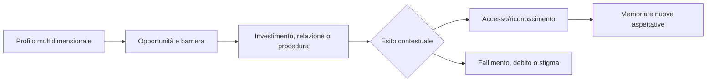

# Mobilità sociale e prestigio

## Scopo

Definire cambiamenti lenti, multidimensionali e reversibili di accesso, mezzi e riconoscimento.

## Descrizione

Mobilità economica, giuridica, professionale, familiare e reputazionale non coincidono. Un liberto ricco, un cittadino indebitato, un artigiano prestigioso o un magistrato screditato occupano profili diversi.

## Ambito

Apprendimento, lavoro, proprietà, matrimonio/adozione, patronato, manomissione, cariche, onori, infamia, fallimento e mobilità intergenerazionale.

## Regole e flusso

Ogni percorso richiede opportunità, prerequisiti, tempo, attori/autorità e conseguenze. Ricchezza amplia mezzi ma non converte automaticamente cittadinanza, origine o reputazione. Prestigio è riconoscimento per comunità e dominio; reputazione conserva credenze e prove; status cambia solo mediante evento valido.

## Dati, eventi e casi limite

Legge status, patrimonio, competenze, famiglia, reti, cariche e reputazioni. Produce `OpportunityOpened`, `PrestigeChanged`, `AccessChanged`, `MobilityMilestone`; ascolta manomissione, eredità, matrimonio, fallimento, condanna, carica e migrazione. Guadagno improvviso, perdita, status contestato, reputazioni discordi e successione non vengono compressi in un livello.

## Bilanciamento, accuratezza e persistenza

Nessun grind garantisce avanzamento; esistono regressione, percorsi laterali e successo locale. Tempi, barriere e possibilità sono profili storici A–E. Persistono milestone, accessi, rifiuti e memorie comunitarie anche dopo aggregazione.

## Dipendenze

- [Status](social-status.md)
- [Patronato](patronage.md)
- [Carriere](../professions-education/career-framework.md)
- [Carriera politica](../politics-law/political-career.md)

## Collegamenti agli altri documenti

- [Reputazione](reputation.md)
- [Famiglia](family.md)
- [Economia](../economy-production/economic-model.md)

## Test e Definition of Done

Testare ricchezza senza status, status senza mezzi, manomissione, fallimento, prestigio divergente, percorso intergenerazionale e save/load. S4 quando tre percorsi demo sono completi e fallibili.

## Decisioni ancora aperte

- Traguardi leggibili della demo senza livelli anacronistici.
- Effetti intergenerazionali e comunità reputazionali P0.

## TODO

- Definire scenari cittadino, liberto e schiavo.
- Collegare metriche di accesso e prestigio alla UX.
