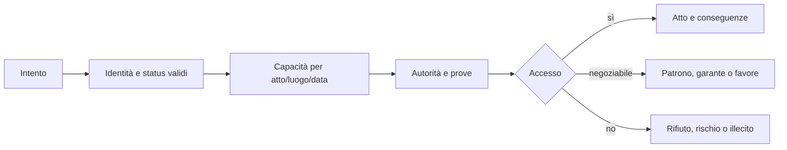

# Status, cittadinanza e capacità sociale

## Scopo

Definire lo status come insieme storico di condizioni giuridiche, familiari, civiche ed economiche che abilita, limita o rende rischiose le azioni.

## Descrizione

Non esiste una barra unica di “classe”. Il profilo di una persona compone libertà, cittadinanza, origine, sesso/età nel contesto giuridico, posizione familiare, infamia, rango, ricchezza, occupazione, cariche, patronato e reputazioni locali.

## Ambito

Cittadini, liberi non cittadini quando pertinenti, liberti e persone schiavizzate; capacità, protezioni, obblighi, accessi, mutamenti e riconoscimento istituzionale. Validità sempre vincolata a data, luogo e fonte.

## Modello dati canonico

| Dimensione | Autorità | Effetti |
|---|---|---|
| `FreedomStatus` | diritto/status | libertà, schiavitù, manomissione |
| `CitizenshipStatus` | comunità/ordinamento | capacità civiche e giuridiche contestuali |
| `FamilyPosition` | household/diritto | autorità, tutela, successione, matrimonio |
| `CivicStanding` | città/autorità | cariche, onori, sanzioni, infamia |
| `EconomicPosition` | economia/proprietà | reddito, patrimonio, debiti; non concede da sola diritti |
| `SocialRecognition` | conoscenza/reputazione | prestigio e fiducia per comunità, mai verità globale |

Ogni attestazione ha fonte, validità, autorità emittente e storico. Un cambio non riscrive la biografia.

## Regole e capacità

- **Cittadinanza:** non equivale a ricchezza o libertà materiale; abilita soltanto atti e tutele pertinenti al contesto.
- **Libero:** la libertà non garantisce cittadinanza, prestigio, proprietà o protezione.
- **Liberto:** conserva origine e rapporto patronale secondo condizioni valide; non è un cittadino “senza passato” né un percorso sociale uniforme.
- **Schiavizzato:** resta persona persistente con memoria, relazioni, bisogni e agency limitata dalla coercizione; vedere la specifica dedicata.
- **Rango/prestigio:** onori, famiglia, condotta pubblica e reti hanno riconoscimenti differenti; non acquistabili con una sola valuta.
- **Mobilità:** ogni transizione richiede evento, autorità/prova, costo e conseguenze; può fallire o essere contestata.

## Flusso di autorizzazione

## Eventi e conseguenze

Produce `StatusRecognized`, `CapacityGranted/Denied`, `StatusContested`, `InfamyChanged`, `ManumissionRecognized`; ascolta nascita, adozione, matrimonio, emancipazione, condanna, carica, morte, migrazione e decisione imperiale. Conseguenze: accesso a proprietà/contratti, famiglia, culto, processo, lavoro, politica e reputazione.

## Casi limite e persistenza

Documenti discordanti, status ignoto, persona fuori giurisdizione, cambi retroattivi, cittadinanza contestata, minore/orfano e autorità non competente aprono verifica, non un fallback arbitrario. Si persistono profilo, prove, transizioni, contestazioni e decisioni.

## Accuratezza storica

Ogni regola deve indicare periodo e area con livello A–E. La vertical slice adotta una matrice specifica per Pompei e data canonica; non generalizza automaticamente Roma città o province. Terminologia moderna è solo interfaccia esplicativa.

## Dipendenze

- [Diritto](../politics-law/law-framework.md)
- [Famiglia](family.md)
- [Schiavitù](slavery.md)
- [Patronato](patronage.md)

## Collegamenti agli altri documenti

- [Proprietà](../economy-production/property.md)
- [Contratti](../economy-production/contracts.md)
- [Carriera politica](../politics-law/political-career.md)
- [Framework storico](../../02-historical-foundation/historical-framework.md)

## Test e Definition of Done

Test matriciali per status × atto × luogo × prova; successione, manomissione, adozione, condanna, migrazione e save/load. S3 quando dati, transizioni ed errori sono completi; S4 quando la matrice Pompei è validata da storia giuridica e scenari end-to-end.

## Decisioni ancora aperte

- Matrice esatta delle capacità per gli status demo.
- Terminologia UI e grado di incertezza visibile al giocatore.

## TODO

- Collegare claim e fonti per ogni regola P0.
- Definire casi iniziali cittadino, liberto e schiavo.
