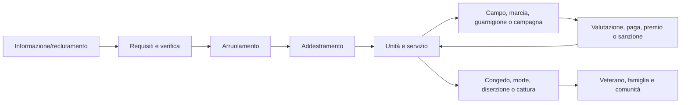

# Esercito, servizio e campagne

## Scopo

Definire l'esercito come istituzione di persone, autorità, disciplina, paga, equipaggiamento e logistica, non come generatore di battaglie continue.

## Descrizione

Unità e campagne esistono nel mondo anche senza il giocatore. Reclutamento, addestramento, marcia, accampamento, approvvigionamento, combattimento, congedo e insediamento dei veterani producono conseguenze familiari, economiche, politiche e religiose.

## Ambito

Reclutamento e requisiti, legioni, ausiliari, coorti, centurie, ranghi, disciplina, paga, equipaggiamento, campi, marce, logistica, battaglie, assedi, congedo, veterani, ricompense, punizioni e carriera. Ogni struttura è profilata per data e provincia.

## Modello istituzionale

| Entità | Dati minimi |
|---|---|
| `MilitaryFormation` | tipo, appartenenza, composizione, forza autorizzata/effettiva, coesione, posizione |
| `UnitMembership` | persona, unità, ruolo/rango, data, status, paga e storico |
| `CommandAuthority` | titolare, ambito, durata, catena, ordini e limiti |
| `RecruitmentCase` | candidato, requisiti, prove, esito, luogo e impegno |
| `TrainingProgram` | competenze, istruttori, calendario, equipaggiamento e valutazione |
| `SupplyPlan` | domanda, scorte, fonti, rotte, capacità, perdite e priorità |
| `Campaign/Operation` | obiettivo, autorità, forze, fasi, territorio, costo ed esito |

## Reclutamento, addestramento e carriera

Accesso verifica cittadinanza/status, età, salute, origine, precedenti e fabbisogno secondo profilo storico. Arruolamento crea un impegno, non teletrasporta alla guerra. Addestramento sviluppa marcia, disciplina, armi, formazione, lavoro di campo e routine. Avanzamento dipende da servizio, competenza, patronato, vacanza, reputazione, disciplina e decisione; può arrestarsi o retrocedere.

## Legioni, ausiliari, unità e gradi

Legione/ausiliari non sono skin equivalenti. Coorte, centuria e sotto-unità hanno identità, forza effettiva, ufficiali, specialisti, insegne, morale e scorte. Nomi, consistenze, ranghi e requisiti variano per periodo: nessun numero “standard” viene hard-coded senza fonte. Il comando invia ordini con latenza, interpretazione e fallimento.

## Disciplina, paga ed equipaggiamento

Disciplina deriva da addestramento, coesione, autorità, bisogno, paura, fiducia e precedente; non obbedienza perfetta. Paga registra maturazione, trattenute, arretrati, premi e beneficiario. Equipaggiamento ha provenienza, custodia, taglia, integrità, manutenzione e responsabilità. Ricompense e punizioni richiedono autorità, causa, prova e conseguenze; niente bonus/malus istantanei senza atto.

## Accampamenti, marce e logistica

Un campo è un insediamento temporaneo con perimetro, accessi, alloggi, comando, sanità, acqua, rifiuti, animali, officine e mercato. Marcia consuma tempo, cibo, acqua, calzature, animali e coesione; terreno/meteo/strade determinano capacità. Logistica collega requisizione, acquisto, trasporto, magazzini e distribuzione; le scorte non seguono magicamente le unità.

## Battaglie e assedi

Battaglia: intelligence → schieramento → contatto → coesione/morale → rotta, resa, inseguimento o disimpegno → feriti, prigionieri e memoria. Assedio: investimento/blocco, ingegneria, sortite, approvvigionamento, malattia, negoziazione e assalto eventuale. Grandi scontri sono rari, condizionati e normalmente aggregati lontano da Pompei; il player può vivere conseguenze o ruoli circoscritti.

## Congedo e veterani

Congedo verifica servizio, autorità, paga/premi e obblighi. Il veterano conserva ferite, competenze, reti, reputazione e trauma; insediamento, proprietà, lavoro, famiglia o riarruolamento sono possibilità, non premio garantito.

## Eventi e conseguenze

Produce `Recruited`, `Assigned`, `OrderIssued/Acknowledged`, `PayDue`, `SupplyShortage`, `CampEstablished`, `BattleResolved`, `Discharged`, `VeteranSettled`; ascolta guerra, direttiva, prezzo, epidemia, meteo, strada, rivolta e morte. Conseguenze su mercati, tasse, famiglie, migrazione, politica, religione e crimine.

## Casi limite, bilanciamento e persistenza

Unità senza comandante, ordini concorrenti, paga in arretrato, forza negativa, recluta ineleggibile, scorte duplicate, marcia su rotta chiusa, resa durante aggregazione e congedo postumo richiedono quarantena/reconciliation. Carriera e battaglia non sono grind obbligatorio. Persistono persone, unità, rango, ordini, paga, scorte, perdite, prigionieri, campagne e veterani.

## Accuratezza storica

Organici, titoli, equipaggiamento, paga, durata e reclutamento hanno area/periodo/fonti A–E. La documentazione distingue norma, epigrafia/papiro, archeologia e pratica ricostruita. Nessuna struttura flavia è estesa all'intero Impero senza profilo.

## Dipendenze

- [Reclutamento](recruitment.md)
- [Legioni e ausiliari](legions-auxiliaries.md)
- [Unità e gradi](units-and-ranks.md)
- [Logistica](military-logistics.md)
- [Carriera](military-career.md)

## Collegamenti agli altri documenti

- [Guerre](wars.md)
- [Battaglie](battles.md)
- [Assedi](sieges.md)
- [Economia](../economy-production/economic-model.md)
- [Politica](../politics-law/political-system.md)

## Test e Definition of Done

Testare recluta→congedo, comando, paga, equipaggiamento, campo, marcia, logistica, battaglia/assedio aggregati, prigionieri, veterano e save/load. S4 quando un profilo militare data/area è approvato e i livelli riconciliano persone/scorte/perdite.

## Decisioni ancora aperte

- Epoca/provincia dei contenuti militari P0/P1 e ruolo nella demo.
- Organici, paghe, dotazioni e durata di servizio da dossier.

## TODO

- Creare profilo storico militare canonico e scenari logistici.
- Allineare sottodocumenti specialistici al modello.
