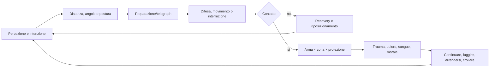

# Visione e contratto del combattimento

## Scopo

Definire un combattimento fisico realistico nelle conseguenze, leggibile nelle intenzioni e compatibile con un RPG open world in cui il giocatore non è un eroe invulnerabile.

## Descrizione

Il combattimento è un fallimento o una scelta rischiosa della vita sociale, non il loop obbligatorio. Distanza, spazio, iniziativa, postura, equipaggiamento, addestramento, fatica, paura e numero contano più di livelli astratti. La simulazione comunica segnali anticipatori e permette fuga, resa, cattura e de-escalation.

## Ambito

Corpo a corpo, armi, scudi, armature, ferite, dolore, sanguinamento, fatica, paura, morale, resa, cattura, morte, guarigione, addestramento, non letale, risse, duelli, arena, gruppi e folla. Il combattimento a distanza segue gli stessi invarianti ma richiede dossier dedicato prima dello scope P0.

## Principi e invarianti

- Nessun “punto vita” annulla localizzazione e funzione: il corpo possiede condizioni e capacità.
- Ogni attacco ha preparazione, traiettoria, portata, energia, bersaglio e recovery; niente hit confermati solo dall'animazione.
- Difesa combina distanza, spostamento, parata, scudo, armatura e ostacoli.
- Un colpo non è automaticamente letale; una ferita non è automaticamente reversibile.
- Dolore, perdita di sangue, fatica e paura sono assi distinti e osservabili indirettamente.
- NPC e player usano le stesse regole; difficoltà modifica assistenza/leggibilità, non immunità.
- Resa e cattura sono esiti validi; l'avversario valuta capacità, ordini, rischio, status e reputazione.
- La folla non è una mente unica e può osservare, fuggire, intervenire, chiamare aiuto o diffondere versioni diverse.

## Dati posseduti

| Entità | Dati minimi |
|---|---|
| `CombatantState` | postura, orientamento, mobilità, mani, fatica, dolore, paura, morale, intenti |
| `CombatEngagement` | partecipanti, ostilità, regole, luogo, autorità, escalation e stato |
| `AttackIntent/Resolution` | tecnica, arma, bersaglio, tempo, contatto, energia, esito e causalità |
| `DefenseIntent` | movimento, guardia, parata/scudo, priorità e finestra |
| `Surrender/Capture` | offerente, destinatario, condizioni, custodia, prove e violazioni |
| `WitnessObservation` | percettore, visibilità, evento creduto e confidenza |

## Ciclo corpo a corpo

## Stati e transizioni

`Non ostile → Tensione → Minaccia → Ingaggio → Separazione/Resa/Cattura/Incapacità/Morte`. Escalation richiede atto percepito o ordine; de-escalation può fallire per paura, folla, obblighi o informazione. Combattimento non letale cambia obiettivo e tecniche, non garantisce assenza di danno.

## Armi, scudi e armature

Armi: massa, baricentro, portata, mani, modalità di danno, spazio richiesto, integrità, qualità e legalità contestuale. Scudi: copertura geometrica, presa, massa, integrità e interferenza. Armature: zone, strati, materiale, vestibilità, mobilità, calore, manutenzione e protezione per tipo di impatto. L'equipaggiamento riduce o devia energia; non aggiunge “vita”.

## Abilità e addestramento

Competenze modificano scelta, timing, controllo, economia del movimento, disciplina e lettura; non moltiplicano arbitrariamente il danno. Apprendimento richiede maestro, pratica sicura, attrezzatura, tempo e rischio. Tecniche non conosciute possono essere tentate con controllo ridotto.

## Forme di conflitto

| Forma | Regole | Esiti |
|---|---|---|
| Rissa | armi improvvisate, spazio sociale, interventi e responsabilità | separazione, fuga, trauma, denuncia |
| Duello | accordo/consuetudine e testimoni solo se coerenti | resa, ferita, morte e conseguenze legali |
| Arena | contratto/status, organizzazione, pubblico e regole specifiche | vittoria, resa/decisione, ferita, reputazione |
| Gruppo | formazione, comando, coesione, linee, pressione e friendly obstruction | rotta, resa, accerchiamento, frammentazione |
| Non letale | presa, spinta, controllo, minaccia e contenimento | immobilizzazione/cattura, ma rischio trauma |

## Folla e informazione

Ogni spettatore valuta distanza, uscite, appartenenza, pericolo, coraggio e fatti percepiti. Densità e panico alterano movimento; cadute e schiacciamento sono rischi. Solo osservazioni locali alimentano crimine e reputazione.

## Bilanciamento e accessibilità

Time-to-consequence breve ma segnali chiari; finestre assistite configurabili; telegraph audiovisivo, indicatori diegetici/assistivi, rimappatura, riduzione camera shake e intensità visiva. La vittoria numerica non è garantita, ma superiorità, sorpresa e spazio hanno peso. Evitare stun-lock, circling AI, spugne di danno, i-frame invisibili e guarigione istantanea.

## Casi limite, errori e persistenza

Arma attraversa geometria, bersaglio già caduto, doppio contatto, resa ignorata, cambio livello durante colpo, animazione interrotta, folla senza uscita e save in ingaggio richiedono risoluzione idempotente o blocco del save secondo policy. Persistono ferite, sangue perso, fatica, equipaggiamento, ostilità, resa/custodia, morti e osservazioni.

## Dipendenze

- [Corpo a corpo](melee-combat.md)
- [Armi](weapons.md)
- [Scudi e armature](shields-and-armor.md)
- [Ferite](injuries.md)
- [Morale](fatigue-fear-morale.md)

## Collegamenti agli altri documenti

- [Guarigione](healing.md)
- [Gruppi](group-combat.md)
- [Risse, duelli e arena](duels-brawls-arena.md)
- [Criminalità](../politics-law/criminality.md)
- [Accessibilità](../../08-ux/user-experience/accessibility.md)

## Test e Definition of Done

Test property-based su contatti e conservazione; scenari 1v1, inferiorità numerica, resa, cattura, non letale, folla, armatura, fatica, ferite e save/load. S4 quando leggibilità, causalità, accessibilità e performance P0 sono validate senza eccezioni player.

## Decisioni ancora aperte

- Prospettiva/camera, assistenze e livello di controllo direzionale.
- Armi, armature e forme di conflitto P0 della demo.

## TODO

- Definire matrice tecnica-arma-zona-protezione.
- Creare scenari di accettazione con animazione, AI, salute, audio e UX.
