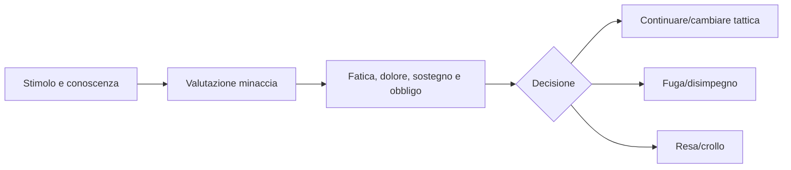

# Fatica, paura e morale

## Scopo

Definire limiti fisici e decisionali che rendono fuga, resa e rotta esiti razionali e leggibili.

## Descrizione

Fatica è costo fisiologico; paura è risposta individuale a minaccia percepita; morale è disponibilità situata a continuare un obiettivo. Non sono un'unica barra né debuff casuali.

## Ambito

Sforzo, recupero, stress, minaccia, coraggio appreso, disciplina, coesione, panico, rotta, resa e impatto di dolore/ferite/comando.

## Dati e aggiornamento

`ExertionState`: carico breve/lungo, calore, sonno e recupero. `ThreatAppraisal`: fonte, probabilità creduta, gravità, vie d'uscita e sostegno. `CommitmentState`: obiettivo, obbligo, fiducia, coesione e soglia decisionale. Input: sprint, attacchi, equipaggiamento, ferite, numero percepito, leader, perdite, rumore, terreno e ordini.

## Regole e casi limite

Fatica riduce frequenza, precisione di controllo e recovery; non sottrae vita. Paura può focalizzare, esitare o causare fuga secondo persona/contesto. Morale di gruppo deriva da individui e segnali, non telepatia. Leader morto ma non osservato non ha effetto immediato. Stimoli simultanei, fuga senza uscita, ordine suicida e passaggio M0↔M2 preservano conoscenza e stato.

## Bilanciamento, performance e persistenza

Feedback audiovisivi anticipano crisi; assistenze non nascondono costo. Recupero richiede tempo e condizioni. M0 aggiorna continuamente/eventi, M1 a intervalli, M2+ aggrega distribuzioni mantenendo individui P0. Persistono fatica significativa, trauma/paure apprese, rotta, resa e memoria; arousal momentaneo può decadere.

## Dipendenze

- [Combattimento](combat-vision.md)
- [Ferite](injuries.md)
- [Gruppi](group-combat.md)
- [NPC](../npc-population-ai/ai-architecture.md)

## Collegamenti agli altri documenti

- [Bisogni](../npc-population-ai/needs-ai.md)
- [Esercito](army.md)
- [Audio](../../09-art-audio/audio/README.md)

## Test e Definition of Done

Testare sforzo/recupero, minaccia non percepita, superiorità, leader, perdita, via di fuga, resa, rotta e aggregazione. DoD: nessun knowledge leak, stati spiegabili e scenari senza oscillazione.

## Decisioni ancora aperte

- Curve e segnali P0.
- Persistenza di paure/trauma fuori dal combattimento.

## TODO

- Definire scenari longitudinali e accessibilità feedback.
- Collegare personalità, disciplina e memoria.
