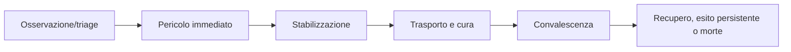

# Stabilizzazione, cura e guarigione

## Scopo

Definire interventi e recupero credibili, fallibili e storicamente contestualizzati.

## Descrizione

La cura modifica condizioni specifiche con mezzi, competenza, tempo e rischio. Guarigione è processo biologico sostenuto da riposo, nutrizione, igiene e assistenza; non ripristino istantaneo.

## Ambito

Valutazione, controllo del sanguinamento, pulizia, bendaggio, immobilizzazione, gestione del dolore, trasporto, convalescenza, infezione, riabilitazione e fine vita P0/P1 secondo fonti e safety.

## Flusso e dati

`CareEpisode` registra paziente, praticante, luogo, conoscenza, strumenti/sostanze, azioni, osservazioni ed esito. Trattamento consuma beni e tempo; una diagnosi è credenza. Intervento errato, contaminato o interrotto può non aiutare o peggiorare senza risultato predeterminato.

## Regole, casi limite e bilanciamento

Priorità su pericoli osservabili; nessun praticante onnisciente. Trasporto può aggravare ma salvare. Riposo accelerato solo tramite time-skip con costi/opportunità e simulazione del mondo. Guaritore assente/ferito, risorse mancanti, più pazienti, rifiuto, prigioniero, infezione tardiva e save/load conservano cronologia.

## Accuratezza, performance e persistenza

Pratiche, terminologia, strumenti e accesso hanno profilo A–E; evitare ospedale/antibiotico/diagnosi moderna impliciti. Milestone programmate sostituiscono tick lontani. Persistono lesioni, interventi, responsabili, materiali, prognosi credute, complicazioni e capacità.

## Dipendenze

- [Ferite](injuries.md)
- [Salute](../health-medicine/health-system.md)
- [Medicina](../health-medicine/medicine.md)
- [Economia](../economy-production/supply-chains.md)

## Collegamenti agli altri documenti

- [Famiglia](../family-social/family.md)
- [Esercito](army.md)
- [Carriere](../professions-education/career-framework.md)

## Test e Definition of Done

Testare triage, stabilizzazione, trasporto, risorse, infezione, convalescenza, esito persistente, morte e time-skip. S4 con pratiche P0 storicamente validate e golden scenarios bilanciati.

## Decisioni ancora aperte

- Pratiche/ruoli disponibili a Pompei e granularità del recupero.
- Tempi e rischi, subordinati a fonti e ritmo demo.

## TODO

- Collegare oggetti, professioni e luoghi di cura P0.
- Definire UX e filtri per contenuti medici.
