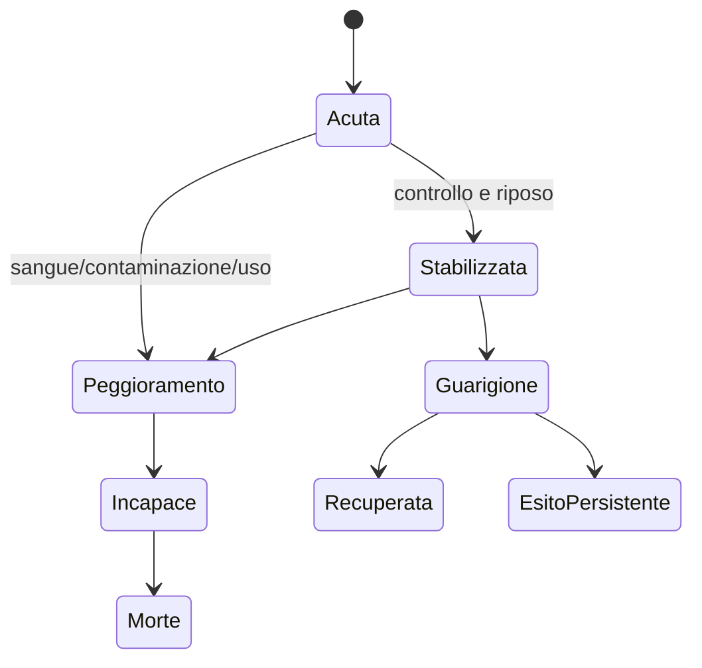

# Ferite, dolore, sangue e sopravvivenza

## Scopo

Definire conseguenze corporee persistenti e comprensibili senza simulazione medica gratuita o falsa precisione.

## Descrizione

Il trauma produce lesioni localizzate; dolore, sanguinamento, shock, infezione e funzione evolvono separatamente. Il sistema comunica gravità osservabile e incertezza diagnostica, non numeri clinici moderni presentati come certezza.

## Ambito

Contusioni, tagli, perforazioni, fratture/lussazioni, trauma cranico e ustioni P0/P1 secondo safety review; dolore, emorragia, incapacità, morte, stabilizzazione, guarigione, cicatrici e disabilità.

## Modello dati

`Injury`: zona, tessuti astratti, causa, severità, apertura, contaminazione, stabilità. `PhysiologyState`: sangue funzionale, coscienza, respirazione astratta, dolore, stress, temperatura, fatica. `Treatment`: operatore, conoscenza, mezzi, tempo, azione, rischio ed esito. `PrognosisBelief`: osservatore, informazione e confidenza.

## Regole e progressione

- Contatto → trauma; protezione modifica energia e tipo.
- Sanguinamento esterno/interno evolve nel tempo e può essere rallentato, non cancellato retroattivamente.
- Dolore influenza controllo, attenzione, morale e sonno; tolleranza non elimina lesione.
- Fatica e paura aggravano decisione e coordinazione, non causano danno arbitrario.
- Coscienza, incapacità e morte derivano da condizioni, non da barra a zero.
- Trattamento stabilizza, pulisce, immobilizza o sostiene; competenza e mezzi limitano risultati.
- Guarigione consuma tempo/nutrizione/riposo e può lasciare infezione, rigidità, cicatrice o deficit.

## Morte, resa e cattura

Una persona incapace può essere soccorsa, abbandonata, catturata o uccisa; ciascun atto genera testimoni e conseguenze. La morte chiude funzioni corporee, conserva identità/tombstone, apre funerale, successione, paga/obblighi e memoria sociale.

## Bilanciamento, UX e casi limite

Lettura tramite postura, voce, sangue, respirazione, animazione e pannello accessibile. Riduzione sangue e filtri sono configurabili. Ferite multiple, trattamento interrotto, arto già compromesso, medico ferito, time-skip, corpo scaricato e morte simultanea devono essere deterministici. Nessuna pozione o riposo breve ripristina trauma grave.

## Prestazioni e persistenza

Vicino: lesioni e tick temporali; remoto: milestone cliniche programmate, mantenendo lesioni del player/P0. Persistono cause, trattamenti, sangue perso, dolore rilevante, prognosi, infezione, cicatrici e disabilità. Le persone aggregate non muoiono senza evento causale registrato.

## Accuratezza storica

Conoscenze, praticanti, strumenti e prognosi dipendono da luogo/periodo/fonti A–E. Evitare diagnosi moderne in dialogo e tassi di sopravvivenza inventati; valori di design D sono dichiarati.

## Dipendenze

- [Combattimento](combat-vision.md)
- [Guarigione](healing.md)
- [Salute](../health-medicine/health-system.md)
- [Ciclo di vita](../npc-population-ai/npc-lifecycle.md)

## Collegamenti agli altri documenti

- [Morale](fatigue-fear-morale.md)
- [Medicina](../health-medicine/medicine.md)
- [Famiglia](../family-social/family.md)

## Test e Definition of Done

Testare ogni trauma P0, lesioni multiple, sanguinamento, stabilizzazione, infezione, recupero, morte, aggregazione e save/load. S4 dopo review medica-storica, safety/accessibilità e scenari longitudinali.

## Decisioni ancora aperte

- Granularità anatomica, tipi P0 e soglie di feedback.
- Policy di morte del player e continuazione con erede.

## TODO

- Collegare trattamenti e strumenti attestati.
- Definire golden scenarios trauma→esito.
