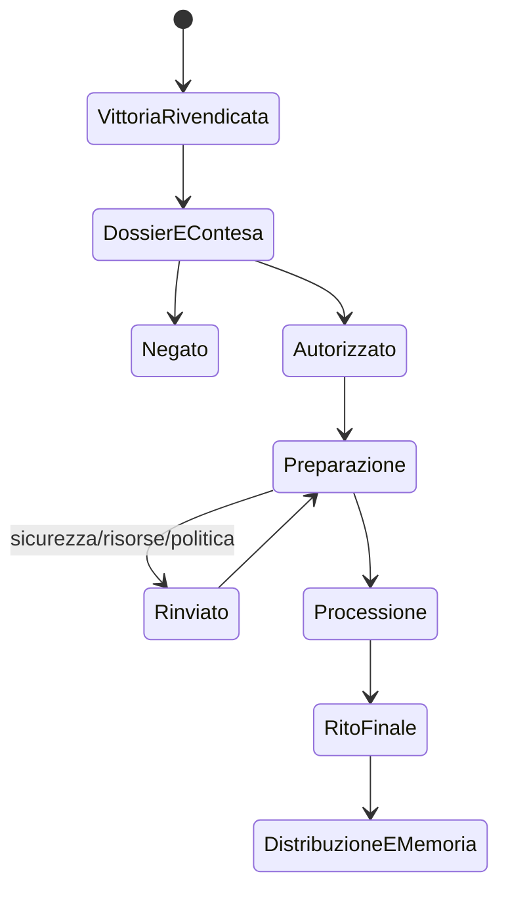

# Trionfi e grandi cerimonie militari

## Scopo

Definire il trionfo romano come rarissimo processo politico-religioso e logistico, non come ricompensa automatica o festa replicabile in ogni città.

## Descrizione

Un trionfo richiede vittoria rivendicata, requisiti storicamente pertinenti, decisione delle autorità, preparazione, percorso urbano, partecipanti, bottino/prigionieri, rito, sicurezza e memoria propagandistica. Pompei può riceverne notizie e conseguenze; una ricostruzione fisica appartiene primariamente a Roma e a uno scope futuro.

## Ambito

Requisiti, petizione/decisione, negoziazione, preparazione, percorso, ordine della processione, folla, musica, sacrifici, bottino, prigionieri, sicurezza, propaganda e conseguenze. Forme affini restano profili separati.

## Lifecycle

## Dati e requisiti

`TriumphClaim`: comandante, autorità, campagna, vittoria, status/comando, prove e opposizioni. `Authorization`: organo, decisione, condizioni e data. `ProcessionPlan`: percorso, capienza, sequenza, partecipanti, oggetti, animali, musica, sicurezza e fallback. `SpoilsLedger`: provenienza, custodia, destinazione e contestazioni. `CaptiveRecord`: persona persistente, origine, status, custodia, salute e destino; mai prop anonimo.

I requisiti esatti non sono numeri universali: periodo, comando, natura del conflitto, vittoria e decisione politica richiedono fonti A–E. Una vittoria non garantisce autorizzazione.

## Preparazione e percorso

Verifica calendario, percorso storicamente valido, strade, addobbi, prove/raffigurazioni, musica, carri, animali, offerte, alloggi, custodia, folla, uscite, presidi e pulizia. Chiusure alterano traffico, lavoro e mercato. Il piano contiene ritardo, riduzione, deviazione ed evacuazione.

## Partecipanti e ruoli del giocatore

Comandante, magistrati/autorità, soldati, veterani, personale rituale, musicisti, portatori, artigiani, funzionari, guardie, venditori, spettatori, prigionieri e delegazioni secondo fonti. Il player può essere soldato, veterano, artigiano, trasportatore, musicista, officiante idoneo, guardia, mercante, spettatore, informatore, oppositore o persona coinvolta coercitivamente. Nessun ruolo garantisce accesso o centralità.

## Bottino, prigionieri e sacrifici

Bottino conserva provenienza, quantità, custodia, esposizione, destinazione e impatto economico; niente creazione di ricchezza dal nulla. Prigionieri sono NPC con salute, paura, relazioni e memoria; trattamento/destino ha conseguenze. Sacrifici richiedono luogo, officianti, beni, sequenza e interpretazioni, senza buff soprannaturale certificato.

## Folla, musica, sicurezza e propaganda

Folla usa densità, conoscenza, appartenenza, uscite e reazioni locali. Musica è evento spaziale sincronizzato con gruppi e rito. Sicurezza separa accesso, perimetro, custodia, incendio, animali, panico e minacce. Propaganda è produzione/diffusione di narrazioni: monumenti, iscrizioni, immagini, discorsi, doni e memoria; osservatori possono dissentire.

## Conseguenze

- **Economiche:** domanda, chiusure, distribuzioni, bottino, prezzi locali, pagamenti e furti.
- **Politiche:** prestigio, rivalità, debiti di favore, legittimazione e opposizione.
- **Religiose:** voti, sacrifici, calendario, correttezza contestata e memoria rituale.
- **Sociali/narrative:** veterani, prigionieri, lutto, folla, voci, crimini e ricordi persistenti.

## Frequenza e livelli di simulazione

Gate globale di rarità: condizioni storiche + autorizzazione + risorse + calendario + cooldown storico, mai RNG isolato. Feste e giochi ricorrenti seguono calendari e budget; non riempiono continuamente la città. Trionfo remoto M5/M4 può produrre notizie e shock economico-politici; fisico M0 richiede Roma future scope e budget dedicato.

## Casi limite, performance e persistenza

Autorizzazione revocata, comandante morto, bottino mancante, prigioniero fuggito/morto, pioggia/incendio, percorso bloccato, folla oltre capienza, rito interrotto e save durante processione usano contingency. Persistono decisione, piano, ledger, partecipanti P0, incidenti, distribuzioni e memoria. LOD folla/audio e streaming per segmenti sono requisiti, non autorizzazione tecnica attuale.

## Dipendenze

- [Politica](../politics-law/political-system.md)
- [Religione](../religion-calendar/religious-system.md)
- [Esercito](army.md)
- [Gruppi e folla](group-combat.md)
- [Economia](../economy-production/economic-model.md)

## Collegamenti agli altri documenti

- [Calendario](../religion-calendar/calendar.md)
- [Musica](../../09-art-audio/audio/music.md)
- [Criminalità](../politics-law/criminality.md)
- [Fonti storiche](../../02-historical-foundation/README.md)

## Test e Definition of Done

Testare gate/negazione, piano, ledger conservativo, prigionieri persistenti, rito, folla, sicurezza, incidente, conseguenze, M0↔M5 e save/load. S4 solo dopo dossier storico del profilo, percorso GIS, budget folla/audio e review etica.

## Decisioni ancora aperte

- Se il trionfo resti esclusivamente evento remoto nell'orizzonte Pompei.
- Profilo storico, percorso e forme affini future.

## TODO

- Creare matrice requisito-fonte-periodo.
- Definire scenario remoto di notizie e conseguenze a Pompei.
