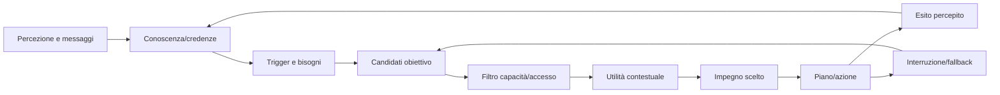

# Architettura della simulazione decisionale NPC

**System ID:** SYS-NPC-001

**Stato:** S3 — Contracted

## Scopo

Definire percezione, aggiornamento della conoscenza, selezione degli obiettivi, pianificazione, azione, interruzione e diagnostica per NPC scalabili.

## Descrizione

L'AI non “sceglie la cosa più realistica” da uno stato globale. Decide tra azioni materialmente possibili usando credenze locali, bisogni, impegni, relazioni, status, competenze, rischio e personalità.

## Ambito

Decisione individuale N0–N3 e policy aggregate N4/N5. Animazione e pathfinding eseguono un'intenzione ma non la scelgono.

## Pipeline

## Responsabilità

| Modulo | Possiede | Non possiede |
|---|---|---|
| perception adapter | osservazioni candidate | fatti globali |
| knowledge interface | query credenze | memoria autorevole |
| trigger manager | urgenze e scadenze | bisogni/contratti stessi |
| goal selector | ranking e commitment | conseguenze di dominio |
| planner | sequenze/alternative | teletrasporto o permessi |
| executor | stato azione e feedback | animazione interna |
| interruption manager | priorità, lock e recovery | cancellazione arbitraria |
| inspector | cause, candidati esclusi, costi | dati segreti al player |

## Requisiti funzionali

- decisioni basate solo su query autorizzate e conoscenza disponibile;
- supporto a obiettivi fisiologici, sociali, economici, rituali e istituzionali;
- impegni prenotano tempo/risorse quando necessario;
- azioni fallibili con ragioni tipizzate;
- interruzioni limitate da severità e costo di abbandono;
- decisione equivalente tra N0–N3 entro tolleranza causale;
- spiegazione interna della scelta e dei candidati scartati.

## Modello di utilità

`utilità = urgenza × valore atteso × fattibilità × confidenza − costo − rischio − costo sociale − costo di abbandono`.

È un modello concettuale configurabile, non formula finale. Nessun termine può dominare senza clamp e test. La personalità modifica pesi entro range; status e capacità applicano guardie hard.

## Stati dell'agente

| Stato | Significato | Uscite |
|---|---|---|
| IdleBounded | nessun obiettivo, ricerca con backoff | trigger/attesa |
| Deliberating | valuta candidati | commit/fallback |
| Committed | obiettivo prenotato | planning/cancel |
| Executing | azione in corso | success/failure/interrupt |
| Recovering | risolve errore o bisogno critico | retry/replan/abort |
| Incapacitated | nessuna decisione ordinaria | recovery/death |

## Interruzioni

Priorità: minaccia letale → salute critica → autorità/coercizione valida → emergenza household → scadenza hard → bisogno → routine → opportunità. Il costo di interrompere un rito, lavoro o cura impedisce comportamento a scatti; il pericolo reale può superarlo.

## Errori e fallback

Destinazione irraggiungibile, oggetto mancante, negozio chiuso, autorità rifiuta, interlocutore assente, conoscenza obsoleta, conflitto di prenotazione, timeout. Fallback: alternativa nota, richiesta informazione, attesa limitata, rinegoziazione, rinuncia, segnalazione. Mai spin loop senza backoff.

## Anti-ripetizione

- cooldown contestuale, non globale;
- memoria degli esiti e riduzione utilità dei fallimenti recenti;
- alternative equivalenti con preferenze stabili;
- micro-variazione solo presentazionale, non casualità senza causa;
- budget di novità per dialoghi/azioni;
- routine con finestre e contingenze;
- obiettivi a medio termine che danno continuità.

## Eventi

Riceve tempo, percezione, bisogno, impegno, evento pubblico, relazione, salute e accesso. Genera `GoalCommitted`, `ActionStarted/Completed/Failed`, `PlanRevised`, `AgentStuck`, `CriticalNeedUnresolved`. Gli eventi tecnici non diventano conoscenza diegetica.

## Prestazioni

N0 delibera su trigger o breve intervallo; N1 su eventi/intervalli medi; N2 su appuntamenti; N3 batch; N4/N5 policy statistiche. Cache di query versionate, candidate set limitati, spatial index e backoff. Nessun polling globale per NPC.

## Persistenza

Persistono commitment, obiettivi a medio termine, piano necessario al recovery, fallimenti significativi e prenotazioni. Candidate list e score momentanei sono ricostruibili.

## Test

Scenario matrix per bisogni/status; conoscenza falsa; obiettivo impossibile; interruzioni; due agenti in contesa; 30 giorni; N0↔N3; inspector; seed variati; starvation e deadlock dei planner.

## Dipendenze

- [Modello NPC](npc-model.md)
- [Memoria](memory.md)
- [Bisogni](needs-ai.md)
- [Routine](routines.md)
- [Interazione](../../05-player/gameplay/interaction-model.md)

## Collegamenti agli altri documenti

- [Decisione](decision-making.md)
- [Percezione](perception.md)
- [Performance](ai-performance.md)
- [Eventi sociali](social-event-responses.md)

## Criteri di accettazione

Nessuna query globale non autorizzata; ogni scelta spiegabile; fallback finito; ripetizione misurata; equivalenza cross-level; budget e telemetria definiti.

## Definition of Done

Contratti, score, guardie, stati, errori, test e profiler approvati; scenari Pompei senza stalli per 30 giorni.

## Decisioni ancora aperte

- Tecnica UE5 concreta rimandata al design tecnico.
- Budget di deliberazione e numero candidati.

## TODO

- Definire curve e scenari di calibrazione.
- Collegare comandi ed eventi al catalogo tecnico.
