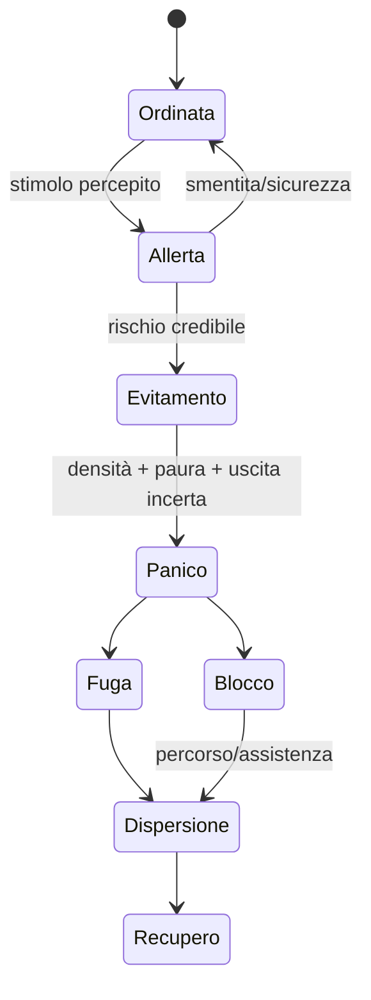

# Folle, panico, fuga e comportamento collettivo

## Scopo

Simulare aggregazioni temporanee mantenendo individui, gruppi sociali, capacità dello spazio e sicurezza.

## Descrizione

Una folla non è una mente unica. È un insieme di persone con mete, companion, informazioni e soglie differenti, coordinato da un controller di flusso che non possiede le decisioni individuali.

## Ambito

Mercati, feste, giochi, funerali, processi, incendi, epidemie e rivolte.

## Struttura

| Livello | Dati |
|---|---|
| individuo | ID o membro coorte, obiettivo, companion, paura, capacità, conoscenza |
| gruppo | household/colleghi/seguito, leader, coesione, rendezvous |
| folla | venue, ingressi/uscite, densità, direzioni, mood distribuito |
| spazio | capacità, colli di bottiglia, ostacoli, rischio, autorità |

## Stati

Arrivo → Aggregazione → Attività → Deflusso. Stimolo critico può portare Allerta → Evitamento → Panico localizzato → Fuga/Blocco → Dispersione → Recupero. Rivolta è un processo politico/sociale distinto, non “panico alto”.

## Paura e contagio informativo

Paura deriva da minaccia percepita, vicinanza, esperienza, companion, autorità e uscite note. Vedere altri fuggire è informazione ambigua. Coraggio, dovere o coercizione possono ritardare fuga; non annullano rischio.

## Fuga

Obiettivo primario: sicurezza percepita; secondari: figli/companion, beni critici, casa, autorità. L'NPC sceglie tra uscite conosciute e raggiungibili. Il sistema evita che tutti selezionino lo stesso punto con identica conoscenza.

## Eventi specifici

- Giochi/feste: arrivi scaglionati, venditori, controllo, picchi e deflusso.
- Incendio: propagazione fisica separata, allarme locale, acqua/ostacoli, salvataggi.
- Epidemia: comportamento guidato da sintomi e credenze, non conoscenza germinale moderna.
- Funerale: corteo e coesione, accessi e memoria.
- Processo: audience, fazioni, reazioni a esiti percepiti.
- Rivolta: grievances, reti, leadership, opportunità, repressione e defezione; non spawn casuale.

## Livelli e performance

Vicino: agenti e avoidance dettagliata. Fuori vista: corridoi, gruppi e flussi. Città non caricata: conteggi di venue e incident risk. Aggregato: arrivi/uscite e conseguenze. Budget di densità, path query, animazione e audio separati; back-pressure sugli ingressi.

## Persistenza

La folla temporanea non persiste come entità dopo dispersione; persistono partecipazione rilevante, ferite, morti, crimini, relazioni, memoria, danni e conseguenze.

## Casi limite

Uscita bloccata, falso allarme, evento simultaneo, player o NPC incapacitato, bambino separato, autorità fugge, venue sovraccarica, transizione di livello durante panico, save/load nel deflusso.

## Test

Capacità venue, ingressi scaglionati, evacuazioni multiple, informazione parziale, companion, N0↔aggregato, determinismo statistico, nessuna compenetrazione logica, performance e recovery.

## Dipendenze

- [Percezione](perception.md)
- [AI](ai-architecture.md)
- [Mondo Pompei](../../07-pompeii-demo/design/pompeii-urban-system.md)
- [Eventi](../calendar-events/event-system.md)

## Collegamenti agli altri documenti

- [Risposte sociali](social-event-responses.md)
- [Giochi](../religion-calendar/public-games.md)
- [Crimine](../politics-law/criminality.md)

## Criteri di accettazione

Folle eterogenee, uscite/capacità rispettate, nessuna mente collettiva, panico causale, esiti persistenti e budget superati in modo degradabile.

## Definition of Done

Venue model, flussi, panico, companion, test di sicurezza e profiler approvati per la demo.

## Decisioni ancora aperte

- Densità target e qualità animazione per piattaforma.
- Eventi di massa inclusi nella demo.

## TODO

- Dimensionare Anfiteatro, Foro e Stabian Baths per scenari demo.
