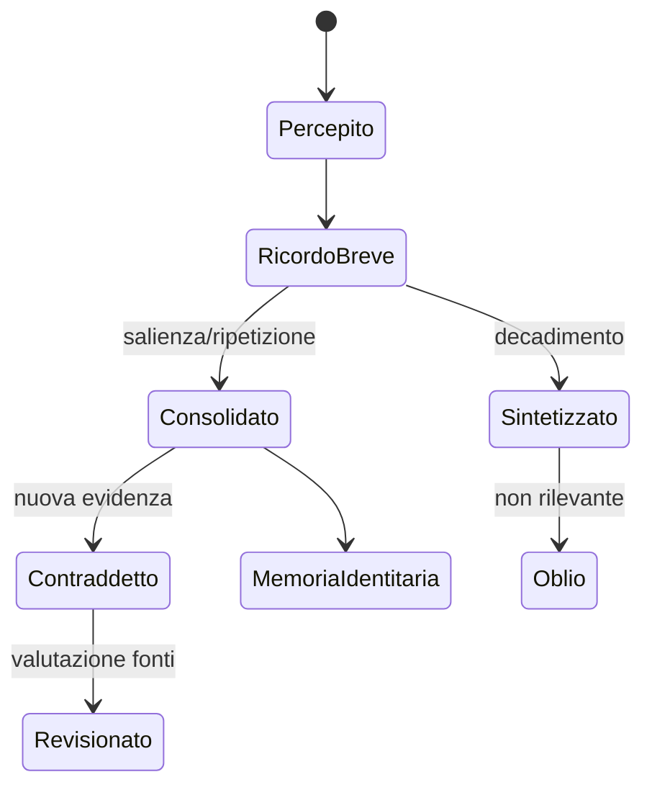

# Conoscenza, memoria e oblio

**System ID:** SYS-KNOW-001

**Stato:** S3 — Contracted

## Scopo

Impedire NPC onniscienti e preservare la memoria del mondo con costi scalabili.

## Descrizione

Il sistema distingue fatto canonico, osservazione, ricordo, testimonianza, messaggio, credenza e reputazione. Una credenza falsa può guidare azioni senza modificare il fatto.

## Ambito

Conoscenza individuale e sintesi di gruppo; memoria storica pubblica; esclusa la memoria tecnica dei save.

## Modello

| Entità | Campi minimi |
|---|---|
| FactRef | evento/soggetto/tempo/luogo canonico, accessibile solo ad autorità |
| Observation | osservatore, sensi/canale, dettaglio, condizioni, tempo |
| Memory | contenuto ricordato, fonte, confidenza, valenza, salienza, accessibilità |
| Message | mittente, ricevente/pubblico, proposizione, canale, intenzione |
| Belief | proposizione, confidenza, fonti, contraddizioni, ultima revisione |
| PublicRecord | iscrizione/atto/annuncio, accesso, durata, autorità |

## Acquisizione

Percezione valida crea osservazione; comunicazione crea informazione attribuita alla fonte; lettura richiede accesso/competenza; inferenza crea credenza derivata. Nessuna subscription a `PersonDied` informa automaticamente parenti o guardie.

## Decadimento e consolidamento

Dettagli ordinari decadono; gist e valenza possono durare. Debiti, traumi, promesse, parentela, morte, proprietà, crimini osservati e fatti pubblici hanno retention speciale. Ripetizione consolida ma può consolidare errore. Oblio non cancella eventi autorevoli.

## Contraddizioni

Le credenze conservano fonti concorrenti. Fiducia, autorità, esperienza diretta, coerenza e interesse modulano la revisione. Nessun “last write wins” universale.

## Scalabilità

N0–N2 hanno ricordi individuali indicizzati; N3 conserva top-K per categoria e sintesi; N4 usa prevalenza di credenze e portatori chiave; N5 solo record pubblici/trend. Eventi critici restano nel ledger e possono rigenerare contesto senza rigenerare conoscenza privata.

## Persistenza

Persistono credenze che influenzano impegni, relazioni, casi, segreti e identità; ricordi episodici ordinari vengono compressi. Ogni sintesi conserva provenance e range temporale.

## Eventi

`Observed`, `Learned`, `BeliefRevised`, `MemoryConsolidated`, `MemorySummarized`, `InformationShared`, `ContradictionDetected`. Payload privati rispettano accesso e non vengono broadcast.

## Casi limite

Testimone muore prima di parlare; gemelli/omonimi; identità mascherata; ricordo di luogo aggregato; due voci; analfabetismo; messaggio intercettato; evento pubblico ignorato; NPC promosso senza conoscenza della scena.

## Test

Crimine non osservato; propagazione a distanza; falsa voce; contraddizione; oblio; save/reload; N2↔N4; leak test; cento eventi ordinari compressi senza perdere un debito.

## Dipendenze

- [Percezione](perception.md)
- [Comunicazione](communication-gossip.md)
- [Event contracts](../../10-technical/architecture/event-contracts.md)

## Collegamenti agli altri documenti

- [Relazioni](relationships.md)
- [Reputazione](../information-and-reputation.md)
- [Criminalità](../politics-law/criminality.md)
- [AI](ai-architecture.md)

## Criteri di accettazione

Ogni credenza ha fonte; nessun leak globale; contraddizioni conservate; memoria critica persiste; compressione è spiegabile e testata.

## Definition of Done

Schema, retention, privacy, propagazione, test anti-onniscienza e budget approvati.

## Decisioni ancora aperte

- Budget ricordi per livello e policy di sintesi linguistica/strutturata.
- Accesso del player al grado di certezza.

## TODO

- Definire tassonomia dei fatti ricordabili nella demo.
