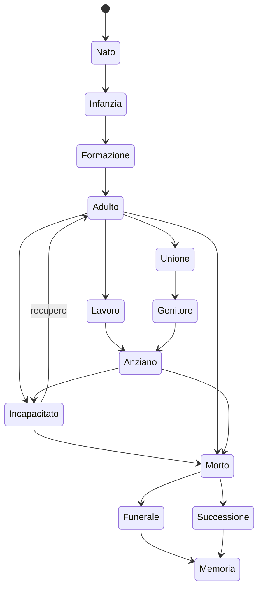
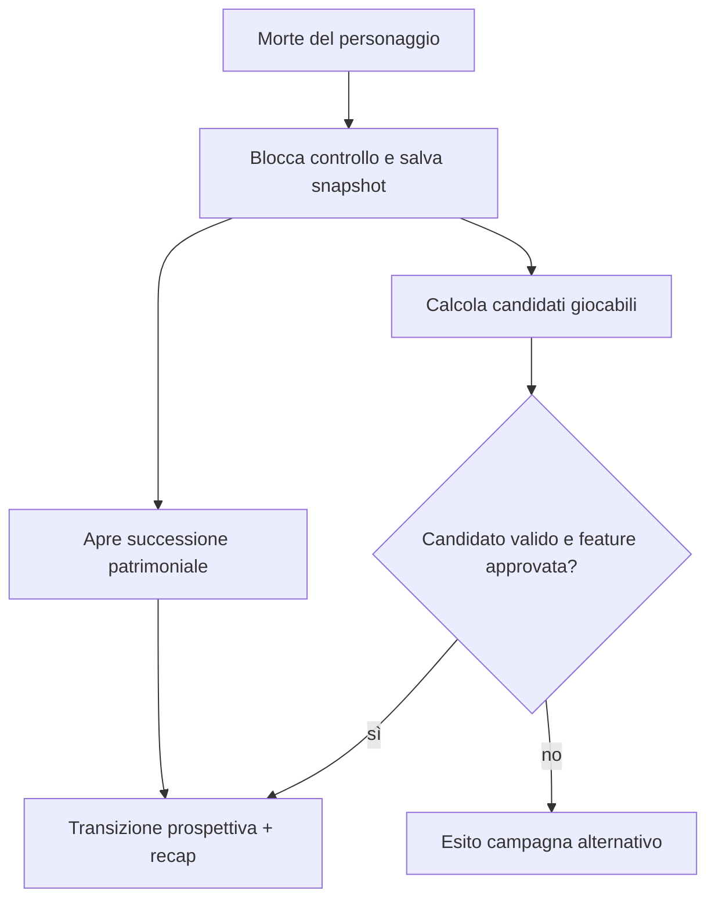

# Ciclo completo della vita, morte e successione

## Scopo

Definire le transizioni biografiche dalla nascita alla memoria postuma e la possibile continuazione del giocatore tramite erede.

## Descrizione

Il lifecycle coordina persona, household, status, salute, educazione, lavoro, proprietà, religione e contenuti. Non decide autonomamente gli effetti giuridici: orchestra autorità specializzate.

## Ambito

NPC persistenti e player; popolazioni aggregate usano tassi e coorti compatibili con le stesse invarianti.

## Fasi

| Fase | Trigger | Capacità/obblighi | Sistemi coinvolti |
|---|---|---|---|
| gestazione/nascita | evento biologico/sociale validato | dipendenza totale, status derivato secondo regole | salute, household, status |
| prima infanzia | età/cura | bisogni, attaccamenti, nessun lavoro autonomo | salute, famiglia |
| infanzia | età e contesto | apprendimento, compiti situati | educazione, lavoro, famiglia |
| apprendistato/formazione | accordo/opportunità | pratica, obbligo, rischio | professioni, contratti |
| età adulta contestuale | soglie giuridiche/sociali | capacità differenziate | status, politica, famiglia |
| lavoro/household | ruolo/contratto | reddito, produzione, cura | economia, routine |
| unione/matrimonio | procedura e consenso/autorità applicabili | alleanze, dote/risorse, domicilio | famiglia, diritto, proprietà |
| genitorialità/adozione | nascita o atto | cura, potestas/tutela, successione | household, status |
| emancipazione/manomissione | atto valido | cambio capacità/dipendenze | diritto, patronato, proprietà |
| invecchiamento | tempo + salute | capacità variabile, memoria/ruolo | salute, lavoro, famiglia |
| malattia/incapacità | esposizione/condizione | cura, assenza, rischio morte | salute, bisogni |
| morte | causa confermata | fine azioni, apertura procedure | tutti i domini |
| funerale/memoria | household/comunità/rito | costo, reputazione, lutto | religione, relazioni |
| successione | morte/atto | trasferimenti e tutela | proprietà, contratti, status |

## Macchina di lifecycle

Le fasi possono sovrapporsi; “Adulto” non garantisce matrimonio, figli o lavoro.

## Nascita e figli

Registra persona, genitori noti/riconosciuti, luogo, tempo, salute e status con classe storica. Fecondità e mortalità aggregate attendono dossier demografico. I bambini hanno bisogni, relazioni e sviluppo; non sono miniature di adulti né decorazioni.

## Educazione e apprendistato

Accesso dipende da household, status, genere, luogo, denaro, rete e bisogno di lavoro. Apprendimento richiede tempo, docente/maestro, pratica e strumenti. Assenza, fallimento o abuso hanno effetti; nessuna scuola universale è assunta.

## Matrimonio, figli, adozione ed emancipazione

Ogni transizione interroga capacità, status, autorità, intenzione e prove. Unione affettiva, matrimonio giuridico, coabitazione e *contubernium* non sono sinonimi. Adozione e emancipazione cambiano grafi e successione in modo atomico.

## Invecchiamento, malattia e cura

L'età modifica probabilità e capacità, non applica debuff identico. Malattia può essere non diagnosticata, cronica o contagiosa; ciò che la persona crede è separato dallo stato medico. Caregiver e risorse influenzano esiti.

## Morte

Sequenza: causa/stato → incapacità finale → conferma o incertezza → interruzione impegni → notifica limitata → conservazione corpo/rito secondo contesto → successione e debiti → memoria. Persona dispersa non equivale a morta per ogni sistema.

## Funerale e lutto

Il funerale richiede chi organizza, status, risorse, luogo, rito, partecipanti e memoria. Può essere ritardato, contestato o povero; non è evento standard identico. Produce assenze, spesa, reputazione, informazione e trasformazione delle relazioni.

## Eredità e continuazione

La successione del patrimonio e quella del personaggio giocante sono separate. Possibili eredi vengono calcolati da diritto, testamento/atti, household e data; conflitti restano gameplay. Continuare con figlio/erede è disponibile solo se Q-007 viene approvata e se il candidato è vivo, eleggibile, individualizzato e narrativamente giocabile. Nessun erede valido: fine campagna o altro percorso deciso da ADR.

## Casi limite

Gemelli; neonato senza caregiver; genitore sconosciuto; adozione durante successione; morte simultanea; erede assente/schiavizzato/minore; testamento contestato; corpo non recuperato; funerali multipli in catastrofe; household estinto; player erede con conoscenze diverse.

## Persistenza e livelli

Nascita, morte, cambi status, unione, adozione, emancipazione e successione sono eventi hard, mai persi in N3–N5. Dettagli di cura o apprendimento possono aggregarsi conservando esiti e cause.

## Test

Generazioni accelerate; successioni simultanee; migrazione save; mortalità aggregata vs individui; genealogie cicliche vietate; erede minore; morte fuori mappa; funerale senza risorse; continuità di conoscenza non trasferita magicamente.

## Dipendenze

- [Modello NPC](npc-model.md)
- [Famiglia](../family-social/family.md)
- [Eredità](../family-social/inheritance.md)
- [Salute](../health-medicine/health-system.md)
- [Religione funeraria](../religion-calendar/funerals.md)

## Collegamenti agli altri documenti

- [Educazione](../professions-education/education.md)
- [Apprendistato](../professions-education/apprenticeship.md)
- [Progressione](../../05-player/progression-and-identity.md)
- [Successione player](../../05-player/player-character/succession.md)

## Criteri di accettazione

Ogni transizione ha autorità, precondizioni, eventi e rollback; morte non cancella obblighi; successione conserva valore; erede non eredita memoria personale automaticamente.

## Definition of Done

Lifecycle, diritto applicabile, demografia, test generazionali e UX della morte approvati; Q-007 chiusa.

## Decisioni ancora aperte

- Q-007 e durata della campagna.
- Modelli demografici e soglie per la data demo.

## TODO

- Collegare regole storiche per status e periodo.
- Progettare il recap e la selezione erede.
