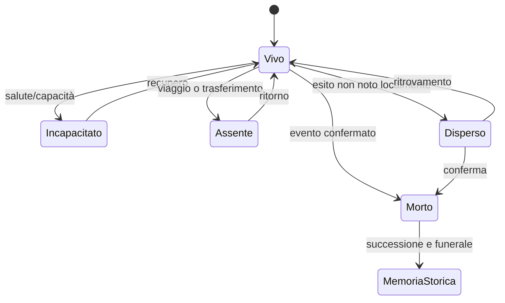

# Modello canonico dell'individuo persistente

**System ID:** SYS-PER-001

**Stato:** S3 — Contracted

**Owner:** Simulation Design / Narrative Systems

## Scopo

Definire l'identità persistente di ogni individuo simulato e separare dati biografici autorevoli, stato corrente, conoscenza, relazioni e rappresentazione runtime.

## Descrizione

“Vita completa” significa continuità causale sufficiente a rispondere a chi è la persona, dove appartiene, come vive, cosa conosce, quali obblighi ha e come cambia. Non richiede simulare ogni gesto né conservare ogni dettaglio per sempre.

## Ambito

Persone individualizzate, storiche o sintetiche. Le coorti non individualizzate sono definite nei [livelli di simulazione](simulation-levels.md).

## Aggregati e autorità

| Aggregato | Proprietario | Contenuto | Modifica tramite |
|---|---|---|---|
| Person Core | SYS-PER | ID, nascita, sesso registrato, origine, morte | eventi di vita validati |
| Legal/Social Status | SYS-STAT | cittadinanza, libertà, potestas, infamia, cariche | atti e procedure |
| Household/Family | SYS-HH | parentela, unioni, tutela, successione | eventi familiari |
| Agent Runtime | SYS-NPC | attività, piano, obiettivo attivo, posizione logica | scheduler/decisione |
| Needs/Health | SYS-NEED | fame, sonno, igiene, salute, dolore | tempo, consumo, cura |
| Knowledge/Memory | SYS-KNOW | osservazioni, credenze, ricordi | percezione/comunicazione |
| Relations | SYS-REL | legami e dimensioni | interazioni/eventi |
| Economy/Property | SYS-ECO/PROP | patrimonio monetario, diritti, debiti | transazioni/atti |
| Inventory | SYS-INV | custodia fisica di oggetti | trasferimenti |

Nessun singolo record NPC duplica questi dati. Espone una vista composta versionata.

## Schema dell'individuo

| Gruppo | Campi | Regole |
|---|---|---|
| identità | person_id, nome/i, nomenclatura, alias, pronuncia | nomi contestuali e provenienza; ID immutabile |
| biografia | nascita/data stimata, età, sesso, origine, lingue | date incerte conservano range/confidenza |
| status | cittadinanza, libero/liberto/schiavizzato, potestas, classe/ordine, reputazione civica | dimensioni separate, versionate nel tempo |
| attività | professione, ruolo, luogo lavoro, datore/autorità, contratto | professione ≠ identità totale |
| famiglia/rete | household, genitori, figli, coniuge/unione, patrono, clienti | grafi tipizzati, non liste piatte |
| residenza | domicilio, diritto di accesso, posto letto, stabilità | abitazione ≠ proprietà |
| risorse | proprietà, denaro, credito, inventario, accessi condivisi | viste da sistemi proprietari |
| corpo | salute, ferite, malattia, fame, sonno, igiene, capacità | soglie e tendenze, non barre onniscienti per UI |
| psicologia | tratti, valori, opinioni, paure, desideri, tolleranze | distribuzioni limitate e contestuali |
| competenze | dominio, pratica, affidabilità, conoscenza procedurale | livello + evidenza/esperienza |
| informazione | fatti, fonti, confidenza, ricordi, segreti | nessun accesso allo stato globale |
| comportamento | routine, impegni, obiettivi, piano, fallback | posseduto da SYS-NPC |
| storia | eventi di vita, trasferimenti, cambi status, milestone | ledger selettivo permanente |

## Identità, nomi e storicità

- NPC attestato: nome e ruolo con fonte A–C; azioni private non attestate sono D e non diventano biografia storica.
- NPC sintetico: identità D costruita da distribuzioni storicamente revisionate.
- Alias, cambi di status e nomenclatura non cambiano `person_id`.
- Età sconosciuta usa intervallo; il sistema non inventa compleanni precisi per ottenere ordine deterministico.
- “Classe sociale” è una vista analitica, non un punteggio autorevole.

## Personalità, paure e desideri

| Dimensione | Effetto ammesso | Effetto vietato |
|---|---|---|
| propensione al rischio | modifica utilità e soglie | ignora pericolo materiale |
| socievolezza | frequenza/costo delle interazioni | amicizia automatica |
| conformità | peso di norme e autorità | obbedienza assoluta |
| pazienza | tolleranza attesa/frustrazione | loop infinito |
| attaccamento | priorità di persone/luoghi | telepatia o percorso impossibile |
| ambizione | orizzonte e investimento | carriera garantita |

Paure hanno oggetto, causa, intensità, generalizzazione e decadimento. Desideri hanno origine, orizzonte, costo, compatibilità e condizioni di abbandono.

## Stati della persona

Lo stato reale e ciò che gli altri credono possono divergere.

## Input e output

Input: tempo, nascita/morte, cambi status, salute, transazioni, relazioni, eventi percepiti. Output: viste della persona, milestone biografiche e trigger di lifecycle. SYS-PER non decide attività né diffonde automaticamente informazioni.

## Eventi generati

`PersonBorn`, `PersonNamed`, `PersonMatured`, `PersonCapacityChanged`, `PersonRelocated`, `PersonDied`, `PersonIdentityCorrected`. Tutti includono tempo, luogo, fonte causale e versione.

## Persistenza

Persistono core, status storico essenziale, legami identitari, milestone e tombstone. Stato runtime ricostruibile può essere snapshot. La morte non elimina il record: blocca mutazioni incompatibili e avvia successione/memoria.

## Casi limite

Nascita senza genitore noto; età stimata; omonimia; persona data per morta ma viva; due household; schiavitù e trasferimento separati da residenza; professione persa; patrono morto; oggetto posseduto ma non custodito; NPC storico con fonti conflittuali.

## Prestazioni e scalabilità

Le viste composte sono materializzate solo per agenti attivi. Gli ID e i core sono compatti; collezioni pesanti vivono nei sistemi proprietari. Query bulk e indici per luogo/household/attività evitano scansioni globali.

## Strategie di test

Integrità ID; lifecycle centenario accelerato; migrazioni; morte/successione; cambi status; trasferimenti; ricostruzione vista; conflitti di fonte; nessuna duplicazione tra proprietà e inventario.

## Dipendenze

- [Ownership dati](../../10-technical/data/data-ownership-matrix.md)
- [Status](../social-status-and-law.md)
- [Household](../family-social/household.md)
- [Salute](../health-medicine/health-system.md)

## Collegamenti agli altri documenti

- [AI](ai-architecture.md)
- [Lifecycle](npc-lifecycle.md)
- [Memoria](memory.md)
- [Relazioni](relationships.md)
- [Readiness](../../11-production/roadmap-backlog/implementation-readiness-matrix.md)

## Criteri di accettazione

Ogni campo richiesto ha proprietario; identità sopravvive ai livelli; la vista è ricostruibile; nessuna conoscenza globale è inclusa; morte e cambi status conservano storia.

## Definition of Done

Schema logico, invarianti, ownership, eventi, migrazioni, test e budget approvati; almeno dieci biografie longitudinali validate.

## Decisioni ancora aperte

- Rappresentazione precisa di sesso, genere sociale e categorie giuridiche per epoca.
- Durata massima della campagna e precisione delle date di nascita.

## TODO

- Definire schema nomi per la data demo.
- Collegare ogni campo al modello dati versionato.
