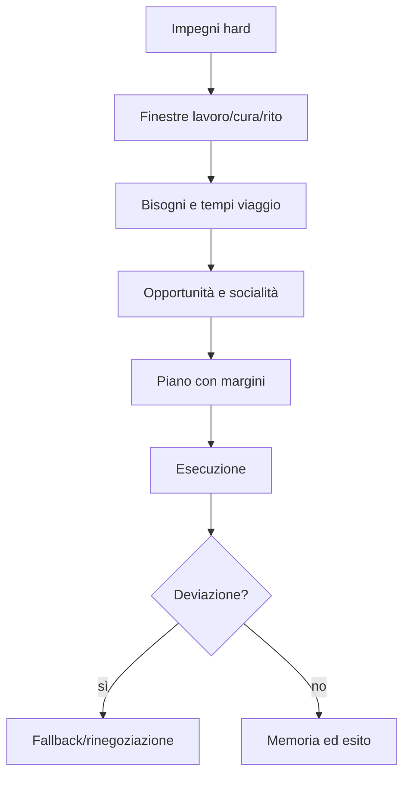

# Routine, impegni e attività

## Scopo

Produrre giornate coerenti ma adattive, evitando percorsi rigidi, sincronizzazione artificiale e ripetizione evidente.

## Descrizione

La routine è un insieme di finestre, impegni, preferenze e alternative. Gli impegni derivano da lavoro, household, patronato, culto, contratti, salute e contenuti.

## Ambito

Routine individuali N0–N3 e pattern di coorte N4/N5.

## Modello impegno

| Campo | Funzione |
|---|---|
| commitment_id | identità/idempotenza |
| fonte | lavoro, famiglia, contratto, rito, scelta |
| finestra | earliest/latest e durata |
| luogo/partecipanti | destinazione e dipendenze |
| priorità/costo abbandono | risoluzione conflitti |
| prerequisiti | accesso, strumenti, informazione, salute |
| alternative | luogo, persona, orario o esito sostitutivo |
| conseguenza | successo, ritardo, assenza, violazione |

## Costruzione della giornata

## Anti-artificialità

- finestre e distribuzioni, non orari identici;
- tempi di viaggio e congestione reali;
- giorni e stagioni modificano il piano;
- household coordina risorse condivise;
- fallimento ha conseguenze e non resetta al giorno seguente;
- micro-azioni non ripetute quando fuori osservazione;
- preferenze stabili danno riconoscibilità, alternative danno varietà.

## Conflitti

Due impegni incompatibili sono valutati per autorità, costo, relazione, bisogno e rischio. L'NPC può arrivare tardi, delegare, rinegoziare, mentire, rinunciare o violare; non può essere in due luoghi.

## Livelli

N0/N1 eseguono percorso e azione; N2 salta tra appuntamenti con validazione capacità; N3 risolve blocchi di attività; N4 applica distribuzioni di presenza/produzione. Promozione materializza il piano residuo, non inventa una nuova giornata.

## Eventi e persistenza

Riceve `DayStarted`, cambi lavoro, evento, malattia, accesso e relazione. Genera `CommitmentCreated/Met/Missed/Renegotiated`, `RoutineBlocked`, `UnexpectedOpportunityAccepted`. Persistono impegni futuri, violazioni e pattern personale; il dettaglio di passi no.

## Casi limite

Luogo distrutto, due turni, funerale improvviso, festa, arresto, padrone/datore assente, figlio malato, porta chiusa, viaggio ritardato, cambio livello a metà appuntamento.

## Test

Settimane simulate, varianza controllata, conflitti, shock, comparazione di due status, transizioni N0–N3, congestione, nessun teleport e nessun ciclo idle infinito.

## Dipendenze

- [AI](ai-architecture.md)
- [Tempo](../../03-world/time-and-persistence.md)
- [Lavoro](../economy-production/labor.md)
- [Household](../family-social/household.md)

## Collegamenti agli altri documenti

- [Cicli Pompei](../../07-pompeii-demo/design/daily-seasonal-cycles.md)
- [Bisogni](needs-ai.md)
- [Decisione](decision-making.md)

## Criteri di accettazione

Routine spiegabili, variabili e temporalmente possibili; conflitti producono esiti; N0/N3 conservano appuntamenti e risorse; ripetizione entro soglia UX.

## Definition of Done

Template impegni, scheduler, fallback, scenari e test longitudinali approvati.

## Decisioni ancora aperte

- Numero massimo di impegni futuri e orizzonte di pianificazione.
- Granularità delle routine dei bambini e persone sotto coercizione.

## TODO

- Creare set di routine Pompei per professioni/status selezionati.
