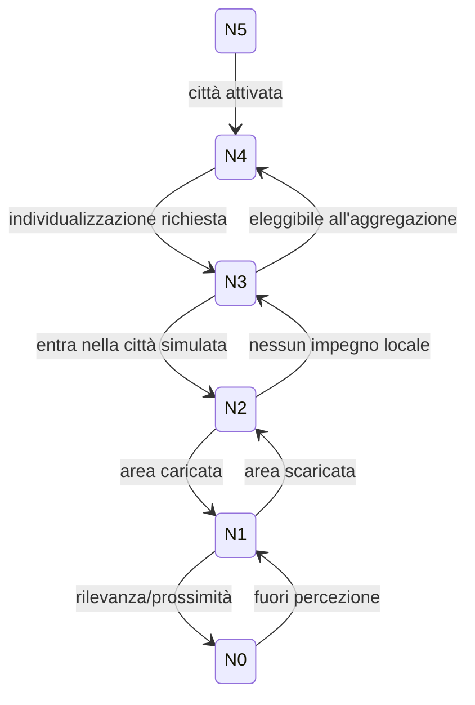

# Livelli di simulazione della popolazione

## Scopo

Scalare da individui visibili a popolazioni statistiche preservando identità, beni, obblighi, causalità e memoria.

## Descrizione

Il livello controlla frequenza e rappresentazione, non l'esistenza della persona. Le transizioni sono operazioni di raffinamento/aggregazione con invarianti verificabili.

## Ambito

Sei livelli N0–N5 per NPC e popolazioni; folla istantanea e gruppi istituzionali usano gli stessi contratti.

## Livelli N0–N5

| Livello | Presenza | Aggiornamento | Mantiene | Approssima |
|---:|---|---|---|---|
| N0 | visibile e vicino | continuo/event-driven | corpo, percezione, animazione, azione, oggetti | microdettagli non rilevanti |
| N1 | area caricata, fuori schermo | frequente a intervalli | posizione su grafo, attività, collisioni logiche, bisogni urgenti | movimento e animazione |
| N2 | città, area non caricata | scheduler per appuntamenti/eventi | luogo logico, lavoro, household, scadenze, salute critica | percorso e consumo ordinario |
| N3 | individuo semplificato | batch temporale | identità, ruolo, relazioni chiave, bilanci, milestone | routine tramite esito probabilistico vincolato |
| N4 | coorte aggregata | batch per periodo/area | conteggi, distribuzioni, capacità, flussi | biografie non individualizzate |
| N5 | popolazione statistica | aggiornamento macro | stock e distribuzioni regionali | individui e percorsi |

## Regole di promozione e retrocessione

Trigger di promozione: vicinanza, relazione col giocatore, evento critico, contratto, proprietà nominata, testimone, contenuto o rischio. Retrocessione: distanza, assenza di impegni ravvicinati, stato stabile e snapshot valido. Isteresi e cooldown impediscono oscillazioni.

## Invarianti cross-level

- una persona individualizzata non viene duplicata nella coorte;
- denaro, beni, posti letto e lavori non aumentano durante la transizione;
- scadenze, morte, nascita, debito, matrimonio e crimine non vengono persi;
- viaggio conserva origine, destinazione e tempo minimo;
- promozione non riscrive eventi già osservati;
- la somma degli individui e delle coorti coincide entro tolleranze dichiarate;
- un NPC non acquisisce conoscenza perché promosso.

## Raffinamento N4→N3

La coorte riserva masse: età, sesso/status, origine, household, attività, salute e risorse. L'individuo viene campionato condizionatamente, riceve ID e storia coerente con gli eventi aggregati; la massa viene sottratta atomicamente. Relazioni o proprietà specifiche richiedono evidenza, non generazione retroattiva opportunistica.

## Aggregazione N3→N4

Consentita solo se l'individuo non è storico, legato al giocatore, proprietario unico, testimone/caso attivo, erede, debitore critico, malato grave, viaggiatore o parte di contenuto persistente. Gli eventi biografici restano nel ledger anche se lo stato torna aggregato.

## Scheduler

| Classe | Esempi | Politica |
|---|---|---|
| deadline hard | udienza, parto, pagamento, evento pubblico | evento esatto, mai saltato |
| rischio critico | emorragia, incendio, panico | priorità alta, step limitato |
| routine | lavoro, pasti, sonno | batch con vincoli |
| trend | reputazione lenta, apprendimento | intervalli lunghi |
| statistica | migrazione e natalità regionali | batch macro con riconciliazione |

## Errori e recovery

Fallimento di raffinamento: resta nel livello precedente e segnala blocco, senza clone. Evento tardivo: applicazione versionata o compensazione. Risorse insufficienti: fallback coerente (ritardo/assenza), non creazione. Invariante violata: quarantena dell'entità e snapshot precedente.

## Prestazioni attese

Budget assoluti dipendono da Q-003/Q-102. Obiettivi relativi: N0 è il più costoso e limitato; N1 non esegue percezione completa; N2 usa eventi/scadenze; N3 batch; N4/N5 vettoriali. Ogni livello ha quota CPU/memoria, backlog massimo e telemetria.

## Persistenza

Snapshot per livello + ledger degli eventi critici + seed/versione delle distribuzioni. I dati ricostruibili possono essere scartati; identità, obblighi e storia no.

## Strategie di test

Ping-pong N0↔N5; viaggio durante unload; morte e successione N3; furto con testimone N2; epidemia N4; inventari e moneta conservati; replay deterministico; soak 30 giorni e generazionale.

## Dipendenze

- [Architettura simulazione](../simulation-architecture.md)
- [Modello NPC](npc-model.md)
- [Popolazione demo](../../07-pompeii-demo/demo-population.md)
- [Performance](../../10-technical/performance-budgets.md)

## Collegamenti agli altri documenti

- [AI performance](ai-performance.md)
- [Routine](routines.md)
- [Folle](crowds.md)
- [Save](../../10-technical/save-system/save-architecture.md)

## Criteri di accettazione

Sei livelli implementabili, invarianti e transizioni documentati, zero duplicazioni/perdite in soak, backlog osservabile e conoscenza invariata dalla promozione.

## Definition of Done

Budget approvati, test cross-level completi, profiler/inspector progettati e scenario Pompei dimensionato.

## Decisioni ancora aperte

- Target numerici per livello e tolleranza aggregata.
- Condizioni definitive per de-individualizzazione.

## TODO

- Chiudere Q-003 e Q-102.
- Definire benchmark Small/Recommended/Stress.
