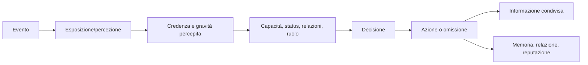

# Matrice delle reazioni agli eventi sociali

## Scopo

Definire come individui, household, istituzioni e folle reagiscono a eventi senza script universali o conoscenza globale.

## Descrizione

Ogni risposta attraversa esposizione, interpretazione, vincoli, decisione, azione, comunicazione e memoria. La matrice è estensibile e non prescrive una reazione identica.

## Ambito

Festività, giochi, incendi, epidemie, funerali, processi, crimini, panico e rivolte.

## Pipeline

## Matrice

| Evento | Trigger/portata | Risposte individuali | Risposte istituzionali | Effetti persistenti |
|---|---|---|---|---|
| festività | calendario e comunità | preparare, partecipare, lavorare, evitare | rito, logistica, ordine | spesa, relazioni, memoria |
| giochi pubblici | programma/capacità | assistere, vendere, servire, scommettere, evitare | controllo, venue, patrocinio | reputazione, crimini, ferite |
| incendio | fisica + osservazione | allarme, spegnere, salvare, fuggire, depredare | coordinare accessi/risorse | morti, danni, sfollati, indagini |
| epidemia | casi/sintomi/informazione | cura, isolamento informale, fuga, negazione | riti, assistenza, ordine, misure contestuali | mortalità, lavoro, credenze |
| funerale | morte + organizzatore | lutto, partecipare, lavorare, contestare | rito e percorso | successione, memoria, debito |
| processo | caso + autorità | testimoniare, sostenere, evitare, corrompere | convocare, giudicare, sanzionare | status, reputazione, pena |
| crimine | atto + percezione | intervenire, fuggire, denunciare, tacere | indagine/procedura | prove, paura, conflitto |
| rivolta | grievances + rete + opportunità | aderire, guidare, osservare, fuggire, opporsi | negoziare, reprimere, cedere | danni, cariche, memoria politica |

## Determinanti

Conoscenza, prossimità, obbligo, rischio, salute, companion, status, autorità, relazione con coinvolti, risorse, personalità e precedenti. Il player non riceve eccezioni.

## Rivolte

Richiedono grievances persistenti, rete, frame condiviso, trigger, opportunità e capacità. Hanno fazioni e obiettivi; possono dissolversi, negoziare, frammentarsi o radicalizzarsi. Vietato un misuratore unico che genera automaticamente folla ostile.

## Epidemie

Il modello sanitario produce esposizione e sintomi; NPC reagiscono secondo conoscenza storicamente plausibile e voci. Non usano germ theory moderna. Aggregazione conserva casi, capacità di cura, assenze e mortalità.

## Casi limite

Eventi simultanei, falsa notizia, autorità incapace, testimone coinvolto, funerale durante epidemia, incendio durante giochi, rivolta con obiettivi concorrenti, player assente, città N4.

## Persistenza e performance

Persistono partecipanti salienti, ferite, morti, danni, casi, cambi relazione/reputazione e memoria pubblica. Gli altri partecipanti diventano conteggi/coorti. La risposta usa fan-out per zona/comunità e subscription, non scansione globale.

## Test

Per ogni evento: non esposto, esposto con credenza falsa, due status, due relazioni, N0/N3/N4, assenza player, fallimento autorità, conseguenze dopo 30 giorni.

## Dipendenze

- [AI](ai-architecture.md)
- [Memoria](memory.md)
- [Relazioni](relationships.md)
- [Folle](crowds.md)

## Collegamenti agli altri documenti

- [Eventi dinamici](../../06-content/events/dynamic-event-framework.md)
- [Salute pubblica](../health-medicine/public-health.md)
- [Processi](../politics-law/trials.md)
- [Calendario Pompei](../../07-pompeii-demo/design/daily-seasonal-cycles.md)

## Criteri di accettazione

Ogni evento ha exposure, risposte plurali, autorità, livelli, persistenza e test; nessuna reazione globale senza canale.

## Definition of Done

Matrice collegata agli eventi demo, soglie e budget approvati, scenari combinati superati.

## Decisioni ancora aperte

- Eventi sociali inclusi nella vertical slice e scala massima.

## TODO

- Collegare catalogo eventi e claim storici specifici.
