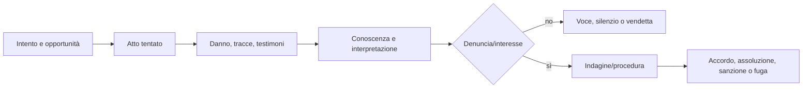

# Criminalità, scoperta e conseguenze

## Scopo

Definire atti dannosi o illeciti, opportunità, reti e risposta senza wanted level globale o autorità onniscienti.

## Descrizione

Un atto produce danno materiale/sociale, tracce, osservazioni e conoscenza localizzata. Diventa caso soltanto tramite interpretazione, denuncia/interesse e autorità. Reputazione criminale è un insieme di credenze per comunità, non una verità universale.

## Ambito

Furto, rapina, aggressione, omicidio, frode, contrabbando, ricettazione, bande, corruzione, denuncia, arresto/custodia quando validi, indagine, processo e pena.

## Modello e flusso

`Incident` registra attori, luogo, tempo, azioni, vittime e danni; `Trace` provenienza, persistenza e custodia; `Observation/Belief` percettore e confidenza; `Complaint/Case` autorità e stato; `CriminalNetwork` relazioni e ruoli, non spawn table.

## Regole e conseguenze

- Possesso illecito non cambia titolo di proprietà.
- Testimoni percepiscono secondo vista, attenzione, paura e interessi.
- Bande richiedono legami, risorse, territori/opportunità e memoria.
- Ricettazione e mercato nero dipendono da conoscenza, rischio e fiducia.
- Corruzione modifica decisioni tramite favore/beneficio e rischio probatorio, non pulsante universale.
- Conseguenze includono danno, salute, debito, vendetta, paura, reputazioni, processo e ordine pubblico.

## Casi limite, prestazioni e persistenza

Vittima morta/assente, identità mascherata, testimoni discordi, prova trasferita, confessione falsa, autorità corrotta, reato durante time-skip e fuga tra città conservano causalità. Incidenti P0 individuali; remoto aggrega rischio e attività ma mantiene casi, autori noti, vittime, prove e reti rilevanti. Save/load non rigenera casualmente testimoni o prove.

## Accuratezza e rappresentazione

Categorie e risposta sono contestuali; evitare equivalenze con polizia/forensics moderni. Violenza sessuale, tortura e abuso richiedono policy, necessità narrativa, ellissi e review specialistica; non sono contenuto procedurale ricompensante.

## Dipendenze

- [Diritto](law-framework.md)
- [Indagini](investigations.md)
- [Processi](trials.md)
- [Pene](punishments.md)
- [Comunicazione e pettegolezzi](../npc-population-ai/communication-gossip.md)

## Collegamenti agli altri documenti

- [Proprietà](../economy-production/property.md)
- [Mercato nero](../economy-production/black-market.md)
- [Reputazione](../family-social/reputation.md)
- [Ordine pubblico](public-order.md)

## Test e Definition of Done

Testare non osservato/osservato, identità errata, denuncia, prova, autorità, corruzione, processo, fuga, aggregazione e save/load. S4 quando casi P0 producono conseguenze spiegabili senza knowledge leak.

## Decisioni ancora aperte

- Illeciti e pene P0 ammessi dalla demo.
- Limiti di rappresentazione, sicurezza e accessibilità.

## TODO

- Creare scenari furto, frode e aggressione end-to-end.
- Collegare tassonomia e fonti alla data canonica.
