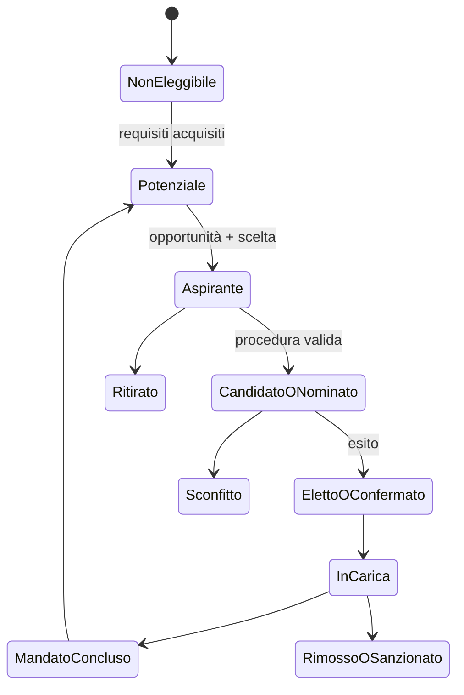

# Carriera pubblica e politica del giocatore

## Scopo

Definire percorsi pubblici contingenti, competitivi e storicamente vincolati, senza cursus universale né successo garantito.

## Descrizione

La carriera emerge da eleggibilità, reputazioni, famiglia, patrimonio, reti, servizio, opportunità e opposizione. Il giocatore può contribuire alla politica senza ricoprire cariche: informatore, cliente, finanziatore, organizzatore, scriba, appaltatore, sacerdote o intermediario.

## Ambito

Accesso, preparazione, candidatura/nomina, campagna quando pertinente, mandato, fallimento, sanzione, uscita e memoria. Cariche locali P0; carriera imperiale è analisi futura/condizione remota salvo ruoli coerenti.

## Requisiti multidimensionali

| Asse | Verifica | Non equivale a |
|---|---|---|
| Sociale | status, patroni, clienti, collegia, famiglia | popolarità globale |
| Economico | patrimonio/spese/tempo/obblighi pertinenti | acquisto automatico della carica |
| Giuridico | cittadinanza, età, capacità, infamia, incompatibilità | libertà generica |
| Familiare | origine, alleanze, autorità e conflitti | bonus dinastico certo |
| Reputazionale | giudizi distinti per comunità e prove | fama onnisciente |

## Ciclo

## Gameplay e alternative

Il giocatore costruisce prove di servizio, relazioni e mezzi; sceglie quali obblighi accettare; forma sostegno; affronta accuse, eventi e rivali; esercita competenze limitate della carica. Alternative: sostenere altri, negoziare un favore, denunciare, amministrare, ritirarsi, perdere e ricostruire. Nessun indicatore garantisce l'esito: l'UX spiega fattori conosciuti e incertezza.

## Dati ed eventi

`CareerRecord`, eleggibilità per carica, sostenitori/oppositori, promesse/favori, spese, endorsements, accuse, atti di servizio, mandato e legacy. Produce `EligibilityChanged`, `CandidacyDeclared`, `SupportChanged`, `OfficeWon/Lost`, `OfficialAct`, `MandateEnded`; ascolta status, ricchezza, debito, famiglia, reputazione, crimine, festa, direttiva e crisi.

## Bilanciamento, casi limite e persistenza

Ricchezza e grind reputazionale hanno rendimenti situati, non soglie universali. Candidato morto, elezione sospesa, carica abolita, parità, prove tardive, debito insoluto e conflitto d'interesse aprono procedure. Persistono candidature, promesse, opposizioni, atti, scandali e memoria; time-skip non può assegnare automaticamente una carica al player.

## Accuratezza storica

Ogni carica, requisito e modalità di scelta è datata/localizzata A–E. “Campagna”, “elezione” e “partito” non importano pratiche moderne. La data canonica deve decidere quali istituzioni pompeiane siano attive.

## Dipendenze

- [Sistema politico](political-system.md)
- [Magistrature](magistracies.md)
- [Status](../family-social/social-status.md)
- [Patronato](../family-social/patronage.md)
- [Reputazione](../family-social/reputation.md)

## Collegamenti agli altri documenti

- [Corruzione](corruption.md)
- [Finanza pubblica](public-finance.md)
- [Religione pubblica](../religion-calendar/public-religion.md)

## Test e Definition of Done

Testare eleggibilità per profilo, candidatura, nomina/elezione, sconfitta, mandato, abuso, rimozione, morte, aggregazione e save/load. S4 richiede almeno un percorso locale completo e tre percorsi di influenza non titolare, tutti fallibili.

## Decisioni ancora aperte

- Cariche accessibili nella demo e data iniziale.
- Costi, finestre, procedure e grado di agency del player.

## TODO

- Creare matrice carica-requisito-competenza-fonte.
- Scrivere scenari di vittoria, sconfitta e ritiro.
