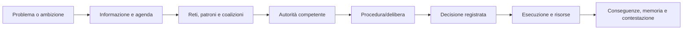

# Politica, autorità e amministrazione

## Scopo

Simulare decisioni civiche e imperiali come processi tra persone, cariche, norme, risorse, reputazioni e informazione imperfetta.

## Descrizione

La politica non è una barra di fazione. Attori sostengono agende per motivi pubblici e privati; magistrature e organi hanno competenze, durata, rituali, procedure e memoria. Il livello imperiale genera vincoli e opportunità senza rendere Pompei il centro dell'Impero.

## Ambito

Magistrature, amministrazione cittadina, elezioni locali pertinenti, deliberazioni, finanza pubblica, politica imperiale, cariche, favori, patronato, corruzione, prestigio, reputazione e risposta a crisi.

## Entità e autorità

| Entità | Dati |
|---|---|
| `OfficeDefinition/Tenure` | competenza, requisiti, durata, titolare, colleghi, limiti |
| `CivicBody` | membri, accesso, quorum/procedura se attestati, agenda |
| `Proposal/Decision` | iniziatore, base, sostenitori, oppositori, risorse, stato, esito |
| `PublicResource` | entrate, obblighi, commesse, spesa e custodia |
| `FavorObligation` | parti, richiesta, costo, prova, reciprocità e conflitto |
| `ImperialDirective` | fonte, area, data, autorità, interpretazione locale |

## Flusso decisionale

## Elezioni, favori e corruzione

Quando coerenti con data/luogo, candidature ed elezioni usano eleggibilità, sostegno, visibilità, reputazioni, famiglia, patrimonio/costi, promesse e opposizione. Favori sono obbligazioni sociali asimmetriche, non gettoni. Corruzione richiede atto, intento/incentivo, segretezza, testimoni/prove, beneficiari e rischio; il gioco distingue pratica attestata, zona grigia e illecito senza imporre categorie moderne.

## Politica imperiale

Direttive, nomine, fiscalità, guerra, culto imperiale e crisi arrivano come eventi con latenza e interpretazione. Gli attori locali possono obbedire, negoziare, ritardare o abusare entro capacità e rischio; il player comune raramente influenza E5 direttamente.

## Eventi, conseguenze e casi limite

Produce `OfficeFilled`, `ProposalOpened`, `Vote/DecisionRecorded`, `DirectiveReceived`, `PublicContractAwarded`, `CorruptionSuspected`; ascolta morte, status, scandalo, crisi, folla, finanze, festa e ordine imperiale. Carica vacante, parità/procedura incerta, candidato ineleggibile, autorità concorrenti, ordine contraddittorio e time-skip elettorale aprono fallback documentati, mai autoelezione del player.

## Simulazione e persistenza

P0 individui, cariche e decisioni; città remota aggrega coalizioni e agenda ma conserva titolari, casi, favori e ordini. Persistono mandati, atti, voti quando rappresentati, spese, obbligazioni, reputazioni e memoria pubblica.

## Accuratezza storica

Titoli, competenze, elezioni e procedure sono profili per città/data; Roma e province non sono template intercambiabili. Claim A–C governano ricostruzione; regole D sono dichiarate. Nessun “senato cittadino” o democrazia moderna viene assunto senza fonti.

## Dipendenze

- [Magistrature](magistracies.md)
- [Amministrazione](administration.md)
- [Politica locale](local-politics.md)
- [Politica imperiale](imperial-politics.md)
- [Corruzione](corruption.md)

## Collegamenti agli altri documenti

- [Carriera politica](political-career.md)
- [Status](../family-social/social-status.md)
- [Patronato](../family-social/patronage.md)
- [Finanza pubblica](public-finance.md)

## Test e Definition of Done

Testare competenza, eleggibilità, vacanza, procedura, direttiva, favore, corruzione, crisi, aggregazione e save/load. S4 quando profilo istituzionale Pompei e un ciclo civico completo sono validati interdisciplinarmente.

## Decisioni ancora aperte

- Data canonica e conseguente disponibilità delle elezioni/cariche locali.
- Organi, competenze e procedure P0 della demo.

## TODO

- Collegare dossier epigrafico e prosopografico di Pompei.
- Allineare sottodocumenti e scenari di crisi.
