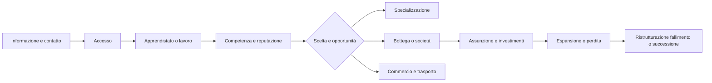

# Framework delle carriere economiche

## Scopo

Consentire al giocatore di apprendere, lavorare, dirigere un'impresa, investire, fallire e cambiare status attraverso opportunità sistemiche, non alberi di carriera garantiti.

## Descrizione

Una carriera è una storia di competenze, relazioni, reputazione, capitale, status e prove di lavoro. Professione, impiego, rango in bottega, proprietà e appartenenza a collegia sono dimensioni separate.

## Ambito

Lavoro occasionale, apprendistato, impiego, lavoro autonomo, bottega, società, trasporto, commercio, investimento, collegia, patronato economico, disoccupazione, insolvenza, fallimento e uscita.

## Ciclo di carriera

## Regole

- Accesso dipende da status, competenze, strumenti, contatti, fiducia, domanda e luogo.
- Apprendere consuma tempo e può richiedere compenso, servizio o patronato; produce conoscenza graduale e prove.
- Il lavoro produce output soltanto se input, capacità, sicurezza e tempo sono disponibili.
- Aprire una bottega richiede diritto d'uso, attrezzature, capitale circolante, fornitori e autorizzazioni pertinenti.
- Assumere crea un accordo, calendario, compenso, condizioni e responsabilità; gli NPC conservano autonomia e bisogni.
- Investire conferisce una quota/obbligazione e rischio tracciati, non reddito garantito.
- Collegia forniscono rete, rituali, mutuo supporto o influenza secondo fonti; non sono sindacati moderni universali.
- Fallimento conserva debiti, reputazione, relazioni, beni e possibilità lecite di recupero.

## Stati

`Non qualificato`, `Allievo`, `Apprendista`, `Lavoratore`, `Specialista`, `Responsabile`, `Autonomo`, `Socio`, `Proprietario`, `Inattivo`, `Insolvente`, `Ritirato`. Non sono livelli lineari: un soggetto può possedere ruoli multipli e retrocedere.

## Professioni giocabili

| Famiglia | Ruoli e progressioni possibili | Sistemi principali |
|---|---|---|
| Agricoltura/allevamento | bracciante, pastore, specialista, fattore, affittuario, proprietario/gestore | stagioni, terra, animali, trasporto |
| Alimentare | mugnaio, fornaio, macellaio, pescatore, produttore di conserve/garum, venditore | filiere, salute, mercato |
| Vino/olio | lavoratore, torchio/frantoio, cantiniere, mercante, gestore | qualità, stagioni, contenitori |
| Tessile/cuoio | filatore, tessitore, follatore, tintore, conciatore, sarto/calzolaio, bottegaio | acqua, ricette, moda, contratti |
| Ceramica/vetro | estrattore, preparatore, vasaio/vetraio, decoratore, capobottega | forni, combustibile, fragilità |
| Metallo/legno | minatore remoto, fonditore, fabbro, carpentiere, riparatore, appaltatore | materiali, sicurezza, commesse |
| Pietra/edilizia | cavatore remoto, trasportatore, muratore, lapicida, decoratore, capocantiere | proprietà, cantieri, rischio |
| Commercio/logistica | facchino, conducente, marinaio, magazziniere, mediatore, mercante, armatore/investitore | rotte, custodia, credito |
| Servizi urbani | oste, locandiere, addetto alle terme, lavandaio, scriba/contabile, banditore | edifici, reputazione, informazione |
| Salute/cura | assistente, raccoglitore, preparatore, praticante secondo competenza/status | salute, medicinali, responsabilità |
| Intrattenimento | musicista, attore, atleta/gladiatore nei limiti di status e contratto, organizzatore | folla, patronato, rischio |
| Religione/amministrazione | mansioni accessibili soltanto con requisiti storici, status e nomina | culto, politica, legge |
| Illecito | contrabbandiere, ricettatore, frodatore o membro di banda come attività rischiose, non “classe” | crimine, prove, mercato nero |

La disponibilità nella demo è una selezione P0, non l'intero catalogo imperiale.

## Dati, eventi e dipendenze

Dati: ruoli, competenze, esperienza osservabile, maestro, accordi, turni, strumenti, luogo, reputazioni, quote, appartenenze, incidenti e storico. Produce `WorkAccepted`, `SkillPracticed`, `ApprenticeshipChanged`, `EnterpriseOpened`, `WorkerHired`, `OrderCompleted`, `EnterpriseInsolvent`; ascolta domanda, prezzo, salute, status, morte, evento familiare, contratto, crimine e shock.

## Casi limite e bilanciamento

Maestro morto, bottega distrutta, pagamento mancato, status mutato, lavoro simultaneo, ricetta senza input, ordine impossibile e successione sospendono o rinegoziano il percorso. La progressione premia affidabilità e conoscenza, ma domanda e potere possono bloccare opportunità. Il gioco presenta cause e alternative, non percentuali opache.

## Prestazioni e persistenza

Vicino: azioni e output per ciclo. Fuori schermo: turni e ordini. Città remota: capacità e impiego aggregati, preservando player, maestri, dipendenti, contratti e crisi. Save/load conserva accordi, competenze, relazioni, proprietà e storico.

## Dipendenze

- [Professioni](professions.md)
- [Apprendistato](apprenticeship.md)
- [Lavoro](../economy-production/labor.md)
- [Contratti](../economy-production/contracts.md)
- [Filiere](../economy-production/supply-chains.md)

## Collegamenti agli altri documenti

- [Status sociali](../family-social/social-status.md)
- [Patronato](../family-social/patronage.md)
- [Reputazione](../family-social/reputation.md)
- [Demo economia](../../07-pompeii-demo/demo-economy.md)

## Test e criteri di completamento

Testare accesso per status, apprendimento, retribuzione, apertura/affitto, assunzione, ordine, investimento, collegium, perdita, fallimento, eredità e aggregazione. Completato quando almeno un percorso end-to-end per ciascuno status demo è giocabile sulla carta e nessun avanzamento è automatico.

## Decisioni ancora aperte

- Professioni P0 e punti d'ingresso per cittadino, liberto e schiavo.
- Soglie di competenza e durata degli apprendistati, subordinate alle fonti e al ritmo demo.

## TODO

- Creare schede professionali P0 con attività, rischi, contratti e strumenti.
- Collegare luoghi di lavoro verificati nella mappa di Pompei.
