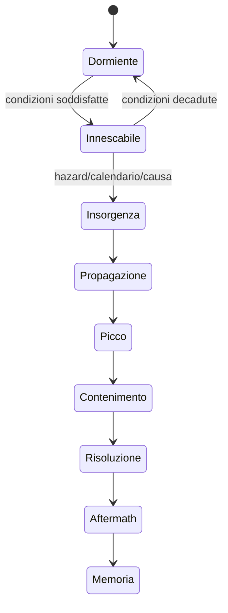

# Framework degli eventi dinamici

## Scopo

Definire eventi condizionati, propagabili e persistenti che trasformano il mondo senza diventare rumore casuale o contenuto continuo.

## Descrizione

Un evento è un processo causale con origine, precondizioni, scala, intensità, durata, propagazione, impatti, risposte e memoria. La frequenza deriva da hazard, calendario e stato del mondo; i grandi eventi sono rari e sottoposti a budget.

## Ambito

Eventi sociali, economici, politici, religiosi, militari; incendi, epidemie, terremoti, eruzione e altre catastrofi solo secondo scope e accuratezza. Impatti su NPC, mercati, edifici e situazioni narrative.

## Dati canonici

`EventDefinition`: famiglia, validità storica, hazard, condizioni, severità possibile, propagazione, risposte e cooldown. `EventInstance`: origine, causa/seed, area, tempo, intensità, fase e attori. `ImpactRecord`: target, danno/cambiamento, autorità e reversibilità. `ResponsePlan`: attore, capacità, priorità e azioni. `HistoricalMemory`: fatti, versioni credute, commemorazione e decadenza.

## Lifecycle

## Frequenza, gravità e budget

| Classe | Esempio | Frequenza | Regola |
|---|---|---|---|
| D0 micro | lite, ritardo, piccolo guasto | frequente ma locale | budget per area/tema |
| D1 routine | mercato, rito, lavoro, udienza | calendario/stato | non trattato come emergenza |
| D2 disturbo | furto, carenza, incendio contenuto | occasionale | cooldown e cause |
| D3 crisi | epidemia locale, grande incendio, rivolta | rara | gate multipli e aftermath |
| D4 catastrofe | terremoto distruttivo/eruzione nello scope | eccezionale/canonica | decisione narrativa-storica |
| D5 imperiale | guerra/trionfo/direttiva maggiore | rarissima/remota | autorità, risorse e cronologia |

Feste e giochi possono ricorrere secondo calendario e finanziamento, ma competono per luoghi, lavoro, attenzione e risorse; nessun scheduler li rende continui.

## Propagazione e impatti

Propagazione usa reti specifiche: contatto/mobilità per malattia, adiacenza/materiali/vento per incendio, rotte/informazione per economia e notizie, autorità per politica. Impatti NPC: conoscenza, bisogni, salute, routine, fuga e lutto. Economia: scorte, capacità, domanda, prezzi, debiti e rotte. Edifici: accesso, funzione, danno, incendio, riparazione. Missioni: nascita, trasformazione, impossibilità, nuove scadenze e aftermath; mai cancellazione silenziosa.

## Risposta, risoluzione e memoria

Attori rispondono solo se informati, autorizzati e capaci. Risoluzione può essere esaurimento, contenimento, decisione, riparazione o trasformazione; non sempre ripristina baseline. Il ledger conserva causa, impatti, responsabili creduti, vittime, cambi urbanistici, prezzi e commemorazioni con diversi livelli di memoria.

## Casi limite, performance e persistenza

Due eventi sovrapposti, propagazione ciclica, area scaricata, edificio già distrutto, NPC evacuato due volte, missione legata a morto e save al picco richiedono idempotenza e causal trace. Aggiornamento a fronti/regioni e milestone, non ogni entità per frame; target P0 individuali persistono. Save: fase, fronti, impatti, risposte, seed e memoria.

## Accuratezza e bilanciamento

Hazard, stagionalità e impatti sono A–E per data/luogo. Nessun disaster director aumenta la gravità perché il player “si annoia”. Tensione deriva da vulnerabilità e capacità reali; sistemi di protezione e recupero creano agency senza rendere il player salvatore universale.

## Dipendenze

- [Sistema eventi](../../04-simulation/calendar-events/event-system.md)
- [Orchestrazione](../../04-simulation/calendar-events/event-orchestration.md)
- [Disastri](../../04-simulation/calendar-events/disasters.md)
- [Ledger](../../04-simulation/calendar-events/world-history-ledger.md)

## Collegamenti agli altri documenti

- [Narrazione](../narrative/emergent-narrative.md)
- [Missioni](../quests/quest-framework.md)
- [NPC](../../04-simulation/npc-population-ai/social-event-responses.md)
- [Edifici](../../03-world/structures/buildings.md)

## Test e Definition of Done

Testare D0–D5, ogni rete di propagazione, sovrapposizione, risposta, impatto sui quattro domini, risoluzione, aftermath, memoria, time-skip e save/load. S4 con frequenze, budget e scenari Pompei approvati.

## Decisioni ancora aperte

- Catalogo e frequenze P0, inclusa collocazione temporale dell'eruzione.
- Budget simultaneità, fronti e memoria.

## TODO

- Creare matrici evento-condizione-impatto-risposta.
- Allineare i dossier specialistici al framework.
