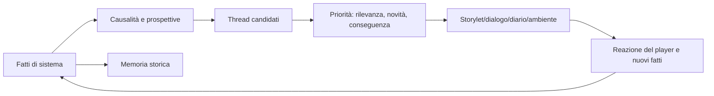

# Narrazione emergente e memoria del mondo

## Scopo

Trasformare catene causali simulate in storie comprensibili senza falsificare eventi, imporre protagonismo o generare testo incoerente.

## Descrizione

La narrazione emerge quando fatti persistenti coinvolgono persone e valori nel tempo. Il sistema seleziona, collega e presenta; non modifica di nascosto economia, politica o relazioni per produrre dramma.

## Ambito

Relazioni, economia, politica, religione, famiglia, reputazione, crimine, guerra, malattia, catastrofe e mobilità sociale; framing, storylet, continuità, recap, memoria e conseguenze.

## Modello narrativo

| Entità | Funzione |
|---|---|
| `WorldFact` | evento canonico con causa, attori, luogo, tempo e autorità |
| `PerspectiveRecord` | ciò che un personaggio crede e prova rispetto al fatto |
| `CausalChain` | collegamenti verificabili tra fatti |
| `NarrativeThread` | tema, posta, partecipanti, tensioni e stato; vista, non autorità |
| `Storylet` | framing curato applicabile a condizioni reali |
| `WorldMemoryEntry` | sintesi persistente pubblica, familiare, personale o istituzionale |

## Pipeline

## Fonti emergenti

- **Relazioni/famiglia:** promesse, gelosia, cura, eredità, separazione e riconciliazione.
- **Economia/mobilità:** scarsità, debito, bottega, fallimento, lavoro e ascesa/regressione.
- **Politica/religione:** favori, cariche, riti, contestazioni, feste e direttive.
- **Crimine/reputazione:** osservazioni, prove, voci, impunità, processo e stigma locale.
- **Guerra/malattia/catastrofe:** assenza, ferite, migrazione, lutto, distruzione e ricostruzione.

## Regole

- Nessun thread conosce fatti non percepiti; prospettive possono contraddirsi.
- Il player può essere periferico, testimone, beneficiario o vittima, non sempre causa.
- La priorità evita ripetizione e sovraccarico, ma non cancella conseguenze.
- Storylet non assegna motivazioni incompatibili con memoria/personalità.
- La causalità distinguibile è consultabile in debug e riassunta senza spoiler in UX.
- Eventi gravi hanno aftermath e cooldown narrativo; non si concatenano per puro intrattenimento.

## Stati, fallimenti e continuità

Thread `Latente → Attivo → Intensificato/Trasformato → Risolto/Estinto → Ricordato`. “Risolto” significa tensione terminata, non esito felice. Un attore morto, un luogo distrutto o un fatto smentito trasforma il thread. Versionamento conserva identità e recap dopo save/migrazione.

## Bilanciamento, casi limite e performance

Budget per thread attivi per persona/area, cooldown semantico, deduplicazione di fatti, priorità per conseguenza e distanza. Cicli causali, thread senza attori, contraddizioni, memoria infinita, due storylet incompatibili e recap che rivela segreti vengono quarantinati. L'elaborazione è event-driven e aggrega thread remoti.

## Accuratezza e linguaggio

Framing e dialogo non attribuiscono categorie psicologiche/politiche moderne senza licenza. Ogni riferimento storico eredita provenance; il testo distingue fatto, voce, interpretazione e adattamento D.

## Dipendenze

- [Architettura narrativa](narrative-architecture.md)
- [Storylet](storylets.md)
- [Continuità](narrative-continuity.md)
- [Missioni](../quests/quest-framework.md)
- [Ledger storico](../../04-simulation/calendar-events/world-history-ledger.md)

## Collegamenti agli altri documenti

- [Dialoghi](dialogue-system.md)
- [Eventi](../events/dynamic-event-framework.md)
- [Reputazione](../../04-simulation/family-social/reputation.md)
- [Informazione UX](../../08-ux/user-experience/information-design.md)

## Test e Definition of Done

Testare una catena per ogni fonte, prospettive discordi, player assente, morte, smentita, aftermath, deduplicazione, recap e save/load. S4 con playtest longitudinali privi di ripetizione, spoiler e causalità inventata.

## Decisioni ancora aperte

- Budget thread/storylet e durata della memoria narrativa.
- Rapporto tra contenuto principale curato ed emergente nella demo.

## TODO

- Creare corpus di golden chains Pompei.
- Definire metriche di ripetizione, chiarezza e agency.
