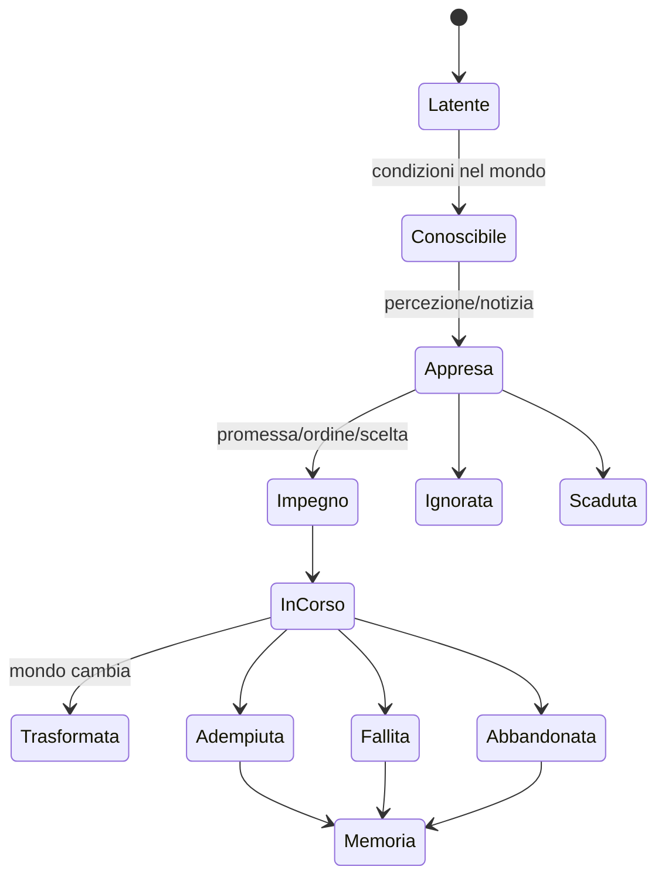

# Framework di situazioni, impegni e missioni

## Scopo

Definire contenuti orientati al giocatore senza trasformare il mondo in una lista artificiale di obiettivi, marker e soluzioni corrette.

## Descrizione

Una missione è una vista editoriale su fatti, impegni, opportunità e conseguenze già posseduti dai sistemi. Non crea direttamente denaro, relazioni, crimini o status: richiede comandi alle rispettive autorità. Il diario registra ciò che il personaggio sa, la fonte e l'incertezza.

## Ambito

Storie principali, professioni, incarichi, favori, famiglia, clientela, religione, politica, esercito, crimini/indagini, eventi emergenti, opportunità temporanee, fallimenti e dilemmi senza soluzione perfetta.

## Tassonomia

| Tipo | Origine | Forma | Conclusione |
|---|---|---|---|
| Storia principale | temi e situazioni curate | catena flessibile, non destino eroico | esiti multipli o abbandono persistente |
| Professionale | ordine, apprendistato, impresa | lavoro, qualità, tempo, accordo | consegna, rinegoziazione, perdita |
| Incarico/favore | persona o autorità | promessa e reciprocità | adempimento, rifiuto, debito sociale |
| Familiare/clientelare | relazione preesistente | obbligo, cura, conflitto | compromesso, rottura o trasformazione |
| Religiosa | calendario, voto, comunità | preparazione e pratica | rito, omissione, contestazione |
| Politica/militare | carica, ordine, rete | competenza e autorità | decisione, servizio, sconfitta o sanzione |
| Crimine/indagine | atto, osservazione, denuncia | prove, rischio, foro | caso, accordo, impunità, pena |
| Emergente/temporanea | stato del mondo | finestra reale | colta, ignorata, scaduta, mutata |

## Modello dati

`SituationDefinition`: tema, ruoli, precondizioni, binding, varianti, safety e fonti. `SituationInstance`: attori/luoghi reali, conoscenza, stato, scadenze, impegni e causalità. `Lead`: fatto creduto, fonte, confidenza e luogo/tempo. `Commitment`: soggetto, destinatario, prestazione, termine e conseguenze. `OutcomeRecord`: fatti prodotti dalle autorità e memoria narrativa.

## Stati e flusso

## Regole di authoring

- Ogni obiettivo visibile deriva da una fonte: osservazione, dialogo, documento, obbligo o deduzione.
- Marker sulla mappa indicano solo luoghi conosciuti con precisione compatibile; voci mostrano aree/incertezza.
- Le condizioni verificano stato canonico; non duplicano inventari o reputazioni.
- Almeno un'alternativa a combattimento quando il contesto lo consente; nessun esito “perfetto” obbligatorio.
- Fallire continua il mondo: debito, perdita, nuovo rapporto, lutto, indagine o occasione diversa.
- Scadenze esistono solo per cause diegetiche e continuano senza il giocatore.
- NPC non attendono eternamente né cambiano personalità per servire il contenuto.
- Ricompense sono trasferimenti e conseguenze reali, non spawn scollegati.

## Flussi alternativi e dilemmi

Informazione incompleta può portare alla persona/luogo errato; un incarico può essere rinegoziato, delegato, tradito o reso impossibile da incendio/morte/arresto. Dilemmi espongono valori e costi incompatibili senza nascondere una soluzione dominante. Il sistema registra il perché dell'esito, non un voto morale universale.

## Eventi generati e ricevuti

Riceve conoscenza, contratto, relazione, morte, prezzo, calendario, crimine, decisione, rito, guerra, malattia, catastrofe ed edificio inaccessibile. Genera solo eventi di contenuto (`SituationKnown`, `CommitmentAccepted`, `LeadUpdated`, `SituationClosed`) e comandi autorizzati; le conseguenze restano dei domini.

## UI e leggibilità

Il diario separa: impegni accettati, opportunità conosciute, persone/luoghi, prove, scadenze, conseguenze e archivio. Nessuna freccia permanente; navigazione assistita opzionale usa conoscenza corrente. Notifiche sono raggruppate e prioritarie, con recap consultabile.

## Casi limite, persistenza e performance

NPC morto, edificio distrutto, oggetto perso, due istanze sullo stesso attore, scadenza nel time-skip, falso lead, save durante transizione e contenuto non più valido producono trasformazione/fallimento esplicito. Persistono binding, conoscenza, impegni, stati, timer causali, outcome e versione. Valutazione event-driven; niente polling globale per frame.

## Dipendenze

- [Framework contenuti](../content-framework.md)
- [Narrazione emergente](../narrative/emergent-narrative.md)
- [Eventi dinamici](../events/dynamic-event-framework.md)
- [Conoscenza](../../04-simulation/npc-population-ai/memory.md)

## Collegamenti agli altri documenti

- [Fallimento](quest-failure.md)
- [Opportunità temporanee](timed-opportunities.md)
- [Diario](../../08-ux/ui/journal.md)
- [Crimini e indagini](crime-investigation-quests.md)

## Test e Definition of Done

Testare ciascun tipo, informazione falsa, rifiuto, trasformazione, fallimento, dilemma, morte, catastrofe, time-skip, save/load e assenza marker. S4 quando una matrice di situazioni Pompei attraversa tutti i sistemi P0 con causal trace e UX validata.

## Decisioni ancora aperte

- Numero e mix di situazioni P0 della demo.
- Assistenza di navigazione predefinita e granularità del diario.

## TODO

- Creare template di authoring e golden situations per ogni famiglia P0.
- Allineare i sottodocumenti delle missioni al contratto canonico.
