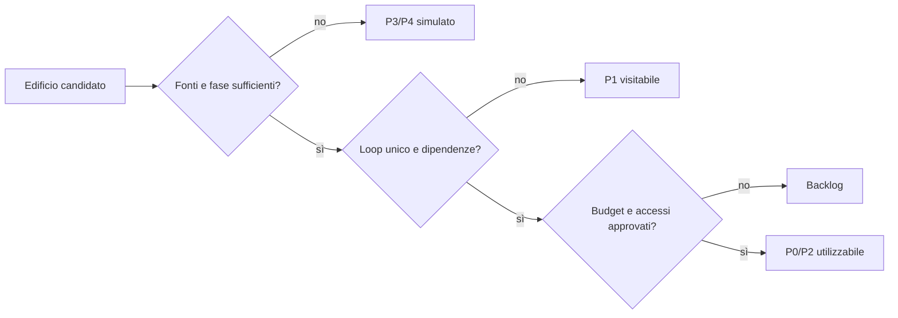

# Catalogo di accessibilità degli edifici di Pompei

## Scopo

Definire quali edifici sono utilizzabili, visitabili, condizionali, chiusi o simulati, con funzione storica, costo e loop.

## Descrizione

Il catalogo è un piano di authoring, non una dichiarazione che ogni attribuzione archeologica sia certa. I nomi “Casa di…” sono identificatori moderni; funzione, proprietà e occupanti richiedono schede A–E.

## Ambito

Candidati PVS-1. L'accessibilità finale dipende dal perimetro e dallo snapshot.

## Edifici pubblici, politici e mercantili

| Luogo | Funzione | Accesso proposto | Uso | Nota storica/produzione |
|---|---|---:|---|---|
| Foro civile | spazio civico, rituale e mercantile | P0/P1 | incontri, annunci, mercato/eventi | funzioni per data e area |
| Basilica | attività giudiziarie/economiche | P1/P2 | udienze e contratti selezionati | procedura da HV-010/011 |
| cosiddetto Comitium | funzione civica discussa | P1 | scene politiche limitate | funzione probabile, non certa |
| Macellum | mercato specializzato | P0 | acquisto, consegne, prezzi, ispezione | contenuti e orari da ricerca |
| Edificio di Eumachia | funzione/uso complesso | P1/P2 | patronato, cerimonia, lavoro indiretto | evitare etichetta funzionale unica |
| edifici amministrativi meridionali | autorità civiche | P2 | accesso per ruolo/appuntamento | interni da selezionare |

## Religione

| Luogo | Accesso | Uso | Vincolo |
|---|---:|---|---|
| Santuario di Apollo | P1/P2 | culto pubblico, offerte, calendario | stato per snapshot |
| Capitolium/Tempio di Giove | P1/P2 | cerimonie civiche | lavori e fase da verificare |
| Santuario dei Lari Pubblici | P1 | osservazione/riti selezionati | interpretazione funzionale discussa |
| Tempio del Genius Augusti/Vespasiano, denominazione discussa | P1/P2 | culto civico-imperiale | nome/funzione non assoluti |
| Santuario di Iside | P0/P2 | preparazione, rituale, rete sociale | accessi differenziati e review religiosa |
| larari domestici | P0 in case selezionate | riti household | variazione, non modello identico |

## Terme e spettacolo

| Luogo | Accesso | Uso | Stato |
|---|---:|---|---|
| Terme Stabiane | P0 | bagno, lavoro, socialità, acqua | candidato core |
| Terme del Foro | P1/P0 opzionale | variante e hub foro | rischio duplicazione |
| Terme Centrali | P1/chiuse | edificio incompleto nel 79 | non trattare come terme operative se snapshot 79 |
| Teatro Grande | P1/P0 evento | spettacolo e folla | programma non continuo |
| Teatro Piccolo/Odeion | P1/P0 evento | spettacolo più contenuto | funzione/programma da dossier |
| Anfiteatro | P1/P0 evento | giochi, venditori, ordine pubblico | grandi eventi rari |
| Grande Palestra | P1/P0 evento | esercizio, aggregazione | funzione e accessi contestualizzati |

## Attività economiche candidate

| Luogo moderno | Accesso | Loop | Cautela |
|---|---:|---|---|
| Fullonica di Stephanus | P0 | tessile, lavoro, consegne | attribuzione/asset per fase |
| panificio da selezionare | P0 | grano–farina–pane | scegliere su attrezzature e percorso |
| Thermopolium di Vetutius Placidus | P0/P1 | vendita e approvvigionamento | evitare “fast food”; contenuti non dedotti dai dolia |
| botteghe VII 14 o equivalenti | P0/P1 | trasformazione d'uso | ricerca mostra fasi e incertezza |
| taverna/caupona selezionata | P0 | ospitalità, notizie, credito | terminologia e reputazione non universali |
| officina artigiana selezionata | P0 | produzione e manutenzione | filiera deve giustificare il costo |

## Case private e ville

| Tipo/candidato | Accesso | Condizione | Funzione gameplay |
|---|---:|---|---|
| casa modesta a uso misto | P0 | residente/origine/rapporto | household e bottega |
| domus media | P2 | cliente, invito, lavoro, illecito | patronato e accesso sociale |
| Casa dei Vettii | P1/P2 | invito o servizio | élite/liberti con cautela biografica |
| Praedia di Giulia Felice | P1/P2 | affitto, servizio, invito | proprietà/uso multiplo da dossier |
| Casa di Venere in Conchiglia | P1/P2 | invito/contenuto | arte e domesticità |
| Casa del Frutteto | P1/P2 | invito/contenuto | giardino/immaginario domestico |
| Villa dei Misteri | P4 o mappa locale P2 | invito, lavoro, viaggio | alto costo; culto/immagini non banalizzati |
| villa rustica vesuviana composita | P4, futuro P0 locale | lavoro/contratto | composito D basato su più siti, dichiarato |

## Edifici chiusi o simulati

- Interni senza loop distinto: P3, con residenti e scorte aggregate.
- Aree non scavate o funzione incerta: P3/P4, senza ricostruzione visibile definitiva.
- Edifici strutturalmente in lavori nello snapshot: accesso limitato, ma lavori producono economia e rischi.
- Ville fuori mappa: P4 con proprietà, produzione, persone e viaggi; nessun teletrasporto.

## Matrice di promozione

## Dipendenze

- [Area](playable-area.md)
- [Stato edifici](../../03-world/structures/buildings.md)
- [Claim storici](../../02-historical-foundation/sources/historical-claims-register.md)

## Collegamenti agli altri documenti

- [Distretti](districts.md)
- [Professioni](demo-professions.md)
- [Economia](../demo-economy.md)
- [Religione](../../04-simulation/religion.md)

## Criteri di completamento

Ogni edificio ha identificatore archeologico, fase, classe, access tier, loop, owner, residenti, orari, inventari, costo, fallback e test.

## Rischi di produzione

Troppi interni, falsa certezza funzionale, case museo, duplicazione dei loop, accessi sociali irrilevanti e costi di conservazione artistica.

## Decisioni ancora aperte

- Selezione esatta di panificio, caupona, officina e case P0.
- Villa dei Misteri nel perimetro o solo nodo.
- Terme del Foro complete o Stabiane soltanto.

## TODO

- Creare schede edificio per tutti i candidati P0/P2.
- Stimare costi modulari e dipendenze audio/AI/quest.
