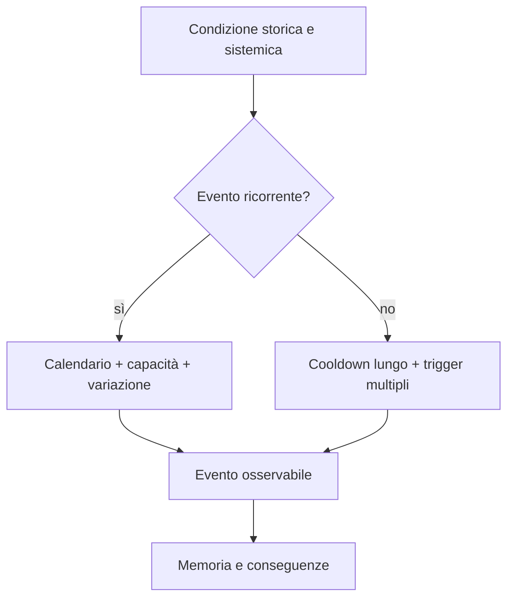

# Cicli temporali, calendario ed eventi di Pompei

## Scopo

Definire ritmi giornalieri, ricorrenze, stagioni ed eventi senza imporre una settimana moderna o orari universali.

## Descrizione

Le attività dipendono da luce, stagione, mercato, status, obblighi, acqua, eventi e lavoro. Il ciclo delle *nundinae* è distinto dalla settimana moderna di sette giorni; la sua applicazione locale precisa resta da verificare.

## Ambito

Demo PVS-1, fino a 30 giorni simulati per test; calendario storico completo subordinato alla data iniziale.

## Ciclo giornaliero

| Fase | Città | Household/lavoro | Istituzioni | Rischi/eventi |
|---|---|---|---|---|
| pre-alba | preparazione, consegne selettive | accensione, acqua, animali | personale prepara spazi | furto, incendio, ritardi |
| alba–mattina | crescita traffico e mercato | avvio turni e visite | udienze/affari secondo giorno | congestione, controversie |
| metà giornata | redistribuzione dei flussi | pasti/riposo variabili | pausa o cambio programma | caldo, scarsità acqua |
| pomeriggio | terme, produzione, spettacoli | completamento/consegne | eventi e patronato | folle, incidenti |
| tramonto | chiusure e rientri | pasti, culto domestico, ospitalità | deflusso | conflitti, smaltimento |
| notte | attività ridotta e selettiva | sonno/guardia | emergenze | crimine, fuoco, malattia |

Nessuna fase impone la stessa routine a tutti; schiavitù, mestiere, età, genere, salute e stagione cambiano libertà e obblighi.

## Ciclo “settimanale” e nundinale

- Il sistema supporta una ricorrenza di otto giorni inclusiva (*nundinum*) per mercati/ritmi quando attestata.
- La settimana di sette giorni può coesistere come computo nel I secolo, ma non viene trasformata automaticamente in weekend moderno.
- Giorni *fasti/nefasti/comitiales* richiedono calendario e applicazione locale; finché non verificati influenzano solo contenuti approvati.
- Scadenze economiche e legali usano date, non “ogni lunedì”.

## Ciclo stagionale

| Driver | Effetti sistemici |
|---|---|
| luce/temperatura | orari, fatica, ombra, domanda di acqua |
| pioggia | strade, drenaggio, lavoro esterno, approvvigionamento |
| raccolti | lavoro, trasporto, scorte, prezzi e feste |
| navigazione | affidabilità delle rotte marittime e arrivi |
| malattie | rischio contestuale, non epidemia automatica |
| calendario rituale | domanda, chiusure, processioni, spettacoli |

## Eventi ricorrenti

Mercato secondo calendario approvato; bagni e spettacoli programmati; riti domestici e civici; pagamenti/scadenze; manutenzione; funerali non “schedulati”; arrivi di merci; riunioni e campagne politiche quando coerenti.

## Eventi eccezionali

Incendio, crollo, scarsità, piena/allagamento locale, disordine a spettacolo, visita di autorità, processo importante, notizia imperiale, malattia diffusa e shock di trasporto. Terremoto ed eruzione richiedono milestone e ADR proprie.

## Frequenza e rarità

Grandi giochi e catastrofi non sono rumore continuo. Ogni evento consuma risorse, modifica flussi e lascia un periodo di recupero.

## Trasformazioni della città

Giorni: scorte, lavori, accessi. Mesi: riparazioni, attività che aprono/chiudono, household riorganizzati. Anni: restauri, cariche, proprietà, carriere e uso degli edifici. La demo prova giorni e conseguenze differite; trasformazioni annuali possono essere aggregate.

## Dipendenze

- [Data](historical-date.md)
- [Tempo](../../03-world/time-and-persistence.md)
- [Calendario](../../04-simulation/religion-calendar/calendar.md)
- [Eventi](../../04-simulation/calendar-events/event-system.md)

## Collegamenti agli altri documenti

- [Zone/flussi](districts.md)
- [Economia](../demo-economy.md)
- [Religione](../../04-simulation/religion.md)
- [Cronologia](../../02-historical-foundation/chronology/official-timeline.md)

## Criteri di completamento

Data approvata; calendario con fonti; routine differenziate; frequenze/cooldown; almeno un ciclo stagionale; test di 30 giorni senza sincronizzazione artificiale.

## Rischi di produzione

Weekend moderno, routine sincronizzate, festival continui, stagioni cosmetiche, sovraccarico di folla e calendario non coerente con la data.

## Decisioni ancora aperte

- Calendario locale, stagione iniziale e ricorrenze della demo.
- Durata massima e accelerazione temporale.

## TODO

- Costruire calendario candidato dopo Q-001.
- Validare heatmap, domanda e performance evento per evento.
