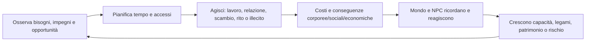

# Mandato eseguibile della demo di Pompei

**ID:** DEM-CHARTER-001
**Stato:** S3 — baseline di scope; greenlight subordinato a `READY_FOR_IMPLEMENTATION.md`

## Scopo

Definire il risultato giocabile minimo che dimostri la visione di *Roma Aeterna* attraverso una vertical slice densa, causale e storicamente contestualizzata.

## Descrizione

La demo non è una versione ridotta dell'Impero. È una prova end-to-end di una vita ordinaria a Pompei: il giocatore entra in un household, lavora, usa denaro o credito, costruisce relazioni, partecipa a pratiche sociali e religiose, può trasgredire, affronta conseguenze persistenti e lascia una posizione modificata a un successore.

## Ambito

### Obiettivo dimostrativo

Entro una singola esperienza completa, il giocatore deve poter spiegare almeno una catena causale che attraversi persona, lavoro, economia, relazione, conoscenza/reputazione e istituzione. Il mondo deve continuare per trenta giorni simulati senza il giocatore e restare interrogabile.

### Durata

| Misura | Target D |
|---|---:|
| Primo percorso completo | 5–7 ore |
| Onboarding fino alla prima scelta autonoma | massimo 20 minuti |
| Tutti e tre i percorsi | 15–21 ore senza richiedere completismo |
| Orizzonte diegetico standard | 30 giorni di gioco |
| Sessione interna di validazione accelerata | fino a 1 anno simulato |

La durata non è ottenuta con grind o attese obbligatorie; il calendario avanza tramite attività, riposo, viaggio e time-lapse controllato.

### Epoca e data iniziale

Pompei, Campania, età flavia. La baseline inizia all'alba del **1 luglio 77 d.C.** La data è una convenzione D, non un'affermazione che gli eventi fittizi siano attestati. L'eruzione del 79 d.C. è esclusa dall'orizzonte della demo pubblicabile.

### Area giocabile

Baseline PVS-1: percorso urbano continuo dal Foro lungo Via dell'Abbondanza fino all'Anfiteatro/Grande Palestra, con cluster selettivi Terme Stabiane, area teatri/Santuario di Iside, panificio, fullonica, botteghe e tre household. Porte, campagna, ville, porto e città regionali sono nodi simulati o destinazioni non liberamente esplorabili. Il poligono esatto resta gate GIS.

## Promessa al giocatore

“Non sei il centro del mondo: possiedi una vita situata e puoi modificarla, ma ogni opportunità ha persone, luoghi, tempi, costi e conseguenze.”

## Ciclo principale

Non esiste un'unica quest principale obbligatoria. Una situazione civico-economica comune collega i tre percorsi, mentre professione, household, culto, patronato e crimine offrono ingressi diversi.

## Percorsi iniziali

| Percorso | Fantasia verificata | Vincolo dominante | Possibile esito demo |
|---|---|---|---|
| Cittadino libero | responsabilità civica e household | debito, reputazione, obblighi | stabilizza attività e designa erede |
| Liberta | autonomia incompleta e rete commerciale | patrono, genere, credito e prestigio | consolida bottega/household e successione |
| Persona schiavizzata | sopravvivenza e agency sotto coercizione | autorità del dominus, violenza e incapacità patrimoniale | migliora condizioni, costruisce legami o ottiene manomissione non garantita |

Dettagli e guardrail sono in [percorsi giocabili](playable-paths.md) e [personaggi iniziali](starting-characters.md).

## Minimo insieme di sistemi

1. tempo, calendario e persistenza;
2. persona, bisogni essenziali, salute e inventario;
3. NPC persistenti, routine, conoscenza e relazioni;
4. accesso situato a edifici e interazioni;
5. lavoro e filiera grano–farina–pane, più tessile e servizi in forma mirata;
6. proprietà/custodia, moneta, prezzi locali, credito e obbligazioni;
7. household, unione/contubernium, eredità e successione coerenti con status;
8. culto domestico e un culto pubblico/associativo;
9. reputazione locale, testimoni, furto/frode/aggressione e risposta istituzionale;
10. dialoghi epistemici, situazioni, UI minimale e audio adattivo;
11. combattimento non letale/rissa e trauma limitato;
12. save manuale/autosave, debug e replay diagnostico.

Se uno di questi elementi manca, la demo non dimostra la promessa completa. Guerre, esercito operativo, arena completa, trionfo a Roma, politica imperiale, intero agro e multiplayer non appartengono al minimo.

## Progressione e conseguenze

- **Progredire:** competenze dimostrate, fiducia, accessi, strumenti, responsabilità e patrimonio; nessun livello astratto sblocca status automaticamente.
- **Relazioni:** tempo condiviso, favori, affidabilità, conoscenza e conflitti; affinità non è una barra universale.
- **Lavorare/guadagnare:** turni, commesse, produzione, vendita, servizio e trasporto con input e controparti reali.
- **Spendere:** cibo, affitto, strumenti, offerte, cura, debiti, abbigliamento, ospitalità e favori.
- **Sbagliare:** perdere una scadenza, danneggiare beni, mentire, indebitarsi, rubare, aggredire o rompere un legame.
- **Subire conseguenze:** perdita economica, dolore, sospetto, testimonianza, esclusione, azione del patrono/dominus o procedimento.
- **Status:** prestigio e ricchezza possono cambiare opportunità; status giuridico cambia solo con atto valido, per esempio manomissione, e non è garantito.
- **Famiglia/eredità:** unione o household, dipendenti e disposizione dei diritti; la continuazione usa un erede eleggibile e conserva la memoria del mondo.

## Risultati di successo

- Le tre origini producono capacità e rischi realmente diversi con regole condivise.
- Almeno due economie di household restano sostenibili senza sussidi invisibili.
- Ogni informazione mostrata ha fonte percettiva o sociale.
- Un errore significativo resta recuperabile senza annullare le conseguenze.
- Il giocatore può chiudere il percorso con patrimonio, legami e reputazioni differenti dall'inizio.
- Save/load e simulazione lontana non duplicano persone, beni o obblighi.

## Dipendenze

- [Visione creativa](../../01-vision/creative-vision.md)
- [Area giocabile](playable-area.md)
- [Scope sistemi](demo-systems-scope.md)
- [Scope contenuti](demo-content-scope.md)
- [Architettura tecnica](../../10-technical/technical-architecture.md)

## Collegamenti agli altri documenti

- [Vertical slice](../pompeii-vertical-slice.md)
- [Professioni](demo-professions.md)
- [Criteri di accettazione](demo-acceptance.md)
- [Backlog](../../11-production/roadmap-backlog/demo-backlog.md)
- [Checklist di implementazione](../../READY_FOR_IMPLEMENTATION.md)

## Rischi

- Scope urbano troppo ampio rispetto alla densità interattiva.
- Tre percorsi diventano tre giochi separati anziché viste dello stesso sistema.
- Successione richiede un orizzonte incompatibile con 5–7 ore.
- Violenza o schiavitù usate come scorciatoia spettacolare.
- Simulazione complessa ma illeggibile al giocatore.

## Criteri di completamento

Mandato approvato da Direction, Historical, Design, Technical, UX/Accessibility, Production e QA; tutte le feature P0 tracciate a epic, test, budget e milestone; nessuna decisione bloccante non registrata.

## Decisioni ancora aperte

- Poligono GIS definitivo e lista edifici P0.
- Target hardware/input/accessibilità e rating.
- Conteggi NPC e contenuti dopo benchmark.
- Regole giuridiche locali finali per famiglia, manomissione e successione.

## TODO

- Chiudere i gate indicati in [READY_FOR_IMPLEMENTATION](../../READY_FOR_IMPLEMENTATION.md).
- Sostituire target D con misure dopo i prototipi autorizzati.
