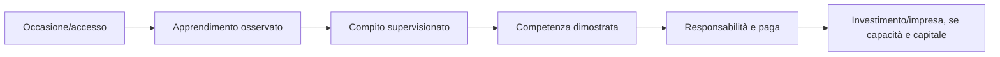

# Professioni e lavoro della demo

**ID:** DEM-WORK-001
**Stato:** S3 — portfolio P0/P1 definito

## Scopo

Limitare il lavoro giocabile alle attività necessarie a dimostrare filiere, competenze, dipendenze sociali e conseguenze economiche.

## Descrizione

Le professioni non sono classi. Sono insiemi di attività, accessi, strumenti, relazioni e rischi. Il giocatore può cambiare lavoro solo se trova opportunità, apprendimento e controparti plausibili.

## Ambito

Tre professioni complete P0, tre attività trasversali P1 e il resto simulato o escluso.

## Portfolio

| Priorità | Attività | Loop | Percorsi | Edifici |
|---|---|---|---|---|
| P0 | panificazione | ricevi grano/farina, macina o prepara, cuoci, consegna/vendi, gestisci scarti | cittadino; altri tramite impiego | panificio + mercato |
| P0 | trattamento tessile/fullonica | ricevi lotto, classifica, tratta, asciuga, consegna, gestisci danno/paga | liberta; lavoro subordinato | fullonica + bottega |
| P0 | servizio domestico e consegna | ricevi ordine, custodisci bene, percorri città, ottieni ricevuta/testimone | schiavo; lavoratori liberi | household + strada + destinazioni |
| P1 | lavoro giornaliero/trasporto | trova ingaggio, sposta lotto, verifica quantità, incassa | tutti secondo accesso | foro/mercato/magazzino |
| P1 | vendita al dettaglio | acquisisci posto/scorta, tratta, vendi, chiudi conto | cittadino/liberta | mercato/caupona |
| P1 | piccola manutenzione | diagnosi semplice, materiali, intervento, paga/rischio | cittadino/liberto | bottega/cantiere |

Agricoltura estesa, medicina professionale, sacerdozio, magistratura, legione, gladiatura, grande commercio marittimo e gestione di villa restano P2/P4 o fuori demo.

## Progressione professionale

La competenza modifica qualità, tempo, spreco e sicurezza; non crea domanda né cancella strumenti/input. Aprire o gestire una bottega richiede capacità giuridica, disponibilità del locale, capitale/credito, fornitori e relazioni.

## Economia minima per lavoro

Ogni loop contiene almeno un input scarso, strumento, luogo, lavoratore/controparte, durata, qualità, spreco, rischio, compenso e ledger. Il salario non è garantito: ritardo, contestazione, debito o pagamento in natura sono contenuti solo se storicamente e sistemicamente validati.

## Dipendenze

- [Economia demo](../demo-economy.md)
- [Produzione](../../04-simulation/economy-production/README.md)
- [Inventario](../../05-player/items/inventory.md)
- [Edifici](accessible-buildings.md)

## Collegamenti agli altri documenti

- [Percorsi](playable-paths.md)
- [Personaggi](starting-characters.md)
- [Backlog](../../11-production/roadmap-backlog/demo-backlog.md)

## Criteri di completamento

Tre loop P0 sono giocabili dall'input al pagamento, conservano beni/moneta, producono failure recuperabili, hanno dati/fonti/animazioni/audio/UI/test e rispettano budget.

## Decisioni ancora aperte

- Selezione archeologica esatta dei luoghi P0.
- Valori economici, durata e profondità delle animazioni.
- Inclusione P1 della manutenzione nella demo pubblicabile.

## TODO

- Costruire matrici input-output e golden economy.
- Dimensionare authoring e animazioni dopo prototipo.
