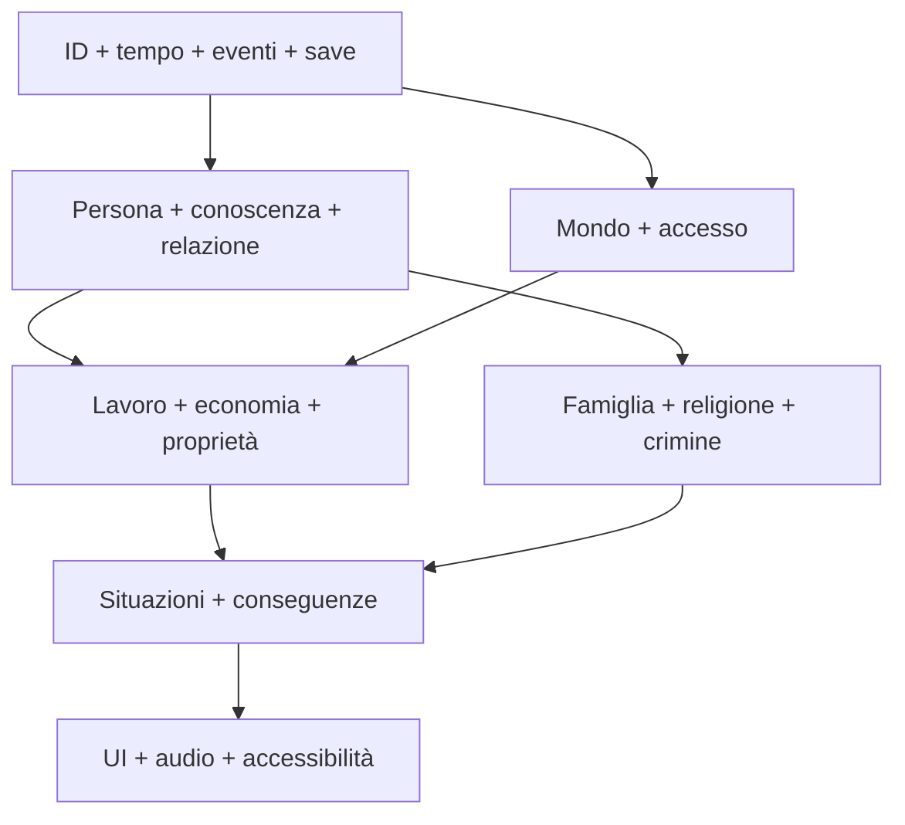

# Scope dei sistemi della demo

**ID:** DEM-SYSTEMS-001
**Stato:** S3 — baseline MoSCoW e livelli di simulazione

## Scopo

Stabilire quali sistemi sono completi, semplificati, remoti o esclusi dalla vertical slice, impedendo espansione implicita dello scope.

## Descrizione

“Attivo” significa sufficiente per i tre percorsi e testato end-to-end, non completo per l'Impero. “Semplificato” mantiene invarianti e dati compatibili con l'estensione futura. “Escluso” non riceve placeholder spacciati per feature.

## Ambito

Runtime e contenuti necessari alla demo di Pompei. Tecnologie e valori definitivi restano subordinati al gate Ready.

## Sistemi attivi P0

| Sistema | Profondità demo | Prova |
|---|---|---|
| tempo/calendario | giorno-notte, scadenze, 30 giorni, time-lapse | ordine e recap corretti |
| persona/bisogni/salute | fame, riposo, dolore/ferite limitate | conseguenze senza grind |
| NPC/routine/conoscenza | N0–N5, memoria e fonti | nessuna onniscienza |
| relazione/reputazione | legami e reputazioni per comunità | effetti situati |
| accesso/interazione | proprietà, status, orario, invito | nessun accesso universale |
| lavoro/economia | tre professioni P0, prezzi, credito, obblighi | ledger chiude |
| inventario/proprietà | possesso, custodia, lotti P0 | nessuna duplicazione |
| household/famiglia/successione | legami, unione, erede, lascito | continuità coerente |
| religione | domestica, Iside/pubblico selettivo | pratica e calendario |
| crimine/diritto | furto, frode, aggressione, testimoni, caso | risposta non onnisciente |
| situazioni/dialogo | thread persistenti, fallimento e scadenza | nessun quest reset |
| UI/audio/accessibilità | informazioni conoscibili, mix contestuale | canali alternativi |
| save/debug | manuale, autosave, recovery e trace | golden saves |

## Sistemi semplificati P1

| Sistema | Semplificazione | Invariante conservato |
|---|---|---|
| politica locale | favori, annuncio, autorità e una procedura | cariche/status non acquistabili |
| combattimento | rissa, difesa, fuga, resa, trauma limitato | contatto/protezione/conseguenza |
| folla | mercato, rito e gioco minore | individui/gruppi, panico non uniforme |
| edilizia | cantieri e stato edificio, non costruzione libera | materiali/lavoro/capacità |
| regione/commercio | nodi e shock aggregati | ritardo, capacità e conservazione |
| malattia/medicina | ferite e indisposizioni selezionate | diagnosi non onnisciente |
| ciclo di vita | successione e scenario accelerato | identità e memoria non copiate |

## Sistemi remoti o presentazionali

- politica imperiale, guerre e trionfi: notizie/effetti con ritardo, nessuna simulazione tattica visibile;
- Neapolis, Nuceria, Stabiae, Herculaneum, porto, ville e campagna: nodi con flussi aggregati;
- giochi maggiori: un evento pianificato in versione controllata, non calendario continuo;
- agricoltura: off-map con consegne e shock, nessuna azienda gestibile.

## Sistemi esclusi

- eruzione del 79;
- intero Impero o intera Pompei con profondità uniforme;
- esercito giocabile, battaglie, assedi e trionfo completo;
- arena/gladiatura come carriera;
- cursus honorum e politica imperiale completa;
- navigazione marittima, edilizia libera, crafting universale;
- multiplayer, live service, modding e cloud save salvo requisito piattaforma;
- generazione procedurale non revisionata di storia o dialoghi.

## Dipendenze e ordine

## Dipendenze

- [Matrice sistemi](../../00-governance/system-dependency-matrix.md)
- [Readiness](../../11-production/roadmap-backlog/implementation-readiness-matrix.md)
- [Architettura](../../10-technical/technical-architecture.md)

## Collegamenti agli altri documenti

- [Mandato](demo-charter.md)
- [Scope contenuti](demo-content-scope.md)
- [Criteri demo](demo-acceptance.md)
- [Backlog](../../11-production/roadmap-backlog/demo-backlog.md)

## Criteri di completamento

Ogni sistema P0/P1 ha owner, S4, budget, contratto, test, dipendenze e fallback; nessun sistema escluso compare come dipendenza hard.

## Decisioni ancora aperte

- Target hardware, camera/input e conteggi N0–N5.
- Profondità finale di combattimento, politica locale e gioco pubblico.
- Cloud save richiesto dalle piattaforme.

## TODO

- Applicare il gate S4 a ogni riga P0/P1.
- Rimuovere o rinviare feature che non superano budget e acceptance.
