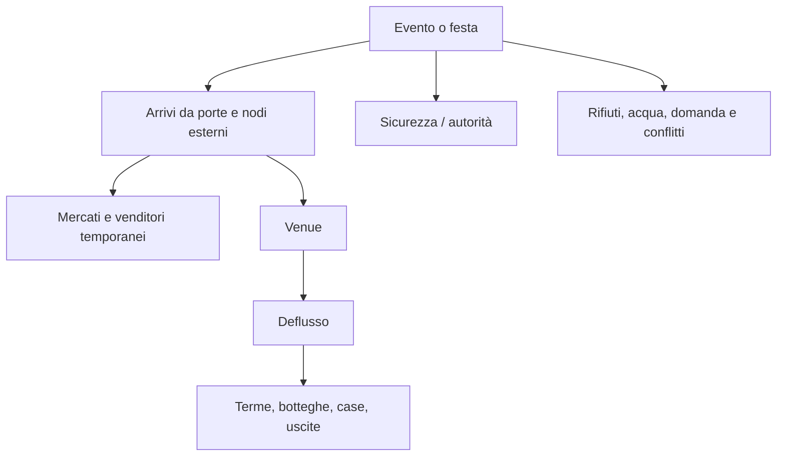

# Zone funzionali e flussi di Pompei

## Scopo

Organizzare contenuti e simulazione in zone analitiche senza presentare le *regiones* di scavo moderne come quartieri antichi attestati.

## Descrizione

Le zone servono a budget, flussi e identità ambientale. Si sovrappongono: una strada può essere residenziale, produttiva e processionale in orari diversi.

## Ambito

Area PVS-1 e nodi esterni collegati.

| Zona | Luoghi cardine | Funzioni | Flussi dominanti | Tier |
|---|---|---|---|---|
| Z1 Foro civico | Foro, Basilica, Macellum, edifici civici e cultuali | politica, giustizia, scambio, cerimonia | magistrati, clienti, venditori, supplicanti | P0/P1 |
| Z2 Spina commerciale | Via dell'Abbondanza e fronti di bottega | vendita, produzione, credito, trasporto | lavoratori, clienti, portatori, animali | P0 |
| Z3 Stabian Baths | terme e incrocio viario | igiene, socialità, servizi | bagnanti, addetti, fornitori | P0/P1 |
| Z4 Teatri-Iside | teatro grande/piccolo, quadriportico, santuario | spettacolo, culto, preparazione | spettatori, officianti, artisti | P1/P2 |
| Z5 Anfiteatro-Palestra | anfiteatro, Grande Palestra, porte orientali | giochi, esercizio, folla | spettatori, venditori, sicurezza | P0 durante eventi; P1 altrimenti |
| Z6 Tessuto domestico-produttivo | case e attività selezionate Regio I/II/IX | vita domestica, lavoro, patronato | household, clienti, consegne | P0–P3 |
| Z7 Mura-necropoli | porte, mura, tombe selezionate | transito, funerali, memoria | viaggiatori, cortei, lavoratori | P1/P4 |
| Z8 Suburbio agricolo | ville/fattorie nodali | produzione, stoccaggio, lavoro coercitivo/libero | carri, stagionali, proprietari | P4, sito locale futuro |

## Heatmap giornaliera

| Fase | Z1 | Z2 | Z3 | Z4 | Z5 | Z6 |
|---|---:|---:|---:|---:|---:|---:|
| pre-alba | bassa | preparazione | servizi | bassa | bassa | domestica/lavoro |
| mattina | molto alta | alta | media | variabile | bassa | uscite/produzione |
| metà giornata | media | alta | alta | programma | evento-dipendente | pasti/riposo variabile |
| pomeriggio | calante | media | alta | alta se spettacolo | molto alta se giochi | lavoro/socialità |
| sera | bassa/controllata | selettiva | chiusura variabile | uscita folla | deflusso | domestica/ospitalità |
| notte | guardia/transito | bassa | chiusa | bassa | bassa | sonno, attività lecite/illecite |

I valori sono D/C e devono essere calibrati; non sono orari romani universali.

## Flussi eccezionali

## Popolazione e status

Ogni zona definisce residenti, lavoratori, visitatori e transitanti separatamente. Status e genere influenzano accesso e rischio senza creare segregazioni moderne rigide non attestate. Famiglie influenti sono legate a proprietà, iscrizioni e cariche solo con classe A–C; NPC compositi restano D.

## Dipendenze

- [Area](playable-area.md)
- [Edifici](accessible-buildings.md)
- [Popolazione demo](../demo-population.md)
- [NPC](../../04-simulation/npc-life-simulation.md)

## Collegamenti agli altri documenti

- [Economia demo](../demo-economy.md)
- [Cicli](daily-seasonal-cycles.md)
- [Eventi](../../06-content/events/README.md)

## Criteri di completamento

Ogni zona ha luoghi, funzioni, quattro popolazioni, heatmap, eventi, accessi e budget; nessun confine è presentato come antico senza prova.

## Rischi di produzione

Zone monoculturali, folle sincronizzate, quartieri moderni inventati, vuoto tra landmark e congestione su una sola strada.

## Decisioni ancora aperte

- Profondità laterale di Z2/Z6 e inclusione completa di Z4.
- Capienza simulata degli eventi.

## TODO

- Associare insulae e proprietà dopo il poligono GIS.
- Validare heatmap con simulazione e fonti di routine.
