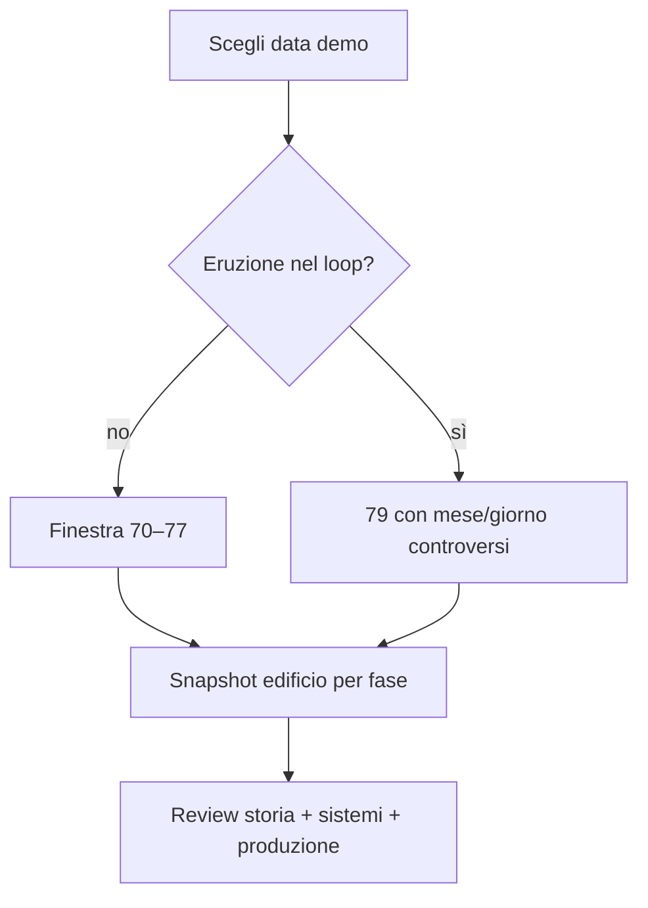

# Data e snapshot storico della demo

## Scopo

Definire le opzioni per lo snapshot di Pompei senza anticipare la decisione su data iniziale ed eruzione giocabile.

## Descrizione

La demo deve rappresentare una sola fotografia coerente: edifici, imperatore, calendario, lavori, merci e personaggi non possono provenire da anni diversi.

## Ambito

Finestra flavia 69–79 d.C.; la timeline precedente serve come contesto, non come set di asset simultanei.

## Opzioni

| Opzione | Data indicativa | Vantaggi | Rischi | Stato |
|---|---|---|---|---|
| A | 70–72 d.C. | ricostruzione post-terremoto visibile; distanza dall'eruzione | stato edilizio da ricostruire meno conservato | Candidate |
| B | 75–77 d.C. | città trasformata ma non “conto alla rovescia” | datazione fine degli interventi difficile | Recommended for evaluation |
| C | estate/autunno 79 | massima prossimità al deposito archeologico | eruzione domina aspettative; giorno/mese controversi | Candidate, high risk |

Nessuna opzione è Approved. Q-001 e Q-002 restano bloccanti. Finché non chiuse, ogni edificio usa uno stato per fase e nessun evento cita una data iniziale precisa.

## Snapshot edilizio

Ogni edificio registra: stato al giorno zero, interventi attribuibili al sisma 62/63, restauri successivi, funzione A–E, accessi, arredi ricostruiti, materiali e differenza tra evidenza del 79 e fase scelta.

## Diagramma decisionale

## Dipendenze

- [Cronologia ufficiale](../../02-historical-foundation/chronology/official-timeline.md)
- [Controversie](../../02-historical-foundation/sources/controversies-register.md)

## Collegamenti agli altri documenti

- [Area giocabile](playable-area.md)
- [Edifici](accessible-buildings.md)
- [Cicli](daily-seasonal-cycles.md)

## Criteri di completamento

ADR approvata; snapshot di ogni edificio compatibile; calendario e autorità coerenti; nessun claim E presentato come fatto.

## Rischi di produzione

Mescolare fasi, promettere l'eruzione implicitamente, usare una data autunnale come certezza e rifare asset dopo la decisione.

## Decisioni ancora aperte

- Q-001: data iniziale.
- Q-002: eruzione nell'orizzonte.

## TODO

- Preparare confronto costo/contenuto delle tre opzioni.
- Ottenere review archeologica sugli edifici candidati.
