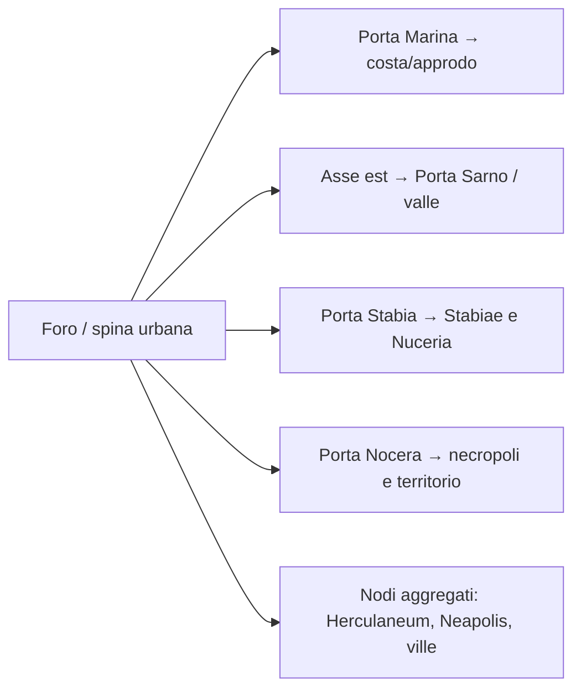

# Area giocabile e limiti fisici di Pompei

## Scopo

Definire un perimetro producibile che dimostri città, economia, istituzioni, religione, spettacolo e collegamenti regionali senza costruire tutta Pompei a profondità uniforme.

## Descrizione

La proposta PVS-1 usa una spina urbana continua, in scala geometrica 1:1, dal Foro lungo Via dell'Abbondanza fino al settore Anfiteatro/Grande Palestra. Una profondità laterale selettiva include Stabian Baths, Santuario di Iside, teatri, botteghe e abitazioni. Il resto della città rimane visibile, simulato o raggiungibile come nodo.

## Ambito

Proposta di pre-produzione D, non perimetro approvato. Misure finali richiedono GIS e Q-101.

## Confini proposti

| Lato/nodo | Confine funzionale | Trattamento |
|---|---|---|
| ovest | Foro civile e margine verso Porta Marina | hub civico; Porta Marina/porto come uscita-nodo |
| centro | Via dell'Abbondanza e Stabian Baths | corridoio primario con profondità di 1–2 isolati selezionati |
| sud-centro | area teatri e Santuario di Iside | cluster religioso/spettacolo collegato |
| est | Anfiteatro, Grande Palestra e accesso verso Porta Sarno | hub spettacolo e uscita est |
| sud-est | tratti selezionati verso Porta Nocera/necropoli | vista o missione limitata; non intero suburbio |
| nord | facciate e isolati selezionati delle Regiones VII/IX/I | barriera per proprietà, lavori o contenuto differito |
| sud | facciate e isolati selezionati delle Regiones VIII/I/II | accessi mirati, mura visibili dove pertinenti |

## Scale

| Dimensione | Policy |
|---|---|
| geometria interna | 1:1 per strade e landmark inclusi; deviazioni CL-001 registrate |
| interni | 1:1 o ricostruzione compatibile; stanze non utili possono essere chiuse, non ridimensionate silenziosamente |
| tempo urbano | continuo; viaggio fuori mappa usa durata simulata |
| popolazione | densità calibrata tramite individui/coorti, non 1:1 presunto |
| hinterland | nodi e corridoi; siti selezionati possono diventare mappe locali |

La lunghezza e superficie esatte restano E fino al rilievo GIS. Non inserire numeri “stimati a vista” nel budget.

## Livelli di accessibilità

| Tier | Definizione | Simulazione |
|---|---|---|
| P0 utilizzabile | interni e funzioni sistemiche complete | individui, inventari, routine, proprietà |
| P1 visitabile | attraversabile con interazioni limitate | stato persistente semplificato |
| P2 condizionale | accesso per invito, ruolo, orario, pagamento o illecito | pieno quando aperto, altrimenti aggregato |
| P3 facciata/chiuso | spazio fisico senza interno prodotto | residenti e attività fuori schermo |
| P4 simulato | fuori perimetro ma nodo vivo | coorti, capacità, eventi e flussi |
| P5 riferimento | panorama o toponimo, nessuna simulazione economica autonoma | dati minimi |

## Barriere diegetiche

Proprietà privata, lavori post-sisma, attività chiusa, controllo sociale, pericolo strutturale, evento temporaneo e bordo urbano fisico. Vietati muri invisibili nel centro strada salvo fallback tecnico esplicitamente temporaneo.

## Uscite regionali

Gli itinerari precisi e l'identificazione del porto pompeiano sono HV-016; i nomi delle rotte non implicano una strada diretta univoca.

## Dipendenze

- [Distretti](districts.md)
- [Edifici accessibili](accessible-buildings.md)
- [Framework insediamenti](../../03-world/settlements/settlement-framework.md)
- [Mappa ufficiale del Parco](https://pompeiisites.org/en/visiting-info/map-and-guide-to-the-excavations/)

## Collegamenti agli altri documenti

- [Vertical slice](../pompeii-vertical-slice.md)
- [Popolazione](../demo-population.md)
- [Performance](../../10-technical/performance-budgets.md)
- [Rete regionale](regional-connections.md)

## Criteri di completamento

- Poligono GIS versionato e confrontato con fonti.
- Ogni bordo ha motivazione diegetica e fallback.
- Tutti i cluster P0 sostengono almeno un loop.
- Percorso continuo e accessibile tra hub principali.
- Budget ambiente/NPC/audio approvati.

## Rischi di produzione

Spina troppo lunga e poco profonda; costo degli interni; densità di folle; false chiusure; aspettativa dell'intera città; ricostruzioni di fasi incompatibili.

## Decisioni ancora aperte

- Q-101: poligono e insulae definitive.
- Inclusione fisica di Porta Marina, Porta Nocera e una villa suburbana.
- Superficie e durata di attraversamento target.

## TODO

- Produrre tre varianti GIS Small/Recommended/Extended.
- Fare walkthrough di missioni, routine e logistica su ciascuna.
