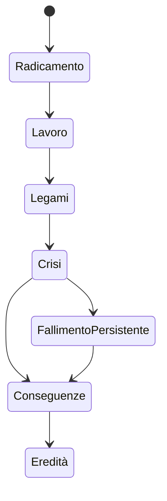

# Percorsi giocabili della vertical slice

**ID:** DEM-PATHS-001
**Stato:** S3 — flussi completi, valori e contenuti da validare

## Scopo

Definire tre percorsi end-to-end che dimostrino regole comuni e differenze reali tra cittadino, liberta e persona schiavizzata.

## Descrizione

Ogni percorso attraversa onboarding, lavoro, relazione, crisi, scelta istituzionale e chiusura di eredità. Le opportunità non sono equivalenti e nessun percorso presenta la coercizione come “modalità difficile” decorativa.

## Ambito

Cinque–sette ore per percorso, trenta giorni diegetici, medesima area e situazione civico-economica. Sono esclusi cursus honorum completo, emancipazione garantita e crescita biologica di una nuova generazione entro il normale playthrough.

## Struttura comune

### Percorso cittadino — Lucius Aelius Secundus

| Fase | Situazione | Decisione | Conseguenza persistente |
|---|---|---|---|
| Radicamento | household indebitato e turno al panificio | pagare cibo/debito o acquistare strumento | salute, credito o produttività |
| Lavoro | consegna di grano incompleta | accettare perdita, cercare testimone o frodare misura | salario, reputazione, possibile caso |
| Legami | patrono chiede presenza/favore | adempiere, negoziare o rifiutare | accesso civico e tempo familiare |
| Crisi | scarsità locale e accusa di sottrazione | testimoniare, coprire collega o restituire bene | prezzo, relazione, processo |
| Eredità | stabilizzare household e designare successore eleggibile | ripartire diritti/debiti | nuovo profilo di continuazione |

Successo non significa elezione: significa capacità di sostenere household, mestiere e obblighi senza immunità.

### Percorso liberta — Aelia Prima

| Fase | Situazione | Decisione | Conseguenza persistente |
|---|---|---|---|
| Radicamento | lavoro tessile e obblighi verso l'ex patrono | accettare commessa, credito o rete propria | capitale, dipendenza, fiducia |
| Lavoro | lotto danneggiato e paga dei collaboratori | assorbire costo, contestare o vendere come qualità inferiore | solvibilità e reputazione |
| Legami | opportunità di household/unione | investire tempo/beni o privilegiare bottega | supporto, costi e successione |
| Crisi | concorrente diffonde voce plausibile | raccogliere fonti, mediare o reagire illecitamente | conoscenza locale e clientela |
| Eredità | contratto, attività e dipendenti da proteggere | nominare erede/beneficiario entro capacità | continuità economica non automatica |

La libertà non cancella il passato, gli obblighi patronali o le limitazioni sociali; ricchezza e status giuridico restano assi separati.

### Percorso persona schiavizzata — Daphnis

| Fase | Situazione | Decisione | Conseguenza persistente |
|---|---|---|---|
| Radicamento | lavoro domestico/di consegna imposto | obbedire, negoziare spazio, cercare alleato o sottrarsi | rischio corporeo e fiducia |
| Lavoro | gestione di beni non posseduti | custodire, deviare o documentare abuso/frode | sospetto, protezione o pena |
| Legami | contubernium/legame e rete servile | proteggere relazione o usarla per opportunità | household sociale senza piena capacità legale |
| Crisi | colpa attribuita per perdita | ottenere testimonianza, patronage informale, fuga breve o confessione | punizione, trasferimento, negoziazione |
| Eredità | manomissione possibile ma non garantita | accumulare fiducia/peculium di fatto e alleanze | libertà condizionata oppure lascito relazionale |

Una conclusione senza manomissione può essere valida se agency, danno e legami hanno conseguenze reali. Dopo manomissione, il personaggio non diventa automaticamente cittadino senza vincoli né proprietario dei beni custoditi.

## Famiglia, figli ed eredità

- Il cittadino e la liberta iniziano con un household che include almeno un dipendente minore o erede candidato, evitando una gravidanza accelerata.
- Unione, matrimonio o adozione richiedono capacità e procedure del profilo storico; non sono un pulsante romantico universale.
- La persona schiavizzata può costruire contubernium e responsabilità affettive che il mondo ricorda, ma la UI distingue relazione sociale e riconoscimento giuridico.
- La continuazione con un figlio/erede è dimostrata in epilogo giocabile o scenario di validazione; trasferisce diritti, debiti e memoria pubblica, non conoscenza privata o skill del defunto.

## Fallimenti e recupero

Debito, perdita del lavoro, ferita, arresto, rottura del legame o mancata manomissione non ricaricano automaticamente. Ogni percorso conserva almeno una via plausibile di recupero: lavoro alternativo, mediazione, credito, patronato, testimonianza, cura o riduzione delle ambizioni. Morte senza erede eleggibile termina il percorso con recap, non genera un successore artificiale.

## Dipendenze

- [Personaggi iniziali](starting-characters.md)
- [Status e diritto](../../04-simulation/social-status-and-law.md)
- [Famiglia](../../04-simulation/family-social/README.md)
- [Economia demo](../demo-economy.md)
- [Save](../../10-technical/save-system/save-architecture.md)

## Collegamenti agli altri documenti

- [Mandato](demo-charter.md)
- [Professioni](demo-professions.md)
- [Scope contenuti](demo-content-scope.md)
- [Criteri](demo-acceptance.md)

## Decisioni ancora aperte

- Nomi finali, genere/pronomi selezionabili e grado di personalizzazione.
- Matrice giuridica esatta per unione, adozione, testamento e manomissione nel 77.
- Forma UX dell'epilogo/successione.

## Criteri di completamento

Tre golden playthrough superano onboarding, lavoro, relazione, crisi, conseguenza e successione; nessun percorso viola status, ownership o conoscenza; Historical/Sensitivity/UX approvano.

## TODO

- Scrivere golden scenario con condizioni e dati.
- Validare capacità giuridiche e contenuti sensibili.
- Prototipare soltanto dopo il gate READY.
