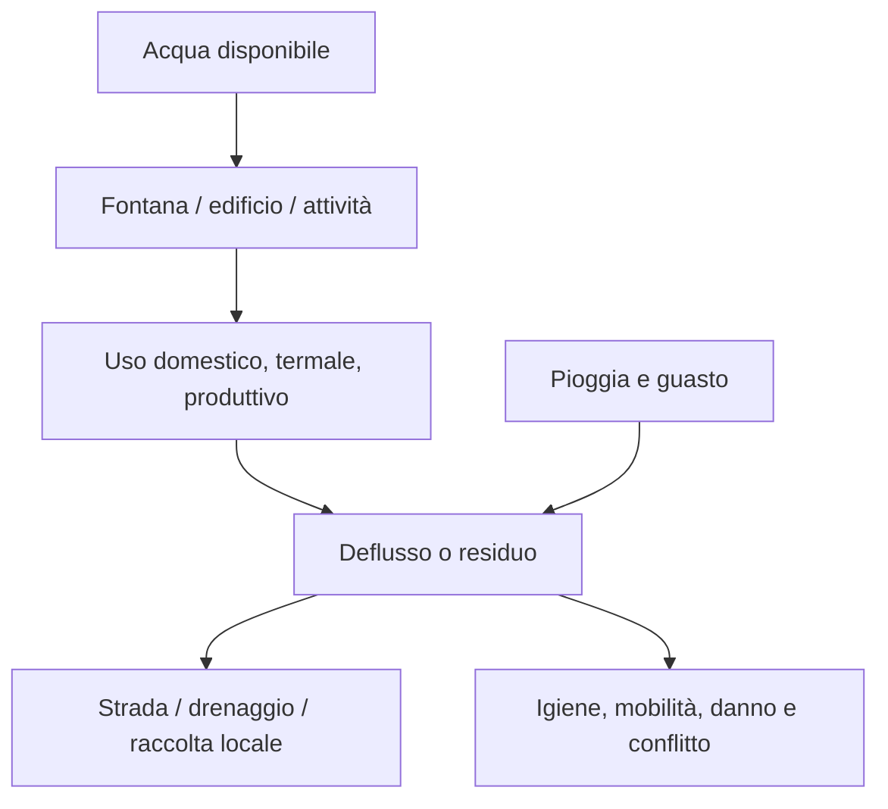

# Dossier urbano integrato di Pompei

## Scopo

Descrivere Pompei come sistema urbano della vertical slice, collegando topografia, infrastrutture, popolazione, istituzioni, economia, culti, criminalità e territorio.

## Descrizione

Il dossier usa la città sepolta nel 79 d.C. come principale archivio materiale, ma lo snapshot della demo resta da scegliere tra 70 e 79. Le nove *regiones* numerate sono convenzione archeologica moderna; le zone di design sono analitiche.

## Ambito

Città murata, suburbio selettivo e rete regionale. Dati numerici non sostenuti restano E; la mappa PVS-1 è licenza D.

## Profilo sintetico

| Campo | Specifica corrente | Classe/stato |
|---|---|---|
| periodo | età flavia, data 70–79 da ADR | B contesto / E giorno iniziale |
| area città antica | circa 66 ha entro il perimetro urbano | A, Parco; non area demo |
| area demo | spina Foro–Via dell'Abbondanza–Anfiteatro + cluster | D/Proposed |
| scala | 1:1 negli spazi inclusi; esterno nodale | D |
| popolazione storica | intervallo da ricerca, non totale preciso | E/C |
| forma di governo | istituzioni municipali nel quadro imperiale | A/B; competenze locali da dossier |
| economia | produzione, servizi, mercato, credito e reti regionali | A/B qualitativo |
| lingua | latino prevalente nel corpus del periodo, con storia osca e presenze greche/altre | B; policy audio E/D |

## Mura, porte e accessi

Il perimetro murario è un palinsesto con funzione e manutenzione variabili. Le porte collegano città e territorio; non sono checkpoint moderni permanenti.

| Porta/asse | Funzione progettuale | Stato demo |
|---|---|---|
| Porta Marina | uscita verso costa e collegamenti occidentali | nodo P4 o margine P1 |
| Porta Ercolano | connessioni nord-occidentali e necropoli | P4 |
| Porta Vesuvio | territorio settentrionale e acqua/quote | P4 |
| Porta di Nola | connessioni nord-orientali | P4 |
| Porta Sarno | estremità orientale e valle | P1/P4 candidata |
| Porta Nocera | necropoli e settore sud-orientale | P1/P4 candidata |
| Porta Stabia | asse meridionale verso Stabiae/territorio | P4, possibile missione |

Nomi, fasi e tracciati vengono verificati sull'atlante; orari di chiusura o controllo sono E finché non documentati.

## Strade e mobilità

| Categoria | Esempi | Regole di simulazione |
|---|---|---|
| asse primario | Via dell'Abbondanza; Via Stabiana | alta connettività, consegne, processioni/eventi |
| asse civico | Via del Foro e accessi al Foro | priorità pedonale/sociale variabile, eventi |
| strada secondaria | connessioni tra insulae | residenti, servizi, scorciatoie |
| vicolo/accesso | lotti e retrobottega | capacità ridotta, privacy, rischio |
| uscita extraurbana | porte e vie funerarie/agricole | carri, viaggiatori, tombe e attività |

Pavimentazione, marciapiedi, attraversamenti rialzati, carreggiata, pendenza e segni di ruota sono dati per segmento. Non si impone traffico a senso moderno. Carri, animali e portatori hanno ingombro, rumore, tempi e restrizioni contestuali da ricercare.

## Acqua, drenaggio, rifiuti e fuoco

- Approvvigionamento: rete pubblica, fontane, torri/castella secondari, tubazioni e sistemi domestici; impluvia/cisterne restano rilevanti e l'accesso non è uniforme.
- Drenaggio: pendenze stradali, canalizzazioni e soluzioni locali; vietata una rete fognaria moderna continua.
- Rifiuti: accumulo, riuso, scarico e rimozione dipendono da luogo/attività; nessun servizio municipale moderno assunto.
- Fuoco: focolari, forni, lampade e attività produttive creano rischio; acqua e accessibilità governano la risposta.
- Manutenzione: lavori chiudono parti di edificio/strada e consumano pietra, legno, calce, metallo e lavoro.

## Edifici e tessuto

| Categoria | Ruolo | Policy |
|---|---|---|
| pubblico-civico | autorità, giustizia, mercato, memoria | foro cluster; funzioni non tutte certe |
| religioso | culti pubblici/domestici, voti, feste | pluralità; accessi e calendari situati |
| termale | igiene, lavoro, socialità | Terme Stabiane core; altre per costo |
| spettacolo | teatri, anfiteatro, palestra | calendario raro/variabile, crowd plan |
| domestico | household, ricevimento, lavoro | dimensioni/status non equivalgono meccanicamente |
| commerciale/artigiano | vendita, produzione, deposito | funzione per contesto e fase |
| incompleto/riparazione | lavori, rischio, trasformazione | niente funzione “finale” retrodatata |

Catalogo e tier sono in [edifici accessibili](accessible-buildings.md).

## Necropoli e suburbio

Le aree funerarie extraurbane seguono le vie d'uscita e combinano tombe, memoria, passaggio e visibilità sociale. La demo può includere un tratto presso Porta Nocera o rappresentare Porta Ercolano come nodo, ma non generalizza una necropoli all'altra. Funerali, manutenzione e commemorazione richiedono accesso e calendario.

## Popolazione e flussi

| Gruppo di presenza | Esempi | Stato |
|---|---|---|
| residenti | household dentro area | persistenti o coorti localizzate |
| lavoratori pendolari | campagna/suburbio → botteghe/cantieri | viaggi aggregati con arrivo |
| visitatori regionali | mercato, affari, culto, spettacolo | generati da eventi/capacità |
| autorità e seguito | magistrati, clienti, messaggeri | calendario e relazioni |
| trasportatori | carri, animali, portatori | slot logistici e congestione |

Le classi sociali non sono quartieri: status giuridico, ricchezza, genere, origine, patronato e professione restano dimensioni separate. Famiglie influenti reali richiedono iscrizioni e proprietà; altrimenti si usano household compositi D.

## Autorità, politica e diritto

Edili/duoviri e consiglio locale sono categorie di ricerca prioritarie; competenze, titolari e calendario dipendono dalla data. Autorità imperiali o regionali agiscono tramite comunicazione e gerarchie, non presenza costante. Il Foro concentra occasioni ma non rende la giustizia un servizio moderno sempre aperto.

## Economia locale

| Cluster | Input | Output/servizio | Connessioni |
|---|---|---|---|
| alimentare | grano, acqua, combustibile, lavoro | farina, pane, pasti | aziende, porte, mercati |
| vino/olio | prodotto agricolo, contenitori | consumo, stoccaggio, commercio | ville e reti regionali |
| tessile | fibra/tessuti, acqua, reagenti, lavoro | trattamento/abiti | botteghe e household |
| edilizia | pietra, calce, legno, metallo | riparazioni e nuovi usi | cantieri e provenienze |
| ospitalità | cibo, spazio, informazione | alloggio/socialità | viaggiatori e porte |
| servizi civici/rituali | offerte, materiali, competenze | eventi, documenti, prestigio | foro, santuari, collegia |

Prezzi, quote e proprietà sono C/E finché il dossier economico non li documenta.

## Culti e calendario

Culto domestico, santuari civici, culto imperiale e Iside sono rappresentati tramite pratiche e comunità, non fazioni esclusive. Prime comunità cristiane a Pompei restano E e fuori dal canone. Feste e giochi modificano flussi e domanda, ma non sono continui.

## Criminalità e sicurezza

Opportunità dipendono da folla, luce, accesso, beni, testimoni e status. Porte e mura non creano sorveglianza onnisciente. Furto, frode, violenza, ricettazione e corruzione usano autorità e reputazioni locali; grandi eventi aumentano opportunità e capacità di controllo insieme.

## Attività quotidiane

Acqua, cibo, cura, lavoro, trasporto, acquisto, culto, patronato, udienze, manutenzione, bagni, spettacoli e socialità. Ogni attività ha luogo, partecipanti, precondizioni, durata, scorte, rumore, rifiuti e memoria.

## Eventi e trasformazioni

Ricorrenti: mercati, riti approvati, bagni, consegne, scadenze e spettacoli programmati. Eccezionali: incendio, crollo, scarsità, disordine, visita, processo, notizia imperiale e rischio sismico/vulcanico solo per milestone. Le riparazioni post-sisma rendono la città dinamica già senza catastrofe finale.

## Collegamenti imperiali

Pompei non controlla l'economia di Roma. Riceve effetti filtrati da Neapolis/Puteoli e reti campane; guerre, politica e trionfi arrivano come notizie, domanda, veterani o prezzi con ritardo. I nodi sono in [rete regionale](regional-connections.md).

## Dipendenze

- [Data](historical-date.md)
- [Area](playable-area.md)
- [Framework città](../../03-world/settlements/city-template.md)
- [Claim storici](../../02-historical-foundation/sources/historical-claims-register.md)

## Collegamenti agli altri documenti

- [Zone e flussi](districts.md)
- [Edifici](accessible-buildings.md)
- [Cicli](daily-seasonal-cycles.md)
- [Popolazione](../demo-population.md)
- [Economia](../demo-economy.md)

## Criteri di completamento

Tutti i CTY-01–25 compilati; GIS e snapshot approvati; reti infrastrutturali per segmento; catalogo P0/P1/P2; popolazione e filiere dimensionate; calendario, eventi e test longitudinali completati.

## Rischi di produzione

Falsa precisione, full-city creep, monumenti senza vita, infrastrutture moderne, popolazione decorativa, troppe folle/eventi e dipendenze regionali istantanee.

## Decisioni ancora aperte

- Data, poligono, popolazione, edifici P0, villa locale, porto/paleo-costa e calendario.

## TODO

- Creare atlante GIS e schede per segmento/edificio.
- Trasformare valori E in C/A–B tramite workstream specialistici.

