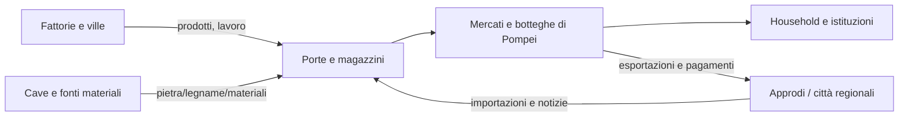

# Rete regionale e hinterland di Pompei

## Scopo

Definire collegamenti terrestri, fluviali e marittimi con campagna, aziende e città vicine senza fingere precisione su porto e percorsi ancora controversi.

## Descrizione

Fuori mappa è una rete viva: persone, merci, messaggi e rischi viaggiano con capacità, costo, stagione e ritardo. Ogni edge richiede una fonte e una geometria separata dal tempo di gameplay.

## Ambito

Pompei, valle del Sarno, costa vesuviana, Nuceria, Stabiae, Herculaneum, Neapolis e nodi portuali/campestri rilevanti.

## Nodi

| Nodo | Ruolo nella demo | Risoluzione | Evidenza/cautela |
|---|---|---:|---|
| territorio periurbano | orti, vigne, ville, lavoro e tombe | P4/P0 locale | rete di ville attestata; singolo legame da provare |
| Boscoreale/Civita Giuliana | aziende e ville vesuviane | P4 | siti produttivi/residenziali attestati |
| valle/fiume Sarno | corridoio agricolo e logistico | P4 | paleo-idrologia e navigabilità specifica da HV-016 |
| Nuceria | città e nodo terrestre | P4 | percorso, tempo e merci da dossier |
| Stabiae | golfo, ville e connessione meridionale | P4 | ruolo strategico/commerciale attestato per fasi |
| Herculaneum | città vesuviana e rete costiera | P4 | non copia di Pompei; scambi quantitativi E |
| Neapolis | grande nodo urbano/marittimo | P4 | legami specifici da documentare |
| approdo/porto pompeiano | interfaccia merci | P4/P0 futuro | localizzazione/configurazione e costa HV-016 |
| Puteoli e reti oltre regione | importazioni e notizie | P5/P4 | edge indiretto, non viaggio demo iniziale |

## Filiera territoriale

## Aziende agricole, cave e miniere

- Aziende: nodi con proprietà, colture, forza lavoro, impianti, scorte e stagionalità; Villa Regina/Pisanella e Civita Giuliana sono riferimenti, non siti intercambiabili.
- Cave: ogni pietra usata deve avere provenienza o classe C; nessuna cava giocabile è approvata nella demo.
- Miniere: nessuna miniera locale è promessa. Metalli possono arrivare tramite reti aggregate; collegare una miniera specifica resta E.
- Legname e combustibile: fonti e bacini di approvvigionamento da dossier; non risorsa infinita locale.

## Contratto di una rotta

Origine, destinazione, modo, distanza storica/geometrica, durata simulata, capacità, costo, stagione, autorità, rischio, merci/persone ammesse, informazione disponibile e fallback.

## Dipendenze

- [Area giocabile](playable-area.md)
- [Trasporti](../../04-simulation/economy-production/transport.md)
- [Geografia](../../03-world/geography/geographic-framework.md)
- [Registro verifiche](../../02-historical-foundation/sources/verification-register.md)

## Collegamenti agli altri documenti

- [Economia demo](../demo-economy.md)
- [Siti rurali](../../03-world/rural-sites/README.md)
- [Porti](../../03-world/structures/ports.md)
- [Strade](../../03-world/structures/roads.md)

## Criteri di completamento

Ogni nodo/edge ha classe, fonte, capacità, tempo, rischio e consumer; porto e paleo-costa revisionati; nessuna miniera/cava inventata.

## Rischi di produzione

Teletrasporto economico, costa moderna, rotte dirette inventate, aziende tutte uguali e materie prime senza provenienza.

## Decisioni ancora aperte

- HV-016: approdo, fiume e paleo-costa.
- Quale villa o azienda diventa mappa locale.
- Rotte attive nel primo slice.

## TODO

- Commissionare dossier geoarcheologico e logistico.
- Collegare le filiere core a edge verificati.
