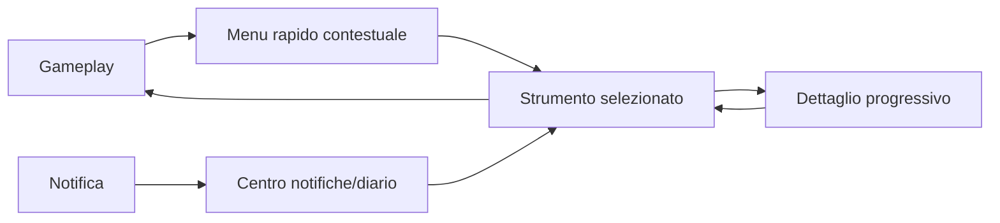

# Architettura dell'interfaccia epistemica

## Scopo

Definire una UI minimale, accessibile e non onnisciente che renda leggibile la simulazione senza sostituire il mondo con pannelli e indicatori.

## Descrizione

Ogni elemento dichiara fonte, certezza, urgenza e persistenza. La UI presenta proiezioni dei sistemi; non possiede inventario, salute, missioni o reputazione. Il giocatore può aumentare assistenza e chiarezza senza ottenere informazioni che il personaggio non ha.

## Ambito

HUD, diario, mappa, inventario, relazioni/reputazioni, attività, economia, salute, tempo/calendario, notifiche, accessibilità, controller, tastiera/mouse, navigazione e gestione del focus.

## Layer e priorità

| Layer | Contenuto | Persistenza |
|---|---|---|
| L0 mondo | segni ambientali, audio, animazione e dialogo | diegetica |
| L1 feedback immediato | conferma azione, pericolo, interazione | temporanea/prioritaria |
| L2 HUD essenziale | stato critico configurabile | solo quando rilevante |
| L3 strumenti | diario, mappa, inventario, relazioni, economia | su richiesta |
| L4 approfondimento | codex storico, provenienza, accessibilità | separato dal sapere PG |
| L5 debug | causal trace e dati autoritativi | mai shipping/player |

## Contratto informativo

`UIFactView`: fatto/belief ID, fonte, confidenza, data dell'informazione, precisione, proprietario e privacy. Stati visivi distinguono osservato, riferito, dedotto, obsoleto, contestato e sconosciuto. Nessun marker, prezzo, posizione NPC o reputazione usa dati autoritativi non conosciuti.

## Strumenti principali

- **Diario:** impegni, opportunità, persone, prove, scadenze diegetiche, conseguenze e archivio; niente checklist obbligatoria.
- **Mappa:** luoghi visitati/appresi, aree incerte, percorsi conosciuti, annotazioni; niente GPS globale.
- **Inventario:** contenitore/custodia, proprietà nota, ingombro, stato e accesso; separa beni portati, depositati e affidati.
- **Relazioni/reputazione:** legami e giudizi noti per persona/comunità con fonte; niente numero universale.
- **Attività/economia:** ordini, contratti, debiti, scorte e prezzi conosciuti con data/mercato.
- **Salute:** sintomi, ferite osservabili, capacità e prognosi creduta; niente diagnosi moderna onnisciente.
- **Tempo/calendario:** luce, data, feste/impegni conosciuti, durata stimata; precisione coerente con strumenti.

## Navigazione e input

Azioni semantiche condivise tra controller e tastiera/mouse: naviga, conferma, annulla, contestuale, filtra, dettaglio, confronta, annota. Rimappatura completa, glyph dinamici, focus prevedibile, nessun hover obbligatorio, deadzone e sensibilità configurabili. Cambio dispositivo senza perdita di focus.

## Notifiche

Classi: critica immediata, impegno imminente, cambiamento rilevante, informazione, archivio. Deduplicazione, aggregazione, cooldown, modalità silenziosa, storico e recap dopo time-skip. Nessun popup per ogni variazione di prezzo/relazione; audio e visuali separatamente configurabili.

## Accessibilità

Dimensioni/font/contrasto, screen reader dove supportato, sottotitoli completi, speaker e direzione opzionali, alternative a colore/audio, riduzione movimento/flash/sangue, hold/toggle, timing assistito, pausa contestuale secondo design, difficoltà informativa separata da quella sistemica. Preset modificabili, mai profili rigidi.

## Casi limite, errori e persistenza

Fonte smentita, marker obsoleto, contenitore remoto, due dispositivi, focus perso, testo lungo, lingua cambiata, safe area, scadenza durante menu e notifica in cascata degradano senza rivelare dati. Persistono preferenze, annotazioni, filtri e stato consultivo; lo stato di gioco resta nei domini.

## Performance e bilanciamento informativo

UI reattiva a eventi/diff, virtualizzazione liste e budget per aggiornamenti. Obiettivo: risposta rapida senza polling dell'intero mondo. Progressive disclosure limita overload; telemetria locale misura notifiche/minuto, tempo di ricerca, errori e uso assistenze senza giudicare il giocatore.

## Dipendenze

- [Principi UX](../ux-principles.md)
- [Information design](../user-experience/information-design.md)
- [Accessibilità](../user-experience/accessibility.md)
- [Controlli](../user-experience/controls.md)

## Collegamenti agli altri documenti

- [Diario](journal.md)
- [Mappa](map.md)
- [Inventario](inventory-ui.md)
- [Notifiche](notifications.md)
- [Missioni](../../06-content/quests/quest-framework.md)

## Test e Definition of Done

Test di conoscenza/leak, navigazione controller/KBM, rimappatura, screen reader/contrasto, focus, localizzazione, storm notifiche, liste grandi e save preferenze. S4 quando ogni sistema P0 ha una proiezione minima, fonte verificabile e criteri WCAG/target approvati.

## Decisioni ancora aperte

- Target di accessibilità, piattaforme e modalità di pausa.
- HUD predefinito e livello di assistenza navigazione.

## TODO

- Creare matrice sistema→vista→fonte→priorità.
- Allineare sottodocumenti UI e prototipi testabili futuri.
