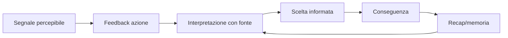

# Principi UX dell'esperienza del giocatore

## Scopo

Rendere un mondo complesso comprensibile, rispettoso del contesto storico e utilizzabile senza indicatori onniscienti o attrito artificiale.

## Descrizione

La UX costruisce fiducia: il giocatore comprende cosa percepisce, cosa sa, da chi lo sa, cosa può tentare e perché il mondo ha reagito. Diegesi e accessibilità sono complementari.

## Ambito

Percezione, feedback, onboarding, navigazione, informazioni, controlli, accessibilità, error recovery, carico cognitivo e coerenza cross-system.

## Principi

1. **Conoscenza situata:** fatto, voce e deduzione hanno forme distinte.
2. **Causalità leggibile:** conseguenze spiegabili senza spoiler.
3. **Progressive disclosure:** mondo → feedback → strumento → dettaglio.
4. **Agency senza garanzia:** opzioni e rischi chiari, esiti non predeterminati.
5. **Continuità:** fallimento, assenza e time-skip producono recap e nuove possibilità.
6. **Minimo rumore:** notifiche e HUD competono per un budget.
7. **Input equivalente:** controller e KBM offrono capacità equivalenti.
8. **Accessibilità nativa:** alternative sensoriali e temporali dal primo contratto.
9. **Linguaggio contestuale:** traduzioni chiare senza burocrazia o psicologia moderne implicite.
10. **Nessuna dark pattern:** niente urgenza falsa, ricompensa manipolativa o grind informativo.

## Flusso di comprensione

## Criteri anti-anacronismo e anti-overload

GPS, quest beacon, classifiche morali, diagnosi, prezzi perfetti e reputazioni globali sono disattivati come default o sostituiti da conoscenza plausibile. Termini latini non diventano barriera: glossario e traduzione funzionale sono separati dal dialogo. Massimo un messaggio critico concorrente; eventi minori vanno a recap.

## Dipendenze

- [Architettura UI](ui/ui-architecture.md)
- [Accessibilità](user-experience/accessibility.md)
- [Missioni](../06-content/quests/quest-framework.md)
- [Audio](../09-art-audio/audio/audio-system.md)

## Collegamenti agli altri documenti

- [Controlli](user-experience/controls.md)
- [Onboarding](user-experience/onboarding.md)
- [Ricerca utenti](user-experience/user-research.md)
- [Dialoghi](../06-content/narrative/dialogue-system.md)

## Test e Definition of Done

Testare “cosa so/da chi/perché”, scoperta senza marker, fallimento, recap, controller/KBM e profili accessibilità. DoD quando compiti P0 sono completabili senza HUD invasivo e senza conoscenza non autorizzata.

## Decisioni ancora aperte

- Metriche UX e campione di utenti per ciascun gate.
- Lessico di traduzione storico-funzionale.

## TODO

- Creare checklist UX per ogni sistema P0.
- Definire test longitudinali della demo.
