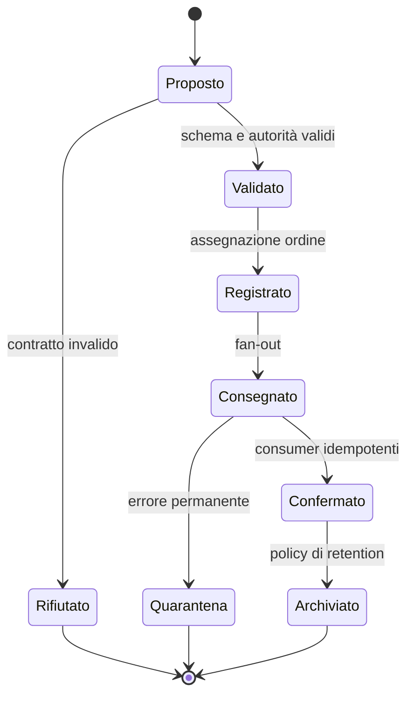

# Contratti degli eventi

## Scopo

Definire semantica, ciclo di vita, payload minimo, ordinamento e responsabilità degli eventi con cui i sistemi di *Roma Aeterna* comunicano senza accoppiamento diretto.

## Descrizione

Un evento afferma che un fatto è stato accettato dall'autorità proprietaria. Non è una richiesta, non concede autorizzazioni e non deve contenere riferimenti presentazionali. I contratti qui definiti sono canonici; i documenti di dominio li specializzano senza cambiarne la semantica.

## Ambito

Eventi di simulazione, dominio, ciclo di vita, istituzioni, economia, interazione, combattimento e diagnostica. Sono esclusi callback locali puramente grafici e input grezzi del dispositivo.

## Busta comune

| Campo | Obbligo | Funzione |
|---|---:|---|
| `event_id` | sì | identità globale e deduplicazione |
| `event_type` | sì | tipo versionato `EVT.<Dominio>.<Fatto>.vN` |
| `occurred_at` | sì | istante nel calendario di simulazione |
| `recorded_at` | sì | istante tecnico di registrazione |
| `producer_system` | sì | proprietario che attesta il fatto |
| `subject_ids` | sì | aggregati direttamente coinvolti |
| `location_id` | se applicabile | luogo storico-logico del fatto |
| `causation_id` | sì | comando o evento causale |
| `correlation_id` | sì | flusso o transazione di appartenenza |
| `schema_version` | sì | compatibilità e migrazione |
| `confidence` | per conoscenza | certezza percepita, non verità globale |
| `payload` | sì | soli dati necessari ai consumatori dichiarati |

## Classi di evento

| Classe | Persistenza | Consegna | Esempi |
|---|---|---|---|
| fatto di dominio | journal selettivo | almeno una volta, idempotente | morte, trasferimento proprietà |
| avanzamento temporale | effimera/coalescibile | ordinata per tick logico | giorno iniziato, stagione cambiata |
| integrazione | fino ad ack | ritentabile | mercato aggregato aggiornato |
| conoscenza | per persona/gruppo | limitata da percezione | voce appresa, crimine osservato |
| presentazione | non autorevole | best effort | notifica, cue audio |
| diagnostica | policy configurabile | best effort | budget superato, invariante violata |

## Catalogo iniziale P0/P1

| Evento | Produttore | Consumatori principali | Payload minimo | Persistenza |
|---|---|---|---|---|
| `EVT.Time.Advanced.v1` | SYS-TIME | SIM, NEED, WORK | intervallo, velocità, calendario | no |
| `EVT.Time.DayStarted.v1` | SYS-TIME | WORK, RELIG, ECO | data, stagione, festività note | no |
| `EVT.Person.Born.v1` | SYS-PER | ID, HH, STAT, SIM | persona, genitori noti, luogo | sì |
| `EVT.Person.Died.v1` | SYS-PER | HH, PROP, WORK, REL, CRIME | persona, tempo, luogo, causa attestata | sì |
| `EVT.Household.SuccessionOpened.v1` | SYS-HH | PROP, CONT, STAT | de cuius, eredi candidati | sì |
| `EVT.Property.Transferred.v1` | SYS-PROP | INV, ECO, HH, CONT | bene, cedente, acquirente, titolo | sì |
| `EVT.Inventory.Transferred.v1` | SYS-INV | ECO, INT, CRIME | oggetto/lotto, origine, destinazione, quantità | selettiva |
| `EVT.Economy.TransactionSettled.v1` | SYS-ECO | CONT, REP, UI | parti, valore, mezzo, mercato | sì |
| `EVT.Work.ActivityCompleted.v1` | SYS-WORK | ECO, INV, NEED, REP | agente, attività, output, qualità | selettiva |
| `EVT.Knowledge.Learned.v1` | SYS-KNOW | NPC, DIALOGUE, CRIME | conoscente, fatto, fonte, confidenza | sì |
| `EVT.Crime.Reported.v1` | SYS-CRIME | KNOW, REP, POL | caso, denunciante, autorità | sì |
| `EVT.Combat.InjuryInflicted.v1` | SYS-COMBAT | PER, CRIME, KNOW | vittima, lesione, agente percepito | sì |
| `EVT.Authority.TransactionFailed.v1` | SYS-AUTH | richiedente, DBG | transazione, categoria errore | audit |

## Stati e transizioni

## Ordinamento, duplicati e causalità

- L'ordine è garantito per aggregato, non globalmente.
- Ogni consumer conserva l'ultimo evento o la chiave di deduplicazione necessaria.
- Gli eventi ritardati non possono retrocedere una versione autorevole.
- Il replay usa calendario e causalità originali, non l'orologio reale.
- Gli eventi coalescibili dichiarano esplicitamente la perdita accettabile di granularità.

## Gestione degli errori

Payload non valido: rifiuto prima della pubblicazione. Consumer temporaneamente indisponibile: retry limitato. Versione sconosciuta o riferimento impossibile: quarantena e diagnostica. Un consumer non può annullare un fatto già registrato; deve emettere un comando compensativo.

## Prestazioni attese e scalabilità

I budget numerici restano configurabili per piattaforma. L'architettura deve supportare batching, coalescenza degli aggiornamenti temporali, priorità per eventi vicini al giocatore e back-pressure senza perdita di fatti critici. Il journal non deve crescere senza politiche di snapshot e retention.

## Strategie di test

- compatibilità backward/forward degli schemi;
- consegna duplicata e fuori ordine;
- replay deterministico entro le tolleranze dichiarate;
- quarantena di payload corrotti;
- tempeste di eventi e back-pressure;
- isolamento della conoscenza per impedire NPC onniscienti.

## Criteri di accettazione

- Ogni evento ha produttore unico, consumatori e retention dichiarati.
- Ogni consumer è idempotente o documenta una garanzia equivalente.
- Nessun evento critico dipende da un riferimento effimero.
- Le modifiche di schema includono migrazione e documenti impattati.

## Definition of Done

Catalogo, schemi logici, versionamento, telemetria, test contrattuali e policy di errore sono approvati; ogni sistema P0/P1 elenca eventi prodotti e ascoltati con collegamento a questo documento.

## Dipendenze

- [Standard di specifica](../../00-governance/system-specification-standard.md)
- [Catalogo dei sistemi](../../00-governance/system-catalog.md)
- [Matrice di proprietà dei dati](../data/data-ownership-matrix.md)
- [Tempo e persistenza](../../03-world/time-and-persistence.md)

## Collegamenti agli altri documenti

- [Architettura degli eventi](event-architecture.md)
- [Architettura della simulazione](../../04-simulation/simulation-architecture.md)
- [Logging e gestione degli errori](logging-errors.md)

## Decisioni ancora aperte

- Selezionare la tecnologia concreta di dispatch solo durante la progettazione UE5.
- Definire retention e granularità del journal per la vertical slice.

## TODO

- Estendere il catalogo agli eventi P2 dopo l'approvazione dei sistemi di dominio.
- Assegnare responsabili e suite di test a ciascun namespace.
