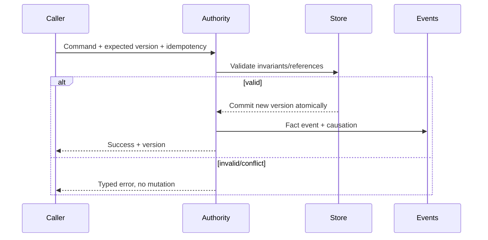

# Architettura dei dati trasversale

## Scopo

Definire identità, ownership, lifecycle, riferimenti, versionamento e accesso ai dati della simulazione.

## Descrizione

I dati sono separati in definizioni read-only, record runtime autoritativi, viste derivate, journal storico e presentazione transitoria. Ogni famiglia ha un writer, schema version, stable ID e policy di persistenza/aggregazione.

## Ambito

Tutti i domini Game Bible, Data Asset/Table/Registry, save DTO, eventi, indici, cache, validazione, provenance e privacy locale.

## Classi di dati

| Classe | Esempi | Mutabilità | Persistenza |
|---|---|---|---|
| Definition | bene, professione, edificio tipo, rito | read-only/versionata | asset/catalogo build |
| Authoritative Record | persona, edificio, contratto, mercato | dominio owner | snapshot/journal |
| Historical Record | morte, titolo, processo, evento | append/chiusura | journal + snapshot |
| Derived View | prezzo mostrato, reputazione aggregata, UI | ricostruibile | cache opzionale/versionata |
| Projection | Actor, Mass fragment, widget, audio emitter | transitoria | mai autorevole |
| Configuration | budget, intervalli, feature flag | layer/versione | manifest/config |

## Identità e riferimenti

Stable IDs tipizzati per entità, record e definition; alias e tombstone preservati. Riferimenti persistenti sono ID + expected type/version, mai pointer o UObject path esclusivo. Soft asset reference solo per definitions/presentation. Relazioni many-to-many hanno ID proprio quando possiedono lifecycle o prove.

## Mutazione

## Schema e compatibilità

Ogni record dichiara `SchemaId`, versione/migration step, ruleset, world time, owner, provenance dove storica e unknown-field policy. Migrazioni forward-only per copia, idempotenti e testate su golden saves; downgrade non garantito. Breaking change richiede ADR e change impact.

## Aggregazione

Snapshot N/E/M/W mantengono conteggi, saldi, distribuzioni, seed ed eccezioni P0. Degradazione produce reconciliation report; promozione non inventa record critici. Debiti, diritti, contratti, morti, parentela, casi, eventi in corso e player non sono medie.

## Accesso, cache e database

Repository/query per dominio; indici derivati invalidati da eventi. Database esterno non è requisito demo: valutazione separata contro store in-memory + snapshot. Cache eliminabile senza perdita. Query massive paginate/batch e budgetizzate.

## Validazione e sicurezza

Schema, range/unità, ID/reference, ownership, cardinalità, tag, provenance, temporalità, conservation e privacy. Dati corrotti in quarantena; nessuna correzione silenziosa che alteri storia. Export telemetria esplicito.

## Dipendenze

- [Catalogo schemi](domain-schema-catalog.md)
- [Ownership](data-ownership-matrix.md)
- [Schema versioning](schema-versioning.md)
- [Dati UE5](../unreal-engine-5/data-assets-tables.md)

## Collegamenti agli altri documenti

- [Save](../save-system/save-architecture.md)
- [Event contracts](../architecture/event-contracts.md)
- [Validation](data-validation.md)
- [Modello concettuale](conceptual-model.md)

## Test e Definition of Done

Contract, property, migration, referential, conservation e aggregation tests per schema; performance query/save. DoD quando ogni dominio P0 ha owner, schema, ID, lifecycle, riferimenti, persistence, migration, validation e classification.

## Decisioni ancora aperte

- Formato snapshot e database embedded eventuale.
- Policy unknown fields, compressione e cifratura locale.

## TODO

- Derivare schema registry P0 e golden datasets.
- Chiudere Q-235–Q-238.
