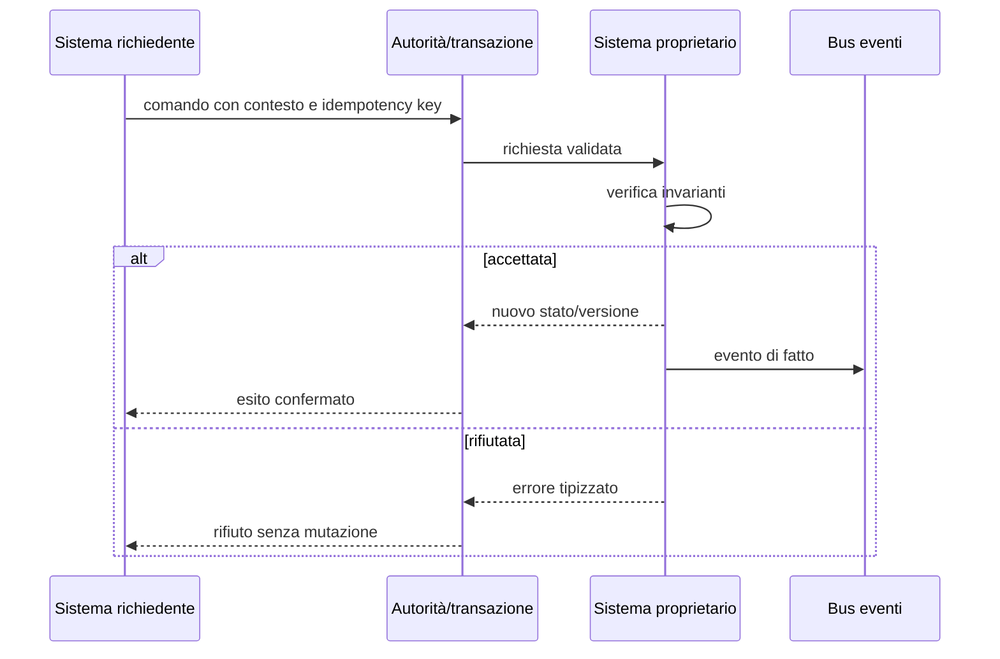

# Matrice di proprietà dei dati

## Scopo

Definire una sola autorità di scrittura per ogni famiglia di dati persistenti o autorevoli, distinguendo proprietà, lettura, mutazione, replica derivata e conservazione storica.

## Descrizione

La matrice è il contratto canonico che impedisce modifiche concorrenti e dipendenze implicite. Un sistema non proprietario può leggere tramite query pubbliche e richiedere una modifica tramite comando; non può scrivere direttamente lo stato di un altro sistema.

## Ambito

Comprende stato globale, mondo, tempo, identità, persone, relazioni, beni, economia, attività, istituzioni, conoscenza, combattimento e diagnostica. I dati puramente presentazionali restano fuori dal salvataggio autorevole.

## Regole di autorità

1. Ogni record autorevole ha un solo sistema proprietario.
2. Le viste denormalizzate dichiarano fonte, versione e politica di ricostruzione.
3. Le modifiche inter-sistema avvengono tramite comando validato o transazione orchestrata.
4. Gli eventi descrivono fatti già accettati; non sostituiscono la validazione del comando.
5. I dati storici non vengono sovrascritti quando servono a diritto, successione, memoria o audit.
6. Ogni migrazione conserva identificatori stabili e provenienza.

## Matrice canonica

| Famiglia dati | Proprietario | Lettori principali | Mutazioni autorizzate | Persistenza | Ricostruibile | Classificazione |
|---|---|---|---|---|---|---|
| tempo assoluto, calendario, velocità | SYS-TIME | tutti i sistemi temporali | comandi di pausa/velocità ammessi dalla sessione | globale | no | critica |
| coda e registro eventi | SYS-EVT | debug, salvataggio, simulazione | pubblicazione validata dai produttori | sessione + journal selettivo | parziale | critica |
| identità e riferimenti stabili | SYS-ID | tutti | allocazione, alias, tombstone | globale | no | critica |
| celle, luoghi e stato ambientale | SYS-WORLD | NPC, economia, UI, eventi | comandi ambientali e transazioni autorizzate | mondo/città | parziale | critica |
| stato aggregato della simulazione | SYS-SIM | mondo, debug, save | step deterministico e riconciliazione | globale/città | sì, da snapshot | critica |
| persona e ciclo di vita | SYS-PER | NPC, famiglia, lavoro, diritto | nascita, maturazione, salute, morte | persona | no | critica |
| conoscenza individuale | SYS-KNOW | dialoghi, crimine, AI | percezione, comunicazione, oblio | persona | no | alta |
| decisione e routine NPC | SYS-NPC | presentazione, simulazione | pianificazione e cambio attività | persona/derivata | parziale | alta |
| relazioni interpersonali | SYS-REL | famiglia, reputazione, dialoghi | eventi sociali validati | relazione | no | alta |
| famiglia, tutela e successione | SYS-HH | diritto, proprietà, NPC | matrimonio, adozione, emancipazione, eredità | nucleo/linea | no | critica |
| status giuridico-sociale | SYS-STAT | politica, lavoro, diritto | atti giuridici e transizioni ammesse | persona + storico | no | critica |
| prezzi, mercati e conti economici | SYS-ECO | commercio, lavoro, UI | transazioni economiche validate | mercato/agente | parziale | critica |
| titolarità e diritti reali | SYS-PROP | inventario, famiglia, diritto | trasferimenti e vincoli giuridici | bene/titolo | no | critica |
| custodia fisica e contenitori | SYS-INV | commercio, crafting, interazione | trasferimenti atomici | contenitore | parziale | critica |
| impiego, professioni e produzione | SYS-WORK | economia, NPC, progressione | contratti, turni, produzione | agente/attività | parziale | alta |
| sessione d'interazione | SYS-INT | UI, inventario, mondo | apertura, scelta, risoluzione | effimera + esiti | sì | media |
| contratti e obbligazioni | SYS-CONT | economia, diritto, famiglia | stipula, adempimento, violazione | contratto | no | critica |
| reputazioni contestuali | SYS-REP | AI, politica, crimine | osservazioni e propagazione valide | soggetto/contesto | parziale | alta |
| bisogni fisiologici | SYS-NEED | NPC, salute, UI | consumo temporale e soddisfacimento | persona | sì con perdita controllata | media |
| stato presentazionale UI | SYS-UI | giocatore | input e preferenze | profilo/sessione | sì | bassa |
| pratiche e appartenenze religiose | SYS-RELIG | calendario, politica, NPC | riti, voti, incarichi | persona/istituzione | no | alta |
| cariche e autorità politiche | SYS-POL | diritto, economia, eventi | nomina, elezione, deliberazione | istituzione + storico | no | critica |
| casi, prove e illecito | SYS-CRIME | diritto, reputazione, AI | denuncia, indagine, giudizio | caso | no | critica |
| salute da combattimento e scontro | SYS-COMBAT | salute, crimine, AI | risoluzione colpi e conseguenze | scontro + persona | parziale | alta |
| unità e campagne militari | SYS-WAR | economia, politica, mondo | ordini, logistica, battaglie | unità/campagna | parziale | alta |
| autorizzazioni e transazioni | SYS-AUTH | tutti i mutatori | concessione, revoca, commit/rollback | globale + audit | no | critica |
| log, metriche e tracing | SYS-DBG | team interno | append diagnostico | configurabile | sì | media |
| snapshot, versioni e migrazioni | SYS-SAVE | tutti i proprietari | checkpoint, migrazione e recovery autorizzati | globale/città/persona | parziale | critica |
| claim, fonti e licenze creative | SYS-HIST | tutti i domini storici | review e promozione delle evidenze | documentale/dati | no | alta |

## Flusso di mutazione inter-sistema

## Gestione degli errori

Riferimenti mancanti, versione obsoleta, autorizzazione insufficiente, invariante violata e conflitto transazionale producono errori tipizzati. Nessun errore parziale deve lasciare inventario, proprietà, denaro o status in stati discordanti.

## Strategie di test

- test di unicità del proprietario per ogni schema;
- test contrattuali su comando, query ed evento;
- test di rollback delle transazioni multi-aggregato;
- test di migrazione e ricostruzione delle viste;
- test di integrità referenziale dopo morte, distruzione e streaming.

## Criteri di accettazione

- Ogni dato previsto dal catalogo ha proprietario e persistenza dichiarati.
- Nessuna dipendenza P0 richiede scrittura diretta esterna.
- Ogni vista derivata dichiara una strategia di invalidazione o ricostruzione.
- Le transazioni critiche hanno comportamento atomico documentato.

## Definition of Done

La matrice è approvata dai responsabili di architettura, design dei sistemi e salvataggi; coincide con i contratti dei singoli sistemi; è verificata da validator automatici prima dell'implementazione di una milestone.

## Dipendenze

- [Standard di specifica](../../00-governance/system-specification-standard.md)
- [Catalogo dei sistemi](../../00-governance/system-catalog.md)
- [Modello dati](../data-model.md)
- [Sistema di salvataggio](../save-system/README.md)

## Collegamenti agli altri documenti

- [Contratti degli eventi](../architecture/event-contracts.md)
- [Matrice delle dipendenze](../../00-governance/system-dependency-matrix.md)
- [Architettura della simulazione](../../04-simulation/simulation-architecture.md)

## Decisioni ancora aperte

- Definire il formato fisico degli snapshot e il perimetro delle transazioni distribuite tra città.
- Confermare quali viste aggregate debbano essere salvate per rispettare i budget di caricamento.

## TODO

- Assegnare owner di disciplina e revisori a ogni famiglia dati.
- Collegare ogni schema logico alla futura definizione versionata.
