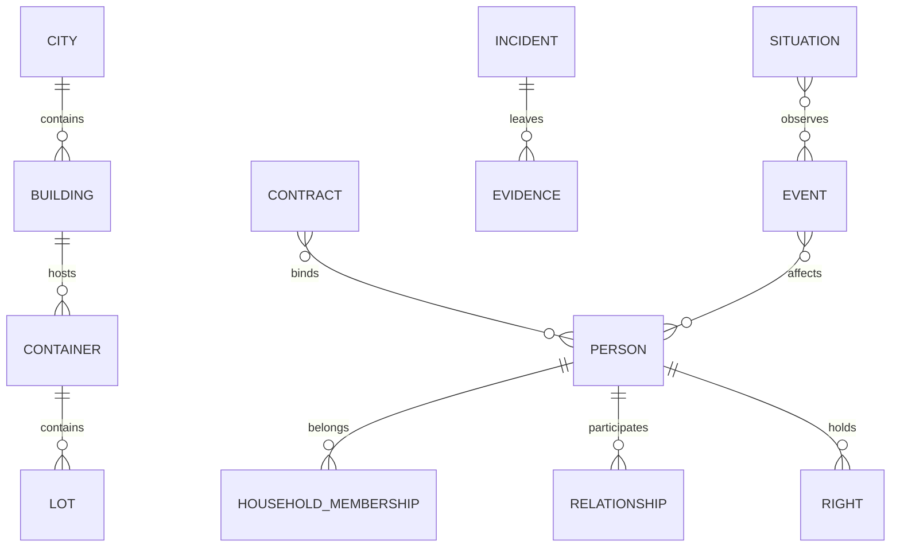

# Catalogo degli schemi di dominio

## Scopo

Definire record, chiavi, relazioni, invarianti e persistenza per tutti i sistemi richiesti.

## Descrizione

Il catalogo è logico e technology-neutral. I nomi sono concettuali; future strutture software o DTO non sono creati in questa fase.

## Ambito

NPC, famiglie, relazioni, edifici, città, professioni, oggetti, merci, prezzi, contratti, eventi, missioni, reputazione, religione, politica, crimini, esercito, salute, calendario, proprietà e inventari.

## Invarianti comuni

Stable ID non riutilizzato; owner unico; versione monotona; riferimenti tipizzati; world time; tombstone per record storici; mutation cause; definizione separata da istanza; stato aggregato riconciliabile.

## Catalogo

| Dominio/record | Campi principali | Relazioni | Invarianti/persistenza |
|---|---|---|---|
| NPC `PersonRecord` | identità, nascita, status refs, corpo, competenze, needs summary, lifecycle | household, relations, work, beliefs | persona/tombstone permanente; projection ricostruibile |
| Famiglia `Household/FamilyRecord` | membri, ruoli, autorità, residenza, risorse comuni | persone, matrimoni, adozioni, estate | grafi validi; successione atomica; storico |
| Relazione `RelationshipRecord` | parti, dimensioni, evidenze, stato, visibilità | persone/comunità | non simmetria implicita; memoria persistente |
| Edificio `BuildingRecord` | place ID, tipo, stato, accessi, funzioni, proprietari/occupanti | città, unità, imprese | esiste unloaded; danno/versione persistenti |
| Città `CityRecord` | regione, luoghi, autorità, population aggregates, mercati, services | edifici, routes, communities | saldi W/E/N; ledger trasformazioni |
| Professione `ProfessionDefinition/CareerRecord` | requisiti, attività, competenze, rischi; storico ruoli | persone, imprese, collegia | definition version; carriera fallibile |
| Oggetto `ItemDefinition/ItemInstance` | tipo, qualità, integrità, unità, provenance | lot/container/owner | instance solo se necessario; no duplicazione |
| Merce `GoodDefinition/LotRecord` | quantità, unità, qualità, origine, deterioramento | container, enterprise, market | conservation e unit conversion |
| Prezzo `PriceObservation/MarketState` | good, market, time, quantity, valuta, source/confidence | città/market | osservazione non globale; serie aggregabile |
| Contratto `ObligationRecord` | parti, prestazioni, scadenze, prove, stato, forum | persone, property, payments | version history; fulfillment atomico |
| Evento `DomainEvent/DynamicEventRecord` | producer, type, time, cause, payload/version; phase/fronts | entity IDs | immutable fact; processo persistente |
| Missione `SituationRecord` | definition, bindings, leads, commitments, state, deadlines | NPC, luogo, eventi | vista sui domini, non reward authority |
| Reputazione `ReputationAggregate` | soggetto, comunità, tema, distribuzione, evidence refs, freshness | beliefs/events | locale, derivata, source/confidence |
| Religione `Practice/Community/VowRecord` | tradizione, partecipanti, luogo, calendario, offerte, interpretazioni | persone, templi, events | belief separata da fatto; voto persistente |
| Politica `Office/Tenure/DecisionRecord` | autorità, titolare, competenza, agenda, decisione/prove | persons, institutions, favors | mandato/giurisdizione; storico append |
| Crimine `Incident/Case/EvidenceRecord` | atto, vittime, tracce, osservazioni, denuncia, procedimento | persone, luoghi, law | incidente non colpevolezza; chain of custody |
| Esercito `Formation/Membership/Campaign` | composizione, comando, posizione, morale, scorte, ordini | persons, politics, economy | persone/scorte/perdite M0–M5 |
| Salute `Health/Injury/CareRecord` | condizioni, capacità, lesioni, sangue/dolore astratti, cure, prognosis beliefs | persona, practitioner | causa/esito; diagnosi belief; longitudinal |
| Calendario `WorldClock/Schedule` | epoch, data, rate, ruleset, deadlines, recurrence | tutti processi | ordine totale + tie-break |
| Proprietà `RightRecord` | oggetto, soggetto, tipo, quota, titolo, vincolo, validità | items/buildings/contracts | proprietà distinta da custodia; storico |
| Inventario `Container/LotPlacement` | custode, capacità, location, contents, reservation | items/lots/person/place | conservation; move atomico |

## Relazioni critiche

## Eventi e viste

Ogni record produce create/change/close/tombstone events specifici. UI, narrative, analytics e debug usano view schemas separati con source version. Event payload usa ID/delta, non aggregate completi senza necessità.

## Casi limite e recovery

Riferimento a tombstone, città scaricata, erede morto, lotto negativo, evento duplicato, contratto con parte mancante e migration parziale producono typed issue e quarantena. Recovery non rigenera identità critiche senza journal.

## Dipendenze

- [Architettura dati](data-architecture.md)
- [Ownership](data-ownership-matrix.md)
- [NPC data](npc-data.md)
- [World data](world-data.md)
- [Economy data](economy-data.md)
- [Institution data](institution-data.md)

## Collegamenti agli altri documenti

- [Save world state](../save-system/world-state.md)
- [Event contracts](../architecture/event-contracts.md)
- [Runtime contracts](../unreal-engine-5/runtime-system-contracts.md)

## Test e Definition of Done

Schema, cardinalità, referential integrity, temporal validity, conservation, aggregation e migration tests. DoD: campi P0, owner, IDs, lifecycle, events, persistence e validation approvati per ogni riga.

## Decisioni ancora aperte

- Granularità degli aggregate e item instances.
- Indici/query e partizionamento snapshot.

## TODO

- Espandere ogni riga in schema versionato P0.
- Collegare data classification e retention.
